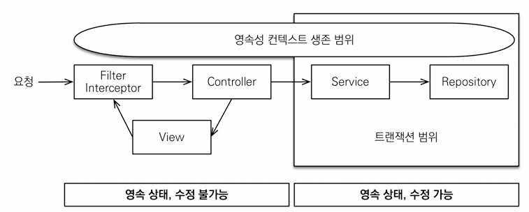

> 해당 글은 김영한님의 인프런 강의 [스프링부트와 JPA활용2 - API 개발과 성능 최적화](https://www.inflearn.com/course/%EC%8A%A4%ED%94%84%EB%A7%81%EB%B6%80%ED%8A%B8-JPA-API%EA%B0%9C%EB%B0%9C-%EC%84%B1%EB%8A%A5%EC%B5%9C%EC%A0%81%ED%99%94)을 듣고 내용을 정리하기 위한 것으로 자세한 설명은 해당 강의를 통해 확인할 수 있습니다.
> 

---

## OSIV와 성능 최적화

- Open Session In View: 하이버네이트
- Open EntityManager In View: JPA

### **OSIV ON**



- `spring.jpa.open-in-view`: true 기본값

애플리케이션 실행시점에 아래처럼 WARN으로 spring.jpa.open-in-view is enabled by default. 라고 나온다.


warn 로그를 남기는 이유가 있다.

OSIV 전략은 트랜잭션 시작처럼 최초 DB 커넥션 시작 시점부터 API 응답이 끝날떄 까지 영속성 컨텍스트와 DB 커넥션을 유지한다. 그래서 View template 이나 API 컨트롤러 단에서 지연 로딩이 가능했다.

영속성 컨텍스트는 기본적으로 DB 커넥션을 유지하는데 지연로딩은 영속성 컨텍스트가 살아있어야 가능하다. 이것 자체가 큰 장점이다.

근데 이 저냙은 오랫동안 DB 컨텍션 리소스를 사용하기 때문에, **실시간 트래픽이 중요한 애플리케이션에서는 커넥션이 모자랄수 있기 때문에 장애로 이어 질수 있다.**

예로 컨트롤러에서 외부 API호출하면 외부 API 대기 시간만큼 커넥션 리소스를 반환하지 못하고 유지하기 때문에 켜넥션이 모자랄수 있다.

### OSIV OFF


- `spring.jpa.open-in-view: false`  OSIV 종료

```yaml
spring:
  jpa:
    open-in-view: false
```

OSIV를 종료하면 트랜잭션을 종료할때 영속성 컨텍스트를 닫고, DB 커넥션도 반환하기 때문에 커넥션 리로스를 낭비하지 않는다..

OSIV를 끄면 지연 로딩을 트랜잭션 안에서 처리해야하기 때문에, 프록시 초기화를 트랜잭션 안에서 하거나, fetch join을 사용해야 한다. 아니면 LazyInitializationException이 발생한다. 그리고 view template에서 지연로딩이 동작하지 않는다. 결론적으로 트랜잭션이 끝나기 전에 지연 로딩을 강제로 호출해야 한다.

### LazyInitializationException 예시

**OrderApiController**

```java
@GetMapping("/api/v1/orders")
public List<Order> ordersV1() {
    List<Order> all = orderRepository.findAllByString(new OrderSearch());
    for (Order order : all) {
        order.getMember().getName();
        order.getDelivery().getAddress();
        List<OrderItem> orderItems = order.getOrderItems();
        orderItems.stream().forEach(o -> o.getItem().getName());
    }
    return all;
}
```

postman으로 실행해보면 아래처럼 LazyInitializationException이 발생하는것을 알수있다.


### 커멘드와 쿼리 분리

실무에서 **OSIV를 끈 상태**로 복잡성을 관리하는 좋은 방법은 **Command와 Query를 분리**하는 것이다.

참고: [https://en.wikipedia.org/wiki/Command–query_separation](https://en.wikipedia.org/wiki/Command%E2%80%93query_separation)

보통 비즈니스 로직은 특정 엔티티 몇개를 등록하고 수정하는 것이기때문에 성능에 크게 문제가 없다. 그런데 복잡한 화면을 출력하기 위한 쿼리는 화면에 맞춰서 성능을 최적화 하는것이 중요하다. 하지만 복잡성에 비해 핵심 비즈니스에 큰 영향을 주지 않는다.

그래서 크고 복잡한 애플리케이션을 개발하면, 이 둘의 관심사를 명확하게 분리하는 선택은 유지보수 관점에서 의미있다.

예로

- OrderSerice
    - OrderService: 핵심 비즈니스 로직
    - OrderQuerySerive: 화면이나 API에 맞춘 서비스(주로 읽기 전용 트랜잭션 사용)

**OrderApiController 수정 전**

```java
@GetMapping("/api/v3/orders")
public List<OrderDto> ordersV3() {
    List<Order> orders = orderRepository.findAllWithItem();

    List<OrderDto> result = orders.stream()
            .map(o -> new OrderDto(o))
            .collect(toList());

    return result;
}
```

**OrderApiController 수정 후**

```java
@GetMapping("/api/v3/orders/osiv")
public List<jpabook.jpashop.service.query.OrderDto> ordersV3_osiv() {
    return orderQueryService.ordersV3_osiv();
}
```

**OrderQueryService**

```java
@Service
@Transactional(readOnly = true)
@RequiredArgsConstructor
public class OrderQueryService {

    private final OrderRepository orderRepository;

    public List<OrderDto>ordersV3_osiv() {
        List<Order> orders = orderRepository.findAllWithItem();

        List<OrderDto> result = orders.stream()
                .map(o -> new OrderDto(o))
                .collect(toList());

        return result;
    }
}
```

**OrderDto**

```java
@Data
public class OrderDto {

    private Long orderId;
    private String name;
    private LocalDateTime orderDate;
    private OrderStatus orderStatus;
    private Address address;
    private List<OrderItemDto> orderItems; //엔티티 외부 노출 하면 안됨

    public OrderDto(Order order) {
        orderId = order.getId();
        name = order.getMember().getName();
        orderDate = order.getOrderDate();
        orderStatus = order.getStatus();
        address = order.getDelivery().getAddress();
        orderItems = order.getOrderItems().stream()
                .map(orderItem -> new OrderItemDto(orderItem))
                .collect(toList());
    }
}
```

**OrderItemDto**

```java
@Getter
public class OrderItemDto {

    private String itemName; //상품 명
    private int orderPrice; //주문 가격
    private int count; //주문 수량

    public OrderItemDto(OrderItem orderItem) {
        itemName = orderItem.getItem().getName();
        orderPrice = orderItem.getOrderPrice();
        count = orderItem.getCount();
    }
}
```

**패키지 구조**


보통 서비스 계층에서 트랜잭션을 유지한다. 두 서비스 모두 트랜잭션을 유지하면서 지연 로딩을 사용할 수 있따.

> 필자는 고객 서비스의 실시간 API는 OSIV를 끄고, ADMIN 처럼 커넥션을 많이 사용하지 않는 곳에서는 OSIV를 켠다.  OSIV에 관해 더 깊이 알고 싶으면 자바 ORM 표준 JPA 프로그래밍 13장 웹 애플리케이션과 영속성 관리를 참고하자.
>

