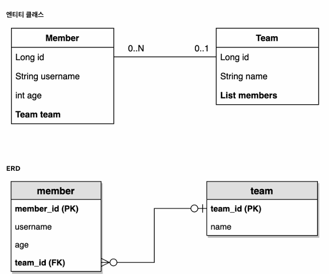

> 해당 글은 김영한님의 인프런 강의 [실전! Querydsl](https://www.inflearn.com/course/querydsl-%EC%8B%A4%EC%A0%84)을 듣고 내용을 정리하기 위한 것으로 자세한 설명은 해당 강의를 통해 확인할 수 있습니다.
> 

---

예제 도메인 모델을 엔티티 클래스와 ERD만 확인하고 넘어가겠다.



---

## JPQL vs Querydsl

**테스트 기본 코드**

```java
@SpringBootTest
@Transactional
public class QuerydslBasicTest {

    @PersistenceContext
    EntityManager em;
    
    @BeforeEach
    public void before() {
        queryFactory = new JPAQueryFactory(em);
        Team teamA = new Team("teamA");
        Team teamB = new Team("teamB");
        em.persist(teamA);
        em.persist(teamB);

        Member member1 = new Member("member1", 10, teamA);
        Member member2 = new Member("member2", 20, teamA);

        Member member3 = new Member("member3", 30, teamB);
        Member member4 = new Member("member4", 40, teamB);

        em.persist(member1);
        em.persist(member2);
        em.persist(member3);
        em.persist(member4);
    }
}
```

@BeforeEach로 각 테스트 실행전에 데이터를 세팅한다.

**Querydsl vs JPQL**

```java
@Test
public void startJPQL() {
    String qlString =
            "select m from Member m" +
            " where m.username =: username";
    Member findMember = em.createQuery(qlString, Member.class)
            .setParameter("username", "member1")
            .getSingleResult();

    assertThat(findMember.getUsername()).isEqualTo("member1");
}

    @Test
    public void startQuerydsl() {
          JPAQueryFactory queryFactory = new JPAQueryFactory(em);
        QMember m = new QMember("m");

        Member findMember = queryFactory
                .select(m)
                .from(m)
                .where(m.username.eq("member1"))
                .fetchOne();

        assertThat(findMember.getUsername()).isEqualTo("member1");
    }
```

- EntityManger로 JPAQueryFactory를 생성한다.
- QMember m = new QMember(”m”);의 “m”은 어떤 QMember인지 구분하기 위한 것이다.
- Querydsl은 JPQL 빌더이다.
- JPQL은 문자이기때문에 실행시점에 오류가 발생하지만, Querydsl은 자바 코드이기때문에 컴파일 시점에 오류가 발생한다.
- JPQL은 파라미터 바인딩을 직접 하지만, Querydsl은 파라미터 바인딩을 자동처리가 된다.

### JPAQueryFactory를 필드로

```java
@SpringBootTest
@Transactional
public class QuerydslBasicTest {

    @PersistenceContext
    EntityManager em;

    JPAQueryFactory queryFactory;

    @BeforeEach
    public void before() {
        queryFactory = new JPAQueryFactory(em);
        //...
    }
    
     @Test
    public void startQuerydsl() {
        QMember m = new QMember("m");

        Member findMember = queryFactory
                .select(m)
                .from(m)
                .where(m.username.eq("member1"))
                .fetchOne();

        assertThat(findMember.getUsername()).isEqualTo("member1");
    }
}
```

> JPAQueryFactory를 필드로 제공하면 동시성 문제는 JPAQueryFactory를 생성할때 제공하는 EntityManager(em)에 달려있다. 스프링 프레임워크는 여러 쓰레드에서 동시에 같은 EntityManager에 접근해도, **트랜잭션 마다 별도의 영속성 컨텍스트를 제공**하기 때문에, 동시성 문제는 걱정하지 않아도 된다.
> 

---

## 기본 Q-Type 활용

**Q클래스 인스턴스를 사용하는 2가지 방법**

```java
QMember qMember = new QMember("m"); //별칭 직접 지정
QMember qMember = QMember.member; //기본 인스턴스 사용
```

**기본 인스턴스를 static import와 함께 사용하기**

```java
import static study.querydsl.entity.QMember.*;

@Test
public void startQuerydsl() {
    Member findMember = queryFactory
            .select(member)
            .from(member)
            .where(member.username.eq("member1"))
            .fetchOne();

    assertThat(findMember.getUsername()).isEqualTo("member1");
}
```

기본 인스턴스와 static import를 함께사용하면 코드를 간략화 할수 있다.

다음 설정을 추가하면 실행되는 JPQL을 볼수 있다.

```yaml
spring.jpa.properties.hibernate.use_sql_comments: true
```

테스트 코드를 실행하면 다음과 같이 /* ~~ */로 표시되는 JPQL을 확인할수 있고, 이후에 SQL문을 확인 할수 있다.


위 JPQL코드에서 from Member member1의 “member1”은 Qmember 클래스안에 다음과 같이 정의된 것으로 나오게된다.


> 같은 테이블을 조인해야 하는 경우가 아니면 기본 인스턴스를 사용하자
> 

---

## 검색 조건 쿼리

**기본 검색 쿼리**

```java
@Test
public void search() {
    Member findMember = queryFactory
            .selectFrom(member)
            .where(member.username.eq("member1")
                    .and(member.age.eq(10)))
            .fetchOne();

    assertThat(findMember.getUsername()).isEqualTo("member1");
}
```

쿼리 결과로 and 조건이 붙은걸 확인 할수 있다.


검색 조건은 .and(), or()를 메서드 체인으로 연결할수 있다. select, from을 selectFrom으로 합칠 수 있다.

### JPQL이 제공하는 모든 검색 조건 제공

```java
member.username.eq("member1") // username = 'member1'
member.username.ne("member1") //username != 'member1'
member.username.eq("member1").not() // username != 'member1'

member.username.isNotNull() //이름이 is not null

member.age.in(10, 20) // age in (10,20)
member.age.notIn(10, 20) // age not in (10, 20)
member.age.between(10,30) //between 10, 30

member.age.goe(30) // age >= 30
member.age.gt(30) // age > 30
member.age.loe(30) // age <= 30
member.age.lt(30) // age < 30

member.username.like("member%") //like 검색
member.username.contains("member") // like ‘%member%’ 검색 
member.username.startsWith("member") //like ‘member%’ 검색
```

### AND 조건을 파라미터로 처리

```java
@Test
public void searchAndParam() {
    Member findMember = queryFactory
            .selectFrom(member)
            .where(
                    member.username.eq("member1"),
                    member.age.eq(10))
            .fetchOne();

    assertThat(findMember.getUsername()).isEqualTo("member1");
}
```

where()에 파라미터로 검색 조건을 추가하면 AND 조건이 추가된다.

파라미터 검색 조건으로 null이 오면 null 값을 무시하기떄문에 메서드 추출을 활용해서 동적 쿼리를 만들수 있다.

쿼리 결과로 and 조건이 추가된것을 확인 할수 있다.


---

## 결과 조회

- fetch(): 리스트 조회, 데이터 없으면 빈 리스트 반환
- fetchOne(): 단 건 조회
    - 결과가 없으면: null
    - 결과가 둘 이상이면: com.querydsl.core.NonUniqueResultException 예외 발생
- fetchFirst(): limit(1).fetchOne()
- fetchResults(): 페이징 정보 포함, total count 쿼리 추가 실행
- fetchCount(): count 쿼리로 변경해서 count 수 조회

```java
@Test
public void resultFetch() {
        //List
    List<Member> fetch = queryFactory
            .selectFrom(member)
            .fetch();
        
        //단 건 조회
    Member fetchOne = queryFactory
            .selectFrom(member)
            .fetchOne();
        
        //처음 한 건 조회
    Member fetchFirst = queryFactory
            .selectFrom(member)
            .fetchFirst();
        
        //페이징에서 사용
    QueryResults<Member> results = queryFactory
            .selectFrom(member)
            .fetchResults();

//        results.getTotal();
//        List<Member> content = results.getResults();
        
        //count 쿼리로 변경
    long count = queryFactory
            .selectFrom(member)
            .fetchCount();
}
```

fetchResults()는 totalCout의 값을 가져와야해서 다음과 같이 쿼리가 총 2번 실행 된다.


---

## 정렬

회원 정렬 순서

1. 회원 나이 내림차순(desc)
2. 회원 이름 올림차순(asc)

단 2에서 회원 이름이 없으면 마지막에 출력(nulls last)

```java
@Test
public void sort() {
    em.persist(new Member(null, 100));
    em.persist(new Member("member5", 100));
    em.persist(new Member("member6", 100));

    List<Member> result = queryFactory
            .selectFrom(member)
            .where(member.age.eq(100))
            .orderBy(member.age.desc(), member.username.asc().nullsLast())
            .fetch();

    Member member5 = result.get(0);
    Member member6 = result.get(1);
    Member memberNull = result.get(2);
    assertThat(member5.getUsername()).isEqualTo("member5");
    assertThat(member6.getUsername()).isEqualTo("member6");
    assertThat(memberNull.getUsername()).isNull();
}
```

- 일반 정렬
    - desc(): 내림차순, asc(): 올림차순
- null 데이터 순서 부여
    - nullsLast(): null 마지막, nullsFirst(): null 처음

---

## 페이징

**조회 건수 제한**

```java
@Test
public void paging1() {
    List<Member> result = queryFactory
            .selectFrom(member)
            .orderBy(member.username.desc())
            .offset(1)
            .limit(2)
            .fetch();

    assertThat(result.size()).isEqualTo(2);

}
```

- offset(1): 0부터 시작이고 offset을 1로 설정
- limit(2): 최대 2건 조회

**전체 조회 수가 필요하면?**

```java
@Test
public void paging2() {
    QueryResults<Member> queryResults = queryFactory
            .selectFrom(member)
            .orderBy(member.username.desc())
            .offset(1)
            .limit(2)
            .fetchResults();

    assertThat(queryResults.getTotal()).isEqualTo(4);
    assertThat(queryResults.getLimit()).isEqualTo(2);
    assertThat(queryResults.getOffset()).isEqualTo(1);
    assertThat(queryResults.getResults().size()).isEqualTo(2);

}
```

> 실무에서 페이징 쿼리를 작성할 때, 데이터를 조회하는 쿼리는 여러 테이블을 조인해야 하지만, count 쿼리는 조인이 필요 없는 경우도 있다. 그런데 이렇게 자동화된 count 쿼리는 원본 쿼리와 같이 모두 조인을 해버리기 때문에 성능이 안나올 수 있다. count 쿼리에 조인이 필요없는 성능 최적화가 필요하다면, count 전용 쿼리를 별도로 작성해야 한다.
> 

---