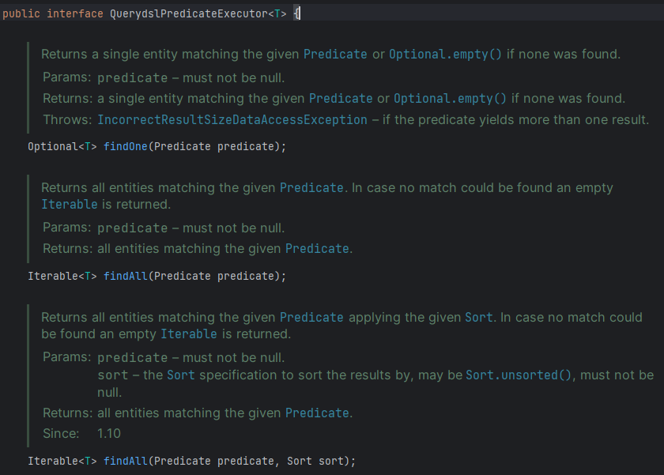

> 해당 글은 김영한님의 인프런 강의 [실전! Querydsl](https://www.inflearn.com/course/querydsl-%EC%8B%A4%EC%A0%84)을 듣고 내용을 정리하기 위한 것으로 자세한 설명은 해당 강의를 통해 확인할 수 있습니다.
> 

여기서 소개하는 기능은 제약이 커서 조인이 들어가는 경우 처럼 복잡한 실무 환경에서 사용하기에는 많이 부족하다. 그래도 스프링 데이터에서 제공하는 기능이므로 간단히 소개하고, 왜 부족한지 설명하겠다.

---

## 인터페이스 지원 - QuerydslPredicateExecutor

- 공식 문서: [https://docs.spring.io/spring-data/jpa/docs/2.2.3.RELEASE/reference/html/#core.extensions.querydsl](https://docs.spring.io/spring-data/jpa/docs/2.2.3.RELEASE/reference/html/#core.extensions.querydsl)

**QuerydslPredicateExecutor 인터페이스**



위의 기능들 이외에도 많은 기능들이 있다.

**리포지토리에 적용**

```java
public interface MemberRepository extends JpaRepository<Member, Long>, MemberRepositoryCustom,
                                                                         QuerydslPredicateExecutor<Member> {
}
```

**테스트**

```java
@Test
public void querydslPredicateExecutorTest() {

    Team teamA = new Team("teamA");
    Team teamB = new Team("teamB");
    em.persist(teamA);
    em.persist(teamB);

    Member member1 = new Member("member1", 10, teamA);
    Member member2 = new Member("member2", 20, teamA);

    Member member3 = new Member("member3", 30, teamB);
    Member member4 = new Member("member4", 40, teamB);

    em.persist(member1);
    em.persist(member2);
    em.persist(member3);
    em.persist(member4);

    QMember member = QMember.member;
    Iterable<Member> result = memberRepository.findAll
            (member.age.between(10, 40).and(member.username.eq("member1")));
    for (Member findMember : result) {
        System.out.println("member1 = " + findMember);
    }
}
```

쿼리 결과와 result 출력 결과를 보면 의도한데로 where 절에 조건이 들어간것을 확인할수 있다.


**한계점**

위에서 확인해본것 처럼 충분히 사용가능할거 같지만 여러가지 한계점이 있다.

- 조인X (묵시적 조인은 가능하지만 left join이 불가능하다.)
- 테스트에서 본것처럼 서비스, 컨트롤러 계층에서 memberRepositry.findAll()에 Querydsl의 predicate를 작성하기때문에 Querydsl 구현 기수에 의존하게 된다. 그러면 나중에 구현 기술을 바꾸게 되면 리포지토리 계층이 아닌 서비스나 컨트롤러 계층에도 수정이 발생하게된다.
- 복잡한 실무 환경에서 사용하기에는 한계가 명확하다.

---

## Querydsl Web 지원

- 공식 문서: [https://docs.spring.io/spring-data/jpa/docs/2.2.3.RELEASE/reference/html/#core.web.type-safe](https://docs.spring.io/spring-data/jpa/docs/2.2.3.RELEASE/reference/html/#core.web.type-safe)

**한계점**

- 단순한 조건만 가능
- 조건을 커스텀하는 기능이 복잡하고 명시적이지 않음
- 컨트롤러가 Querydsl에 의존
- 복잡한 실무환경에서 사용하기에는 한계가 명확

---

## 리포지토리 지원 - QuerydslRepositorySupport

QuerydslRepoitorySupport는 공식문서에는 없다.

자세한 코드 작성법은 [실전! Querydsl](https://www.inflearn.com/course/querydsl-%EC%8B%A4%EC%A0%84)에서 확인할수 있다.

**장점**

- getQuerydsl().applyPagincation() 스프링 데이터가 제공하는 페이징을 Querydsl로 편리하게 변환이 가능하다(단! Sort는 오류발생)
- from()으로 시작 가능(최근에는 QueryFactory를 사용해서 select()로 시작하는것이 더 명시적이다)
- EntityManager 제공

**한계**

- Querydsl 3.x 버전을 대상으로 만듬
- Querydsl 4.x에 나온 JPAQueryFactory로 시작할 수 없음
    - select로 시작할 수 없음 (from으로 시작해야함)
- QueryFactory를 제공하지 않음
- 스프링 데이터 Sort 기능이 정상 동작하지 않는다.

---

## Querydsl 지원 클래스 직접 만들기

스프링 데이터가 제공하는 QuerydslRepositorySupport가 지닌 한계를 극복하기 위해 직접 Querydsl 지원 클래스를 만들어 보자.

**장점**

- 스프링 데이토가 제공하는 페이징을 편리하게 변환
- 페이징과 카운트 쿼리 분리 가능
- 스프링 데이터 Sort 지원
- select(), selectFrom()으로 시작 가능
- EntityManager, QueryFactory 제공

**Querydsl4RepositorySupport**

Querydsl 4.x 버전에 맞춘 Querydsl 지원 라이브러리

```java
@Repository
public abstract class Querydsl4RepositorySupport {
    private final Class domainClass;
    private Querydsl querydsl;
    private EntityManager entityManager;
    private JPAQueryFactory queryFactory;
    public Querydsl4RepositorySupport(Class<?> domainClass) {
        Assert.notNull(domainClass, "Domain class must not be null!");
        this.domainClass = domainClass;
    }
    @Autowired
    public void setEntityManager(EntityManager entityManager) {
        Assert.notNull(entityManager, "EntityManager must not be null!");
        JpaEntityInformation entityInformation =
                JpaEntityInformationSupport.getEntityInformation(domainClass, entityManager);
        SimpleEntityPathResolver resolver = SimpleEntityPathResolver.INSTANCE;
        EntityPath path = resolver.createPath(entityInformation.getJavaType());
        this.entityManager = entityManager;
        this.querydsl = new Querydsl(entityManager, new
                PathBuilder<>(path.getType(), path.getMetadata()));
        this.queryFactory = new JPAQueryFactory(entityManager);
    }
    @PostConstruct
    public void validate() {
        Assert.notNull(entityManager, "EntityManager must not be null!");
        Assert.notNull(querydsl, "Querydsl must not be null!");
        Assert.notNull(queryFactory, "QueryFactory must not be null!");
    }
    protected JPAQueryFactory getQueryFactory() {
        return queryFactory;
    }
    protected Querydsl getQuerydsl() {
        return querydsl;
    }
    protected EntityManager getEntityManager() {
        return entityManager;
    }
    protected <T> JPAQuery<T> select(Expression<T> expr) {
        return getQueryFactory().select(expr);
    }
    protected <T> JPAQuery<T> selectFrom(EntityPath<T> from) {
        return getQueryFactory().selectFrom(from);
    }
    protected <T> Page<T> applyPagination(Pageable pageable,
                                          Function<JPAQueryFactory, JPAQuery> contentQuery) {
        JPAQuery jpaQuery = contentQuery.apply(getQueryFactory());
        List<T> content = getQuerydsl().applyPagination(pageable,
                jpaQuery).fetch();
        return PageableExecutionUtils.getPage(content, pageable,
                jpaQuery::fetchCount);
    }
    protected <T> Page<T> applyPagination(Pageable pageable,
                                          Function<JPAQueryFactory, JPAQuery> contentQuery, Function<JPAQueryFactory,
            JPAQuery> countQuery) {
        JPAQuery jpaContentQuery = contentQuery.apply(getQueryFactory());
        List<T> content = getQuerydsl().applyPagination(pageable,
                jpaContentQuery).fetch();
        JPAQuery countResult = countQuery.apply(getQueryFactory());
        return PageableExecutionUtils.getPage(content, pageable,
                countResult::fetchCount);
    }
}
```

**Querydsl4RepositorySupprot 사용 코드**

```java
@Repository
public class MemberTestRepository extends Querydsl4RepositorySupport {

    public MemberTestRepository() {
        super(Member.class);
    }

    public List<Member> basicSelect() {
        return select(member)
                .from(member)
                .fetch();
    }

    public List<Member> basicSelectFrom() {
        return selectFrom(member)
                .fetch();
    }

    public Page<Member> searchPageByApplyPage(MemberSearchCondition condition, Pageable pageable) {
        JPAQuery<Member> query = selectFrom(member)
                .leftJoin(member.team, team)
                .where(usernameEq(condition.getUsername()),
                        teamNameEq(condition.getTeamName()),
                        ageGoe(condition.getAgeGoe()),
                        ageLoe(condition.getAgeLoe())
                );

        List<Member> content = getQuerydsl().applyPagination(pageable, query)
                .fetch();

        return PageableExecutionUtils.getPage(content, pageable, query::fetchCount);
    }

    public Page<Member> applyPagination(MemberSearchCondition condition, Pageable pageable) {
        return applyPagination(pageable, query ->
                query.selectFrom(member)
                        .leftJoin(member.team, team)
                        .where(usernameEq(condition.getUsername()),
                                teamNameEq(condition.getTeamName()),
                                ageGoe(condition.getAgeGoe()),
                                ageLoe(condition.getAgeLoe())
                        )
        );
    }

    public Page<Member> applyPagination2(MemberSearchCondition condition, Pageable pageable) {
        return applyPagination(pageable, contentQuery -> contentQuery
                .selectFrom(member)
                .leftJoin(member.team, team)
                .where(usernameEq(condition.getUsername()),
                        teamNameEq(condition.getTeamName()),
                        ageGoe(condition.getAgeGoe()),
                        ageLoe(condition.getAgeLoe())
                ), countQuery -> countQuery
                .select(member.id)
                .from(member)
                .leftJoin(member.team, team)
                .where(usernameEq(condition.getUsername()),
                        teamNameEq(condition.getTeamName()),
                        ageGoe(condition.getAgeGoe()),
                        ageLoe(condition.getAgeLoe())
                )
        );
    }

    private BooleanExpression usernameEq(String username) {
        return hasText(username) ? member.username.eq(username) : null;
    }

    private BooleanExpression teamNameEq(String teamName) {
        return hasText(teamName) ? team.name.eq(teamName) : null;

    }

    private BooleanExpression ageGoe(Integer ageGoe) {
        return ageGoe != null ? member.age.goe(ageGoe) : null;
    }

    private BooleanExpression ageLoe(Integer ageLoe) {
        return ageLoe != null ? member.age.loe(ageLoe) : null;
    }
}
```