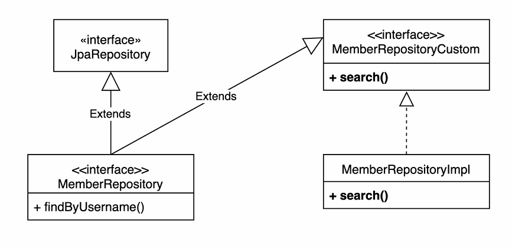

> 해당 글은 김영한님의 인프런 강의 [실전! Querydsl](https://www.inflearn.com/course/querydsl-%EC%8B%A4%EC%A0%84)을 듣고 내용을 정리하기 위한 것으로 자세한 설명은 해당 강의를 통해 확인할 수 있습니다.
> 

---

## 스프링 데이터 JPA 리포지토리 변경

**스프링데이터 JPA - MemberRepository 생성**

이전에 순수 JPA로 만든 리포지토리를 스프링 데이터 JPA 리포지토리로 변경하는데 username으로 member를 조회하는 것 빼고는 다 지원되기 때문에 다음과 같이 작성한다.

```java
public interface MemberRepository extends JpaRepository<Member, Long> {
    List<Member> findByUsername(String username);
}
```

**스프링 데이터 JPA 테스트**

```java
@SpringBootTest
@Transactional
class MemberRepositoryTest {

    @Autowired
    EntityManager em;

    @Autowired
    MemberRepository memberRepository;

    @Test
    public void basicTest() {
        Member member = new Member("member1", 10);
        memberRepository.save(member);

        Member findMember = memberRepository.findById(member.getId()).get();

        assertThat(findMember).isEqualTo(member);

        List<Member> result1 = memberRepository.findAll();
        assertThat(result1).containsExactly(member);

        List<Member> result2 = memberRepository.findByUsername("member1");
        assertThat(result2).containsExactly(member);
    }

}
```

위 테스트를 실행한 결과 올바르게 작동되는것을 확인할수 있다.

- Querydsl 전용 기능인 회원 search를 작성할 수 없다. → 사용자 정의 리포지토리가 필요하다.

---

## 사용자 정의 리포지토리

스프링 데이터 JPA 리포지토리에 Querydsl을 작성하는것이 안되기 때문에 사용자 정의 리포지토리가 필요하다.

**사용자 정의 리포지토리 사용법**

1. 사용자 정의 인터페이스 작성
2. 사용자 정의 인터페이스 구현
3. 스프링 데이터 리포지토리에 사용자 정의 인터페이스 상속

**사용자 정의 리포지토리 구성**



**1.사용자 정의 인터페이스 작성**

```java
public interface MemberRepositoryCustom {
    List<MemberTeamDto> search(MemberSearchCondition condition);
}
```

사용자 정의 인터페이스의 이름은 아무거나 해도 상관없다.

**2.사용자 정의 인터페이스 구현**

```java
public class MemberRepositoryImpl implements MemberRepositoryCustom{

    private final JPAQueryFactory queryFactory;

    public MemberRepositoryImpl(EntityManager em) {
        this.queryFactory = new JPAQueryFactory(em);
    }

    @Override
    public List<MemberTeamDto> search(MemberSearchCondition condition) {
        return queryFactory
                .select(new QMemberTeamDto(
                        member.id,
                        member.username,
                        member.age,
                        team.id,
                        team.name
                ))
                .from(member)
                .leftJoin(member.team, team)
                .where(
                        usernameEq(condition.getUsername()),
                        teamNameEq(condition.getTeamName()),
                        ageGoe(condition.getAgeGoe()),
                        ageLoe(condition.getAgeLoe())
                )
                .fetch();
    }

    private BooleanExpression usernameEq(String username) {
        return hasText(username) ? member.username.eq(username) : null;
    }

    private BooleanExpression teamNameEq(String teamName) {
        return hasText(teamName) ? team.name.eq(teamName) : null;

    }

    private BooleanExpression ageGoe(Integer ageGoe) {
        return ageGoe != null ? member.age.goe(ageGoe) : null;
    }

    private BooleanExpression ageLoe(Integer ageLoe) {
        return ageLoe != null ? member.age.loe(ageLoe) : null;
    }
}
```

사용자 정의 인터페이스 구현체의 이름은 **스프링 데이터 인터페이스 명(MemberRepository) + Impl**로 해야한다.

**3.스프링 데이터 리포지토리에 사용자 정의 인터페이스 상속**

```java
public interface MemberRepository extends JpaRepository<Member, Long>, 
                                                                                    MemberRepositoryCustom {
    List<Member> findByUsername(String username);
}
```

위 방법 처럼 사용자 정의 인터페이스를 만드는 방법도 좋은 방법이지만 핵심 비즈니스 로직에서 재사용 가능성이 있거나, 엔티티를 많이 조회하는경우는 MemberRepository에 작성하고, 공용성이 없고 특정 API 종속되어있는 것들, 즉 수정 라이프 사이클이 API 화면에 맞춰있는 것들은 별도로 조회용 리포지토리를 만드는것도 괜찮은 방법이다.

**커스텀 리포지토리 동작 테스트 추가**

```java
@Test
public void searchTest() {
    Team teamA = new Team("teamA");
    Team teamB = new Team("teamB");
    em.persist(teamA);
    em.persist(teamB);

    Member member1 = new Member("member1", 10, teamA);
    Member member2 = new Member("member2", 20, teamA);

    Member member3 = new Member("member3", 30, teamB);
    Member member4 = new Member("member4", 40, teamB);

    em.persist(member1);
    em.persist(member2);
    em.persist(member3);
    em.persist(member4);

    MemberSearchCondition condition = new MemberSearchCondition();
    condition.setAgeGoe(35);
    condition.setAgeLoe(40);
    condition.setTeamName("teamB");

    List<MemberTeamDto> result = memberRepository.search(condition);

    assertThat(result).extracting("username").containsExactly("member4");
}
```

위 테스트 실행시 올바르게 작동하는것을 알수있다.

---

## 스프링 데이터 페이징 활용1 - Querydsl 페이징 연동

스프링 데이터 Page, Pageable을 활용하여 데이터 내용과 전체 카운트를 한번에 조회하는 단순한 방법과 데이터 내용과 전체 카운트를 별도로 조회하는 방법을 알아보자.

**사용자 정의 인터페이스에 페이징 2가지 추가**

```java
public interface MemberRepositoryCustom {
    List<MemberTeamDto> search(MemberSearchCondition condition);
    Page<MemberTeamDto> searchPageSimple(MemberSearchCondition condition, Pageable pageable);
    Page<MemberTeamDto> searchPageComplex(MemberSearchCondition condition, Pageable pageable);
}
```

페이징을 사용 활용하기 때문에 반환 타입은 Page이고 파라미터에는 Pageable pageable이 들어간다.

### 전체 카운트를 한번에 조회하는 단순한 방법

**searchPageSimple(), fetchResults() 사용**

```java
@Override
public Page<MemberTeamDto> searchPageSimple(MemberSearchCondition condition, Pageable pageable) {
    QueryResults<MemberTeamDto> results = queryFactory
            .select(new QMemberTeamDto(
                    member.id,
                    member.username,
                    member.age,
                    team.id,
                    team.name
            ))
            .from(member)
            .leftJoin(member.team, team)
            .where(
                    usernameEq(condition.getUsername()),
                    teamNameEq(condition.getTeamName()),
                    ageGoe(condition.getAgeGoe()),
                    ageLoe(condition.getAgeLoe())
            )
            .offset(pageable.getOffset())
            .limit(pageable.getPageSize())
            .fetchResults();

    List<MemberTeamDto> content = results.getResults();
    long total = results.getTotal();

    return new PageImpl<>(content, pageable, total);
    }
```

- 파라미터로 받은 pageable을 이용하여 몇번째 페이지 부터 시작할지에 대한 정보를 offset()에, 몇개를 조회 할건지를 limit()에 작성한다.
- Querydsl이 제공하는 fetchResults()를 사용하면 내용과 전체 카운트를 한번에 조회할 수 있다.(실제 쿼리는 content(실제 데이터) 쿼리와, count 쿼리 총 2번 호출)
- fetchResults()는 카운트 쿼리 실행시 필요없는 order by는 제거한다.

**테스트**

```java
@Test
public void searchPageSimple() {
    Team teamA = new Team("teamA");
    Team teamB = new Team("teamB");
    em.persist(teamA);
    em.persist(teamB);

    Member member1 = new Member("member1", 10, teamA);
    Member member2 = new Member("member2", 20, teamA);

    Member member3 = new Member("member3", 30, teamB);
    Member member4 = new Member("member4", 40, teamB);

    em.persist(member1);
    em.persist(member2);
    em.persist(member3);
    em.persist(member4);

    MemberSearchCondition condition = new MemberSearchCondition();
    PageRequest pageRequest = PageRequest.of(0, 3);

    Page<MemberTeamDto> result = memberRepository.searchPageSimple(condition, pageRequest);

    assertThat(result.getSize()).isEqualTo(3);
    assertThat(result.getContent()).extracting("username")
            .containsExactly("member1", "member2", "member3");

}
```

테스트 결과 올바르게 작동하느것을 확인할수 있고 쿼리도 총 2개 나가는것을 확인할수 있다.


### 데이터 내용과 전체 카운트 별도로 조회하는 방법

**searchPageComplex()**

```java
@Override
public Page<MemberTeamDto> searchPageComplex(MemberSearchCondition condition, Pageable pageable) {
    List<MemberTeamDto> content = queryFactory
            .select(new QMemberTeamDto(
                    member.id,
                    member.username,
                    member.age,
                    team.id,
                    team.name
            ))
            .from(member)
            .leftJoin(member.team, team)
            .where(
                    usernameEq(condition.getUsername()),
                    teamNameEq(condition.getTeamName()),
                    ageGoe(condition.getAgeGoe()),
                    ageLoe(condition.getAgeLoe())
            )
            .offset(pageable.getOffset())
            .limit(pageable.getPageSize())
            .fetch();

    long total = queryFactory
            .select(member)
            .from(member)
            .leftJoin(member.team, team)
            .where(
                    usernameEq(condition.getUsername()),
                    teamNameEq(condition.getTeamName()),
                    ageGoe(condition.getAgeGoe()),
                    ageLoe(condition.getAgeLoe())
            )
            .fetchCount();

    return new PageImpl<>(content, pageable, total);
}
```

전체 데이터 내용과 전체 카운트를 한번에 조회하는 방법과 다른점은 fetch()를 사용하여 content(실제 데이터)만 가져오고 따로 fetchCount()를 이용하여 카운트를 가져오는 코드를 작성한다.

- 전체 카운트를 조회 하는 방법을 최적화 할수 있으면 이렇게 분리하면된다.(예를 들어 전체 카운트를 조회할때 조인 쿼리를 줄일수 있다면 상당한 효과가 있다.)
- 코드를 리펙토링해서 내용 쿼리와 전체 카운트 쿼리를 읽기 좋게 분리하면 좋다.

---

## 스프링 데이터 페이징 활용2 - CountQuery 최적화

**PageableExecutionUtils.getPage()로 최적화**

```java
JPAQuery<Member> countQuery = queryFactory
        .select(member)
        .from(member)
        .leftJoin(member.team, team)
        .where(
                usernameEq(condition.getUsername()),
                teamNameEq(condition.getTeamName()),
                ageGoe(condition.getAgeGoe()),
                ageLoe(condition.getAgeLoe())
        );

//return new PageImpl<>(content, pageable, total);
return PageableExecutionUtils.getPage(content, pageable, countQuery::fetchCount);
```

- 스프링 데이터 라이브러리가 제공하낟.
- count 쿼리가 생략 가능한 경우에 생략해서 처리한다.
    - 페이지 시작이면서 컨텐츠 사이즈가 페이지 사이즈보다 작을 때
    - 마지막 페이지 일 때 (offset + 컨텐츠 사이즈를 더해서 전체 사이즈 구함, 더 정확히는 마지막 페이지이면서 컨텐츠 사이즈가 페이지 사이즈보다 작을 때)

---

## 스프링 데이터 페이징 활용3 - 컨트롤러 개발

**컨트롤러**

```java
@RestController
@RequiredArgsConstructor
public class MemberController {

    private final MemberJpaRepository memberJpaRepository;
    private final MemberRepository memberRepository;

    @GetMapping("/v1/members")
    public List<MemberTeamDto> searchMemberV1(MemberSearchCondition condition) {
        return memberJpaRepository.search(condition);
    }

    @GetMapping("/v2/members")
    public Page<MemberTeamDto> searchMemberV2(MemberSearchCondition condition, Pageable pageable) {
        return memberRepository.searchPageSimple(condition, pageable);
    }

    @GetMapping("/v3/members")
    public Page<MemberTeamDto> searchMemberV3(MemberSearchCondition condition, Pageable pageable) {
        return memberRepository.searchPageComplex(condition, pageable);
    }
}
```

- (http://localhost:8080/v2/members?page=0&size=5)로 postman 실행결과

```json
{
    "content": [
        {
            "memberId": 1,
            "username": "member0",
            "age": 0,
            "teamId": 1,
            "teamName": "teamA"
        },
        {
            "memberId": 2,
            "username": "member1",
            "age": 1,
            "teamId": 2,
            "teamName": "teamB"
        },
        {
            "memberId": 3,
            "username": "member2",
            "age": 2,
            "teamId": 1,
            "teamName": "teamA"
        },
        {
            "memberId": 4,
            "username": "member3",
            "age": 3,
            "teamId": 2,
            "teamName": "teamB"
        },
        {
            "memberId": 5,
            "username": "member4",
            "age": 4,
            "teamId": 1,
            "teamName": "teamA"
        }
    ],
    "pageable": {
        "pageNumber": 0,
        "pageSize": 5,
        "sort": {
            "empty": true,
            "sorted": false,
            "unsorted": true
        },
        "offset": 0,
        "paged": true,
        "unpaged": false
    },
    "last": false,
    "totalElements": 100,
    "totalPages": 20,
    "size": 5,
    "number": 0,
    "sort": {
        "empty": true,
        "sorted": false,
        "unsorted": true
    },
    "first": true,
    "numberOfElements": 5,
    "empty": false
}
```

의도한 대로 결과가 나왔고 데이터와 전체 카운트를 한번에 조회하는 것이기때문에 쿼리 결과도 2번 다음과 같이 2번 나가는것을 확인할수 있다.


- (http://localhost:8080/v3/members?page=0&size=110)로 postman 실행결과

```json
{
    "content": [
        {
            "memberId": 1,
            "username": "member0",
            "age": 0,
            "teamId": 1,
            "teamName": "teamA"
        },
        {
            "memberId": 2,
            "username": "member1",
            "age": 1,
            "teamId": 2,
            "teamName": "teamB"
        },
        
        ...
        
        {
            "memberId": 99,
            "username": "member98",
            "age": 98,
            "teamId": 1,
            "teamName": "teamA"
        },
        {
            "memberId": 100,
            "username": "member99",
            "age": 99,
            "teamId": 2,
            "teamName": "teamB"
        }
    ],
    "pageable": {
        "pageNumber": 0,
        "pageSize": 110,
        "sort": {
            "empty": true,
            "sorted": false,
            "unsorted": true
        },
        "offset": 0,
        "paged": true,
        "unpaged": false
    },
    "last": true,
    "totalElements": 100,
    "totalPages": 1,
    "size": 110,
    "number": 0,
    "sort": {
        "empty": true,
        "sorted": false,
        "unsorted": true
    },
    "first": true,
    "numberOfElements": 100,
    "empty": false
}
```

의도한 대로 결과 나왔고, count쿼리가 생략이 가능한 경우인 페이지 시작이면서 먼텐츠 사이즈가 페이지 사이즈보다작은경우 이기때문에 다음과 같이 쿼리 결과가 하나만 호추되는것을 확인할수 있다.


### 스프링 데이터 정렬(Sort)

스프링 데이터 JPA는 자신의 정렬(Sort)을 Querydsl의 정렬(OrderSpecifier)로 편리하게 변경하는 기능을 제공한다. 

스프링 데이터의 정렬을 Querydsl의 정렬로 직접 전환하는 방법은 다음 코드를 참고하자.

**스프링 데이터 Sort를 Querydsl로 OrderSpecifier로 변환**

```java
JPAQuery<Member> query = queryFactory
      .selectFrom(member);
      
for (Sort.Order o : pageable.getSort()) {
                PathBuilder pathBuilder = new PathBuilder(member.getType(), 
                                member.getMetadata());
              query.orderBy(new OrderSpecifier(o.isAscending() ? Order.ASC : Order.DESC,
                        pathBuilder.get(o.getProperty())));
}

List<Member> result = query.fetch();
```

> 정렬(Sort)은 조건이 조인이 포함되는 경우와 같이 조금만 복잡해져도 Pageable의 Sort 기능을 사용하기는 어렵다. 루트 엔티티 범위를 넘어가는 동적 정렬 기능이 필요하면 스프링 데이터 페이징이 제공하는 Sort를 사용하기 보다는 파라미터를 받아서 직접 처리하는 것을 권장한다.
>