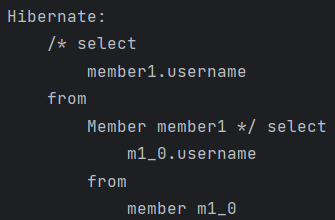

> 해당 글은 김영한님의 인프런 강의 [실전! Querydsl](https://www.inflearn.com/course/querydsl-%EC%8B%A4%EC%A0%84)을 듣고 내용을 정리하기 위한 것으로 자세한 설명은 해당 강의를 통해 확인할 수 있습니다.
> 

---

## 프로젝션 결과 반환 - 기본

프로젝션은 select절의 대상을 지정하는것을 말한다.

### 프로젝션 대상이 하나

```java
@Test
public void simplePorjection() {
    List<String> result = queryFactory
            .select(member.username)
            .from(member)
            .fetch();

    for (String s : result) {
        System.out.println("s = " + s);
    }
}
```

select절에 member.username으로 프로젝션 대상이 하나 이기 때문에 String 타입으로 명확하게 지정이 가능하다.

쿼리 결과와 result 출력 결과를 보면 username의 데이터만 가져오는것을 확인할수 있다.




### 튜플 조회

프로젝션 대상이 둘 이상일때 튜플로 결과를 반환한다.

```java
@Test
public void tupleProjection() {
    List<Tuple> result = queryFactory
            .select(member.username, member.age)
            .from(member)
            .fetch();

    for (Tuple tuple : result) {
        String username = tuple.get(member.username);
        Integer age = tuple.get(member.age);
        System.out.println("username = " + username);
        System.out.println("age = " + age);
    }
}
```

튜플은 con.querydsl.core.Tuple인 Querydsl에 종속적인 타입이기 때문에 리포지토리 계층안에서만 사용하고 다른 계층으로 넘길때는 DTO로 반환하는것을 권장한다.

쿼리 결과와 result 출력 결과를 보면 username과 age의 데이터를 가져오는것을 확인할수 있다


---

## 프로젝션과 결과 반환 - DTO 조회

먼저 순수 JPA에서 DTO를 조회 해보자

**MemberDto**

```java
@Data
@NoArgsConstructor
public class MemberDto {

    private String username;
    private int age;

    public MemberDto(String username, int age) {
        this.username = username;
        this.age = age;
    }
}
```

**순수 JPA에서 DTO 조회 코드**

```java
List<MemberDto> result = em.createQuery(
                        "select new study.querydsl.dto.MemberDto(m.username, m.age) from Member m"
                , MemberDto.class)
        .getResultList();
```

순수 JPA에서 DTO를 조회할 때는 new 명령어를 사용하기때문에 DTO의 package이름을 다 적어줘야해서 지저분하고 생성자 방식(프리티어 방식X)만 지원한다.

### Querydsl 빈 생성(Bean population)

결과를 DTO 반환할때 사용한다.

다음 3가지 방법을 지원한다.

1. 프로퍼티 접근
2. 필드 직접 접근
3. 생성자 사용

**프로퍼티 접근 - Setter**

```java
@Test
public void findDtoBySetter() {
    List<MemberDto> result = queryFactory
            .select(Projections.bean(MemberDto.class,
                    member.username,
                    member.age))
            .from(member)
            .fetch();

    for (MemberDto memberDto : result) {
        System.out.println("memberDto = " + memberDto);
    }
}
```

DTO에 Setter가 있어야지 접근이 가능하다.

쿼리 결과와 result 출력결과를 보면 DTO에 맞게 username, age 값을 가져온다.


**필드 직접 접근**

```java
@Test
public void findDtoByField() {
    List<MemberDto> result = queryFactory
            .select(Projections.fields(MemberDto.class,
                    member.username,
                    member.age))
            .from(member)
            .fetch();

    for (MemberDto memberDto : result) {
        System.out.println("memberDto = " + memberDto);
    }
}
```

Setter가 없어도 되고 필드에 값을 초기화 하는 방식이다

DTO의 필드명과 프로젝션의 필드명이 동일해야 한다.

**별칭이 다를 경우(DTO의 필드명과 엔티티의 필드명이 다를경우)**

```java
@Data
public class UserDto {

    private String name;
    private int age;
}
```

```java
@Test
public void findUserDto() {
    QMember memberSub = new QMember("memberSub");

    List<UserDto> result = queryFactory
            .select(Projections.fields(UserDto.class,
                    member.username.as("name"),
                    ExpressionUtils.as(
                            JPAExpressions
                                    .select(memberSub.age.max())
                                    .from(memberSub), "age")
            ))
            .from(member)
            .fetch();

    for (UserDto userDto : result) {
        System.out.println("userDto = " + userDto);
    }
}
```

프로퍼티나 필드 접근 생성 방식에서 이름이 다를때 해결 방안

- ExpressionUtils.as(Source, alias): 필드나, 서브 쿼리에 별칭을 적용한다.
- username.as(”memberName”): 필드에 별칭을 적용한다.

쿼리 결과와 result 출력 결과를 보면 쿼리문에 별칭이 적용된것을 확인할수있고 결과도 올바르게 나오는것을 확인할수 있다.


**생성자 사용**

```java
@Test
public void findDtoByConstructor() {
    List<MemberDto> result = queryFactory
            .select(Projections.constructor(MemberDto.class,
                    member.username,
                    member.age))
            .from(member)
            .fetch();

    for (MemberDto memberDto : result) {
        System.out.println("memberDto = " + memberDto);
    }
}
```

memberDto의 생성자 파라미터 타입과 프로젝션 타입을 동일하게 맞춰주야 한다.

---

## 프로젝션과 결과 반환 - @QueryProjection

**생성자 + @QueryProjection**

```java
@Data
@NoArgsConstructor
public class MemberDto {

    private String username;
    private int age;

    @QueryProjection
    public MemberDto(String username, int age) {
        this.username = username;
        this.age = age;
    }
}
```

@QueryProjection을 작성후 ./gradlew compileJava를 실행하면 아래 사진처럼 QMemberDto가 생성되는것을 확인할수 있다.


**@QueryProjection 활용**

```java
@Test
public void findDtoByQueryProjection() {
    List<MemberDto> result = queryFactory
            .select(new QMemberDto(member.username, member.age))
            .from(member)
            .fetch();

    for (MemberDto memberDto : result) {
        System.out.println("memberDto = " + memberDto);
    }
}
```

이 방법은 컴파일 시점에 오류를 잡아주고 타입을 체크할수 있으므로 가장 안전한 방법이다. 하지만 DTO에 QueryDSL 어노테이션을 유지해야 하는 점과 DTO까지 Q 파일을 생성해야하는 단점이 있고, DTO에 @QueryProjection 어노테이션으로 인해 Querydsl 라이브러리를 의존해서 나중에 Querydsl의 기술을 바꾸게 된다면 리포지토리 이외의 계층에 영향을 미칠수 있다는 단점이 있다.

쿼리 결과와 result 출력 결과를 보면 Dto에 맞게 쿼리 겨로가와 result 결과가 나온것을 확인할 수 있다.


### distinct

```java
List<String> result = queryFactory
      .select(member.username).distinct()
      .from(member)
      .fetch();
```

---

## 동적 쿼리 - BooleanBuilder 사용

**동적 쿼리를 해결하는 두가지 방식이 있다.**

1. BooleanBuilder
2. Where 다중 파라미터 사용

**BooleanBuilder 사용**

```java
@Test
public void dynamicQuery_BooleanBuilder() {
    String usernameParam = "member1";
    Integer ageParam = 10;

    List<Member> result = searchMember1(usernameParam, ageParam);
    assertThat(result.size()).isEqualTo(1);
}

private List<Member> searchMember1(String usernameCond, Integer ageCond) {

    BooleanBuilder builder = new BooleanBuilder();

    if (usernameCond != null) {
        builder.and(member.username.eq(usernameCond));
    }

    if (ageCond != null) {
        builder.and(member.age.eq(ageCond));
    }

    return queryFactory
            .selectFrom(member)
            .where(builder)
            .fetch();
}
```

BooleanBuilder를 사용해서 username과 age의 값의 null 여부를 판단해서 where절에 조건을 추가할지를 결정한다.

username과 age값이 있다면 다음 쿼리 결과와 같이 파라미터 바인딩이 2개 된것을 확인할 수 있다.


age을 null로 하면 파라미터 바인딩이 1개만 된것을 확인할 수 있다.


---

## 동적 쿼리 - Where 다중 파라미터 사용

```java
@Test
public void dynamicQuery_WhereParam() {
    String usernameParam = "member1";
    Integer ageParam = 10;

    List<Member> result = searchMember2(usernameParam, ageParam);
    assertThat(result.size()).isEqualTo(1);
}

private List<Member> searchMember2(String usernameCond, Integer ageCond) {
    return queryFactory
            .selectFrom(member)
            .where(usernameEq(usernameCond), ageEq(ageCond))
            .fetch();
}

private BooleanExpression usernameEq(String usernameCond) {
    return usernameCond != null ? member.username.eq(usernameCond) : null;
}

private BooleanExpression ageEq(Integer ageCond) {
    return ageCond != null ? member.age.eq(ageCond) : null;
}
```

where 조건에 null은 무시되는 점을 이용하여 여러 조건을 메서드로 생성하여 동적 쿼리를 작성한다. 위 방법은 메서드를 다른 쿼리에서도 재활용할수 있고 메서드의 이름으로 쿼리 자체의 가독성이 높아진다.

**조합 가능**

```java
private BooleanExpression allEq(String usernameCond, Integer ageCond) {
    return usernameEq(usernameCond).and(ageEq(ageCond));
}
```

두개의 조건을 조합하여 하나로 만들수도 있다.

파라미터 값의 null 체크는 주의 해서 처리해야 한다.

---

## 수정, 삭제 벌크 연산

**쿼리 한번으로 대량의 데이터를 수정 해보자**

```java
@Test
public void bulkUpdate() {

    long count = queryFactory
            .update(member)
            .set(member.username, "비회원")
            .where(member.age.lt(28))
            .execute();
}
```

반환값은 변경된 row 수이다.

벌크 연산은 영속성 컨텍스트 말고 DB에 바로 쿼리가 나간다. 그래서 DB의 상태와 영속성 컨텍스트의 상태가 달라진다.

만약 데이터 수정 이후 meber의 값을 가져오는 코드를 실행하면 DB에 sql문을 실행해서 값을 가져오고 가져온 값을 영속성 컨텍스트에 저장하는데 PK값이 같은 것이 영속성 컨텍스트에 있으면 DB에서 가져온 값을 버리고 영속성 컨텍스트의 값을 유지한다.

이러한 문제를 해결하기 위해서는 벌크 연산 이후 아래 코드로 DB와 영속성 컨텍스트의 값을 맞춰준다.

```java
em.flush();
em.clear();
```

**기존 숫자에 1 더하기**

```java
@Test
public void bulkAdd() {
    long count = queryFactory
            .update(member)
            .set(member.age, member.age.add(1))
            .execute();
}
```

빼기 명령어는 없기때문에 값을 뺄때는 add(-1)처럼 작성하면된다.

곱하기는 multiply(x)를 사용하면 된다.

**쿼리 한번으로 대량 데이터 삭제**

```java
@Test
public void bulkDelete() {
    long count = queryFactory
            .delete(member)
            .where(member.age.gt(18))
            .execute();
}
```

---

## SQL function 호출하기

SQL function은 JPA와 같이 Dialect에 등록된 내용만 호출이 가능하다.

member → M으로 변경하는 replace 함수를 사용해보자.

```java
@Test
public void sqlFunction() {
    List<String> result = queryFactory
            .select(Expressions.stringTemplate(
                    "function('replace', {0}, {1}, {2})",
                    member.username, "member", "M"
            ))
            .from(member)
            .fetch();

    for (String s : result) {
        System.out.println("s = " + s);
    }
}
```

쿼리 결과를 보면 jpql은 Expressions.stringTemplate에 작성한것과 동일하게 적용되고 sql문도 replace가 적용된것을 확인할수 있다.


result 출력 결과


소문자로 변경해서 비교해보자.

예제가 좋은 예제가 아니기 때문에 쿼리 문에 집중하자.

```java
@Test
public void sqlFunction2() {
    List<String> result = queryFactory
            .select(member.username)
            .from(member)
            .where(member.username.eq(
                    Expressions.stringTemplate("function('lower', {0})", member.username)
            ))
            .fetch();
}
```

쿼리 결과를 확인해보면 lower function이 적용된것을 확인할수 있다.


lower 같은 ansi 표준 함수들은 querydsl이 상당부분 내장하고있기 대문에 다음과 같이 처리해도 결과는 동일하다.

```java
.where(member.username.eq(member.username.lower()))
```