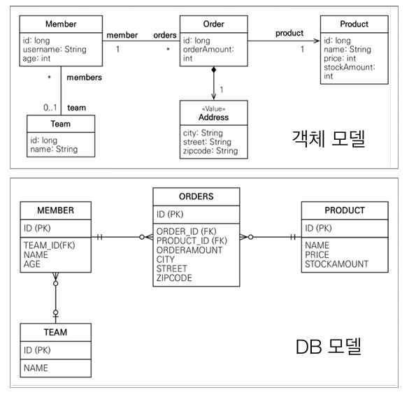

## 객체지향 쿼리 언어 소개

### JPA는 다양한 쿼리 방법을 지원

- **JPQL**
- JPA Criteria
- **QueryDSL**
- 네이티브 SQL
- JDBC API 직접 사용, MyBatis, SpringJdbcTemplate 함께
사용

### JPQL 소개

- 가장 단순한 조회 방법
    - EntityManager.find()
    - 객체 그래프 탐색(a.getB().getC())

### JPQL

- JPA를 사용하면 엔티티 객체를 중심으로 개발
- 문제는 검색 쿼리
- 검색을 할 때도 테이블이 아닌 엔티티 객체를 대상으로 검색
- 모든 DB 데이터를 객체로 변환해서 검색하는 것은 불가능
- 애플리케이션이 필요한 데이터만 DB에서 불러오려면 결국 검색 조건이 포함된 SQL이 필요
- JPA는 SQL을 추상화한 **JPQL이라는 객체 지향 쿼리 언어 제공**
- SQL과 문법 유사, SELECT, FROM, WHERE, GROUP BY, HAVING, JOIN 지원
- JPQL은 엔티티 객체를 대상으로 쿼리
- SQL은 데이터베이스 테이블을 대상으로 쿼리

```java
//검색 
String jpql = "select m From Member m where m.name like ‘%hello%'"; 
List<Member> result = em.createQuery(jpql, Member.class) 
          .getResultList();
```

- 테이블이 아닌 객체를 대상으로 검색하는 객체 지향 쿼리
- SQL을 추상화해서 특정 데이터베이스 SQL에 의존X
- JPQL을 한마디로 정의하면  **객체 지향 SQL**

### JPQL과 실행된 SQL

```java
//검색 
  String jpql = "select m from Member m where m.age > 18"; 
 
  List<Member> result = em.createQuery(jpql, Member.class) 
          .getResultList();
```

```sql
실행된 SQL 
        select 
            m.id as id, 
            m.age as age, 
            m.USERNAME as USERNAME, 
            m.TEAM_ID as TEAM_ID 
        from 
            Member m 
        where 
            m.age>18
```

### Criteria 소개

```java
//Criteria 사용 준비 
CriteriaBuilder cb = em.getCriteriaBuilder(); 
CriteriaQuery<Member> query = cb.createQuery(Member.class);  
 
//루트 클래스 (조회를 시작할 클래스) 
Root<Member> m = query.from(Member.class);  
 
//쿼리 생성 CriteriaQuery<Member> cq =  
query.select(m).where(cb.equal(m.get("username"), “kim”)); 
List<Member> resultList = em.createQuery(cq).getResultList();
```

- 문자가 아닌 자바코드로 JPQL을 작성할 수 있음
- JPQL 빌더 역할
- JPA 공식 기능
- **단점: 너무 복잡하고 실용성이 없다.**
- Criteria 대신에 **QueryDSL 사용 권장**

### QueryDSL 소개

```java
//JPQL 
//select m from Member m where m.age > 18
JPAFactoryQuery query = new JPAQueryFactory(em); 
QMember m = QMember.member; 
 
List<Member> list =  
    query.selectFrom(m) 
         .where(m.age.gt(18)) 
         .orderBy(m.name.desc()) 
          fetch(); 
```

- 문자가 아닌 자바코드로 JPQL을 작성할 수 있음
- JPQL 빌더 역할
- 컴파일 시점에 문법 오류를 찾을 수 있음
- 동적쿼리 작성 편리함
- 단순하고 쉬움
- **실무 사용 권장**

### 네이티브 SQL 소개

- JPA가 제공하는 SQL을 직접 사용하는 기능
- JPQL로 해결할 수 없는 특정 데이터베이스에 의존적인 기능
- 예) 오라클 CONNECT BY, 특정 DB만 사용하는 SQL 힌트

```java
String sql =  
    "SELECT ID, AGE, TEAM_ID, NAME FROM MEMBER WHERE NAME = ‘kim’";  
List<Member> resultList =  
            em.createNativeQuery(sql, Member.class).getResultList();
```

### JDBC 직접 사용, SpringJdbcTemplate 등

- JPA를 사용하면서 JDBC 커넥션을 직접 사용하거나, 스프링 JdbcTemplate, 마이바티스등을 함께 사용 가능
- 단 **영속성 컨텍스트를 적절한 시점에 강제로 플러시** 필요
- 예) JPA를 우회해서 SQL을 실행하기 직전에 영속성 컨텍스트 수동 플러시

---

## JPQL(Java Persistence Query Language)

### JPQL 소개

- JPQL은 객체지향 쿼리 언어다.따라서 테이블을 대상으로 쿼리 하는 것이 아니라 엔티티 객체를 대상으로 쿼리한다.
- JPQL은 SQL을 추상화해서 특정데이터베이스 SQL에 의존하지 않는다.
- JPQL은 결국 SQL로 변환된다.



### JPQL 문법

```sql
select_문 :: =  
    select_절 
    from_절 
    [where_절] 
    [groupby_절] 
    [having_절] 
    [orderby_절] 
update_문 :: = update_절 [where_절] 
delete_문 :: = delete_절 [where_절]
```

- select m from **Member** as m where **m.age** > 18
- 엔티티와 속성은 대소문자 구분O (Member, age)
- JPQL 키워드는 대소문자 구분X (SELECT, FROM, where)
- 엔티티 이름 사용, 테이블 이름이 아님(Member)
- **별칭은 필수(m)** (as는 생략가능)

### 집합과 정렬

```sql
select 
    COUNT(m),   //회원수
    SUM(m.age), //나이 합
    AVG(m.age), //평균 나이
    MAX(m.age), //최대 나이
    MIN(m.age)  //최소 나이
from Member m
```

GROUP BY, HAVING, ORDER BY 모두 가능하다.

### TypeQuery, Query

- TypeQuery: 반환 타입이 명확할 때 사용
- Query: 반환 타입이 명확하지 않을 때 사용

```java
TypedQuery<Member> query = 
    em.createQuery("SELECT m FROM Member m", Member.class);

//username은 String, age는 int 이기때문에 반환 타입이 명확하지 않음
Query query =  
    em.createQuery("SELECT m.username, m.age from Member m");
```

### 결과 조회 API

- query.getResultList(): **결과가 하나 이상**일 때, 리스트 반환
    - 결과가 없으면 빈 리스트 반환
- query.getSingleResult(): **결과가 정확히 하나**, 단일 객체 반환
    - 결과가 없으면: javax.persistence.NoResultException
    - 둘 이상이면: javax.persistence.NonUniqueResultException

### 파라미터 바인딩 - 이름 기준, 위치 기준

```java
//이름 기준
SELECT m FROM Member m where m.username=:username
query.setParameter("username", usernameParam);

//위치 기준
SELECT m FROM Member m where m.username=?1 
query.setParameter(1, usernameParam);
```

위치 기준은 중간에 순서를 하나 추가하게 되면 순서가 밀려서 오류가 날수 있기때문에 사용하지 않는게 좋다.

### 프로젝션

- SELECT 절에 조회할 대상을 지정하는 것
- 프로젝션 대상: 엔티티, 임베디드 타입, 스칼라 타입(숫자, 문자등 기본 데이터 타입)
> 
    
```sql
SELECT m FROM Member m
SELECT m.team FROM Member m
```

    
> 
    
```sql
SELECT m.address FROM Member m
 ```




> 
    
```sql
SELECT m.username, m.age FROM Member m
```


    
- DISTINCT로 중복 제거

### 프로젝션 - 여러 값 조회

username은 String타입이고 age는 int 타입이다.

- SELECT **m.username, m.age** FROM Member m
- 1. Query 타입으로 조회

> 

```java
List resultList = em.createQuery("select m.username, m.age from Member m")
                .getResultList();
                
Object o = resultList.get(0);
Object[] result = (Oject[]) o;
//result[0] -> member1
//resu;t[1] -> 10

List<Object[]> resultList = em.createQuery("select m.username, m.age from Member m")
                .getResultList();
                    
Object[] result = resultList.get(0);
//result[0] -> member1
//resu;t[1] -> 10
```



> 
    
```java
public class MemberDTO{
    
    private String username;
    private int age;
        
    ...
}
    
List<MemberDTO> result = resultList = em.createQuery("select new jpql.MemberDTO(m.username, m.age) from Member m", MemberDTO.class)
                    .getResultList();
                    
MemberDTO memberDTO = result.get(0);
//memberDTO.getUsername() -> member1
//memberDTO.getAge() -> 10
```
    
- 단순 값을 DTO로 바로 조회
SELECT **new** jpabook.jpql.UserDTO(m.username, m.age) FROM
Member m
- 패키지 명을 포함한 전체 클래스 명 입력
- 순서와 타입이 일치하는 생성자 필요



### 페이징 API

- JPA는 페이징을 다음 두 API로 추상화
- **setFirstResult**(int startPosition) : 조회 시작 위치(0부터 시작)
- **setMaxResults**(int maxResult) : 조회할 데이터 수

**페이징 API 예시**

```java
//페이징 쿼리 
String jpql = "select m from Member m order by m.name desc"; 
List<Member> resultList = em.createQuery(jpql, Member.class) 
      .setFirstResult(10) 
      .setMaxResults(20) 
      .getResultList();
```

**MySQL 방언**

```sql
SELECT
    M.ID AS ID,
    M.AGE AS AGE,
    M.TEAM_ID AS TEAM_ID,
    M.NAME AS NAME 
FROM
    MEMBER M 
ORDER BY
    M.NAME DESC LIMIT ?, ?
```

**Oracle 방언**

```sql
SELECT * FROM
    ( SELECT ROW_.*, ROWNUM ROWNUM_ 
    FROM
        ( SELECT
            M.ID AS ID,
            M.AGE AS AGE,
            M.TEAM_ID AS TEAM_ID,
            M.NAME AS NAME 
        FROM MEMBER M 
        ORDER BY M.NAME 
        ) ROW_ 
    WHERE ROWNUM <= ?
    ) 
WHERE ROWNUM_ > ?
```

### 조인

- 내부 조인:
SELECT m FROM Member m [INNER] JOIN m.team t

```java
String query = "select m from Member m inner join m.team t"; //inner 생략가능
List<Member> result = em.createQuery(query, Member.class)
                .getResultList();
```

- 외부 조인:
SELECT m FROM Member m LEFT [OUTER] JOIN m.team t

```java
String query = "select m from Member m letf outer join m.team t"; //outer 생략가능
List<Member> result = em.createQuery(query, Member.class)
                .getResultList();
```

- 세타 조인:
select count(m) from Member m, Team t where m.username = t.name

```java
String query = "select m from Member m, Team t where m.username = t.name"; 
List<Member> result = em.createQuery(query, Member.class)
                .getResultList();
```

**ON 절**

- ON절을 활용한 조인(JPA 2.1부터 지원)
    - 1. 조인 대상 필터링
    - 2.  연관관계 없는 엔티티 외부 조인(하이버네이트 5.1부터)

### 1. 조인 대상 필터링

- 예) 회원과 팀을 조인하면서, 팀 이름이 A인 팀만 조인

```sql
JPQL: 
SELECT m, t FROM 
Member m LEFT JOIN m.team t on t.name = 'A'  

SQL: 
SELECT m.*, t.* FROM  
Member m LEFT JOIN Team t ON m.TEAM_ID=t.id and t.name='A'
```

### 2. 연관관계 없는 엔티티 외부 조인

- 예) 회원의 이름과 팀의 이름이 같은 대상 외부 조인

```sql
JPQL: 
SELECT m, t FROM 
Member m LEFT JOIN Team t on m.username = t.name 

SQL: 
SELECT m.*, t.* FROM  
Member m LEFT JOIN Team t ON m.username = t.name
```

### 서브 쿼리

- 나이가 평균보다 많은 회원

```sql
select m from Member m 
where m.age > (select avg(m2.age) from Member m2) 
```

- 한 건이라도 주문한 고객

```sql
select m from Member m 
where (select count(o) from Order o where m = o.member) > 0
```

### 서브 쿼리 지원 함수

- [NOT] EXISTS (subquery): 서브쿼리에 결과가 존재하면 참
    - {ALL | ANY | SOME} (subquery)
    - ALL 모두 만족하면 참
    - ANY, SOME: 같은 의미, 조건을 하나라도 만족하면 참
- [NOT] IN (subquery): 서브쿼리의 결과 중 하나라도 같은 것이 있으면 참

**예제**

- 팀A 소속인 회원

```sql
select m from Member m 
where exists (select t from m.team t where t.name = ‘팀A')
```

- 전체 상품 각각의 재고보다 주문량이 많은 주문들

```sql
select o from Order o  
where o.orderAmount > ALL (select p.stockAmount from Product p) 
```

- 어떤 팀이든 팀에 소속된 회원

```sql
select m from Member m  
where m.team = ANY (select t from Team t)
```

### JPA 서브 쿼리 한계

- JPA는 WHERE, HAVING 절에서만 서브 쿼리 사용 가능
- SELECT 절도 가능(하이버네이트에서 지원)
- **FROM 절의 서브 쿼리는 현재 JPQL에서 불가능**
    - **조인으로 풀 수 있으면 풀어서 해결**

### 하이버네이트6 변경 사항

- 하이버네이트6 부터는 FROM 절의 서브쿼리를 지원합니다.

### JPQL 타입 표현

- 문자: ‘HELLO’, ‘She’’s’
- 숫자: 10L(Long), 10D(Double), 10F(Float)
- Boolean: TRUE, FALSE
- ENUM: jpabook.MemberType.Admin (패키지명 포함)
- 엔티티 타입: TYPE(m) = Member (상속 관계에서 사용)

```java
em.createQuery("select i from Item i where type(i) = Book", Item.class)
            .getResultList();
```

### JPQL 기타

- SQL과 문법이 같은 식
- EXISTS, IN
- AND, OR, NOT
- =, >, >=, <, <=, <>
- BETWEEN, LIKE, **IS NULL**

### 조건식 - CASE 식

기본 CASE 식

```java
String query = 
                "select " +
                    "case when m.age <= 10 then '학생요금' " +
                  "     when m.age >= 60 then '경로요금' " +
                    "else '일반요금' " +
                    "end " +
                "from Member m";
List<String> result = em.createQuery(query, String.class)
                .getResultList();
```

단순 CASE 식

```sql
select 
    case t.name 
        when '팀A' then '인센티브110%'
        when '팀B' then '인센티브120%'
        else '인센티브105%' 
    end 
from Team t
```

- COALESCE: 하나씩 조회해서 null이 아니면 반환
- NULLIF: 두 값이 같으면 null 반환, 다르면 첫번째 값 반환

사용자 이름이 없으면 이름 없는 회원을 반환

```sql
select coalesce(m.username,'이름 없는 회원') from Member m
```

사용자 이름이 ‘관리자’면 null을 반환하고 나머지는 본인의 이름을반환

```sql
select NULLIF(m.username, '관리자') from Member m
```

### JPQL 기본 함수

- CONCAT

```java
//오류나면 Un-inject Language
String query = "select 'a' || 'b' From Member m;
String query = "select concat('a', 'b') From Member m;
```

- SUBSTRING

```java
String query = "select substring(m.username, 2, 3) From Member m;
```

- TRIM
- LOWER, UPPER
- LENGTH
- LOCATE
- ABS, SQRT, MOD
- SIZE, INDEX(JPA 용도)

```java
//Team의 members의 컬렉션 크기를 반환
String query = "select size(t.members) From Team t";

//@OrderColumn을 사용한 경우에 사용가능, 사용 비추천
String query = "select index(t.members) From Team t";
```

### 사용자 정의 함수 호출

- 하이버네이트는 사용전 방언에 추가해야 한다.
    - 사용하는 DB 방언을 상속받고, 사용자 정의 함수를 등록한다.

```java
public class MyH2Dialect extends H2Dialect {
    public MyH2Dialect(){
        regusterFunction("group_concat", new StandardSQLFunction("group_concat", StandardBasicTypes.STRING))
    }
}
```

등록 방법은 다 외우는 것은 불가능하기 떄문에 H2Dialect를 참고해서 작성해야한다.

```sql
select function('group_concat', i.name) from Item i
```

설정 파일에도 MyH2Dialect로 바꿔줘야한다.