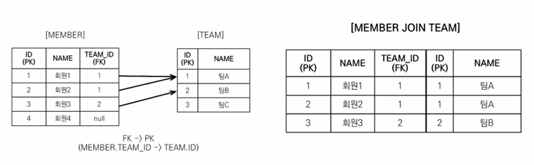

> 해당 글은 김영한님의 인프런 강의 [자바 ORM 표준 JPA 프로그래밍 - 기본편](https://www.inflearn.com/course/ORM-JPA-Basic)을 듣고 내용을 정리하기 위한 것으로 자세한 설명은 해당 강의를 통해 확인할 수 있습니다.
> 

## JPQL - 경로 표현식

경로 표현식은 .(점)을 찍어 객체 그래프를 탐색하는 것이다.

```sql
select m.username -> 상태 필드 
  from Member m  
    join m.team t    -> 단일 값 연관 필드 
    join m.orders o -> 컬렉션 값 연관 필드 
where t.name = '팀A'
```

### 경로 표현식 용어 정리

- **상태 필드**(state field): 단순히 값을 저장하기 위한 필드(ex: m.username)
- **연관 필드**(association field): 연관관계를 위한 필드
    - **단일 값 연관 필드**:
    @ManyToOne, @OneToOne, 대상이 엔티티(ex: m.team)
    - **컬렉션 값 연관 필드**:
    @OneToMany, @ManyToMany, 대상이 컬렉션(ex: m.orders)

### 경로 표현식 특징

- **상태 필드**(state field): 경로 탐색의 끝, 탐색X
    - 더이상 m.username.~~로 이어질수 없다.
- **단일 값 연관 경로:** 묵시적 내부 조인(inner join) 발생, 탐색O
- **컬렉션 값 연관 경로**: 묵시적 내부 조인 발생, 탐색X
    - FROM 절에서 명시적 조인을 통해 별칭을 얻으면 별칭을 통해 탐색 가능
    
    ```java
    String query = "select m From Team t join t.members m";
    ```
    

실무에서는 묵시적 조인보다 명시적 조인을 쓰는게 좋다.명시적 조인을 써야 실제 쿼리 튜닝도 쉬복 JPQL을 튜닝하면 쿼리가 튜닝되기 때문이다.

### 상태 필드 경로 탐색

- JPQL: select m.username, m.age from Member m
- SQL: select m.username, m.age from Member m

### 단일 값 연관 경로 탐색

- JPQL: select **o.member** from Order o
- SQL:
select m.*  
from Orders o  
**inner join Member m on o.member_id = m.id**

묵시적 조인이 발생한다.

### 명시적 조인, 묵시적 조인

- 명시적 조인: join 키워드 직접 사용
    - select m from Member m **join m.team t**
- 묵시적 조인: 경로 표현식에 의해 묵시적으로 SQL 조인 발생
(내부 조인만 가능)
    - select **m.team** from Member m

### 경로 표현식 - 예제

- select o.member.team from Order o -> 성공
    
    묵시적 조인이 2번 발생한다.
    
- select t.members from Team -> 성공
    
    members가 컬렉션이지만 t.member에서 끝났기때문에 성공
    
- select t.members.username from Team t -> 실패
    
    members 컬렉션에서 한번더 값을 조회하는건 불가능
    
- select m.username from Team t join t.members m -> 성공
    
    join t.member로 명시적 조인으로 가져오고 별칭 m을 을 사용해서 m.username으로 했기때문에 성공
    

### 경로 탐색을 사용한 묵시적 조인 시 주의사항

- 항상 내부 조인
- 컬렉션은 경로 탐색의 끝, 명시적 조인을 통해 별칭을 얻어야함
- 경로 탐색은 주로 SELECT, WHERE 절에서 사용하지만 묵시적 조인으로 인해 SQL의 FROM (JOIN) 절에 영향을 줌

### 실무 조언

- **가급적 묵시적 조인 대신에 명시적 조인 사용**
- 조인은 SQL 튜닝에 중요 포인트
- 묵시적 조인은 조인이 일어나는 상황을 한눈에 파악하기 어려움

## JPQL - 페치 조인(fetch join)

**페치 조인은 실무에서 정말 중요하다.**

### 페치 조인(fetch join)

- SQL 조인 종류X
- JPQL에서 **성능 최적화**를 위해 제공하는 기능
- 연관된 엔티티나 컬렉션을 **SQL 한 번에 함께 조회**하는 기능
- join fetch 명령어 사용
- 페치 조인 ::= [ LEFT [OUTER] | INNER ] JOIN FETCH 조인경로

### 엔티티 페치 조인

- 회원을 조회하면서 연관된 팀도 함께 조회(SQL 한 번에)
- SQL을 보면 회원 뿐만 아니라 <strong>팀(T)</strong>
 도 함께 **SELECT**
- **[JPQL]**

```sql
select m from Member m join fetch m.team
```

- **[SQL]**

```sql
SELECT M.*, T.* FROM MEMBER M
INNER JOIN TEAM T ON M.TEAM_ID=T.ID
```




### 페치 조인 사용 코드

```java
String jpql = "select m from Member m join fetch m.team"; 
List<Member> members = em.createQuery(jpql, Member.class) 
                                               .getResultList(); 
for (Member member : members) { 
//페치 조인으로 회원과 팀을 함께 조회해서 지연 로딩X 
    System.out.println("username = " + member.getUsername() + ", " + 
                                "teamName = " + member.getTeam().name());  
}
```

username = 회원1, teamname = 팀A  
username = 회원2, teamname = 팀A  
username = 회원3, teamname = 팀B

### 컬렉션 페치 조인

- 일대다 관계, 컬렉션 페치 조인
- **[JPQL]**

```sql
select t 
from Team t join fetch t.members 
where t.name = ‘팀A' 
```

- **[SQL]**

```sql
SELECT T.*, M.* 
FROM TEAM T 
INNER JOIN MEMBER M ON T.ID=M.TEAM_ID 
WHERE T.NAME = '팀A' 
```


### 컬렉션 페치 조인 사용 코드

```java
String jpql = "select t from Team t join fetch t.members where t.name = '팀A'" 
List<Team> teams = em.createQuery(jpql, Team.class).getResultList(); 
for(Team team : teams) { 
    System.out.println("teamname = " + team.getName() + ", team = " + team); 
    for (Member member : team.getMembers()) { 
      //페치 조인으로 팀과 회원을 함께 조회해서 지연 로딩 발생 안함 
      System.out.println("-> username = " + member.getUsername()+ ", member = " + member); 
  } 
}
```

teamname = 팀A, team = Team@0x100  
-> username = 회원1, member = Member@0x200  
-> username = 회원2, member = Member@0x300  
teamname = 팀A, team = Team@0x100  
-> username = 회원1, member = Member@0x200  
-> username = 회원2, member = Member@0x300

### 페치 조인과 DISTINCT

- SQL의 DISTINCT는 중복된 결과를 제거하는 명령
- JPQL의 DISTINCT 2가지 기능 제공
    - 1. SQL에 DISTINCT를 추가
    - 2. 애플리케이션에서 엔티티 중복 제거

### 페치 조인과 DISTINCT

- select **distinct** t  
from Team t join fetch t.members  
where t.name = ‘팀A’
- SQL에 DISTINCT를 추가하지만 데이터가 다르므로 SQL 결과에서 중복제거 실패


- DISTINCT가 추가로 애플리케이션에서 중복 제거시도
- 같은 식별자를 가진 Team 엔티티 제거


[DISTINCT 추가시 결과]  
teamname = 팀A, team = Team@0x100  
-> username = 회원1, member = Member@0x200  
-> username = 회원2, member = Member@0x300

### 하이버네이트6 변경 사항

- DISTINCT가 추가로 애플리케이션에서 중복 제거시도
- **-> 하이버네이트6 부터는 DISTINCT 명령어를 사용하지 않아도 애플리케이션에서 중복 제거가 자동으로 적용됩니다.**

### 페치 조인과 일반 조인의 차이

- 일반 조인 실행시 연관된 엔티티를 함께 조회하지 않음
- **[JPQL]**

```sql
select t 
from Team t join t.members m 
where t.name = ‘팀A' 
```

- **[SQL]**

```sql
SELECT T.* 
FROM TEAM T 
INNER JOIN MEMBER M ON T.ID=M.TEAM_ID  
WHERE T.NAME = '팀A'
```

### 페치 조인과 일반 조인의 차이

- JPQL은 결과를 반환할 때 연관관계 고려X
- 단지 SELECT 절에 지정한 엔티티만 조회할 뿐
- 여기서는 팀 엔티티만 조회하고, 회원 엔티티는 조회X
- 페치 조인을 사용할 때만 연관된 엔티티도 함께 **조회(즉시 로딩)**
- **페치 조인은 객체 그래프를 SQL 한번에 조회하는 개념**

### 페치 조인 실행 예시

- 페치 조인은 연관된 엔티티를 함께 조회함
- **[JPQL]**

```sql
select t  
from Team t join fetch t.members 
where t.name = ‘팀A'
```

- [SQL]

```sql
SELECT T.*, M.* 
FROM TEAM T 
INNER JOIN MEMBER M ON T.ID=M.TEAM_ID  
WHERE T.NAME = '팀A
```

### 페치 조인의 특징과 한계

- **페치 조인 대상에는 별칭을 줄 수 없다.**
    - 하이버네이트는 가능, 가급적 사용X
    
    ```java
    String query = "select t From Team t join fetch t.member m"
    // join fetch t.members m 불가능
    ```
    
    패치 조인은 기본적으로 연관된 것들을 다 가져오는 거다. 하지만 별칭을 사용해서 성능상 중간에 몇개를 걸러서 가지고 오고싶어서 where절에 별칭을 통한 조건을 넣고 조회하면 잘못 조작하면 나중에 이상하게 동작할수 있다.
    
- **둘 이상의 컬렉션은 페치 조인 할 수 없다.**
    - 일대다대다 이기때문에 데이터가 예상치 못하게 늘어날수 있다.
- **컬렉션을 페치 조인하면 페이징 API(setFirstResult,
setMaxResults)를 사용할 수 없다.**
    - 일대일, 다대일 같은 단일 값 연관 필드들은 페치 조인해도 페이징 가능
    - 하이버네이트는 경고 로그를 남기고 메모리에서 페이징(매우 위험)

### 페치 조인의 특징과 한계

- 연관된 엔티티들을 SQL 한 번으로 조회 - 성능 최적화
- 엔티티에 직접 적용하는 글로벌 로딩 전략보다 우선함
    - @OneToMany(fetch = FetchType.LAZY) //글로벌 로딩 전략
- 실무에서 글로벌 로딩 전략은 모두 지연 로딩
- 최적화가 필요한 곳은 페치 조인 적용

### 페치 조인 - 정리

- 모든 것을 페치 조인으로 해결할 수 는 없음
- 페치 조인은 객체 그래프를 유지할 때 사용하면 효과적
- 여러 테이블을 조인해서 엔티티가 가진 모양이 아닌 전혀 다른결과를 내야 하면, 페치 조인 보다는 일반 조인을 사용하고 필요한 데이터들만 조회해서 DTO로 반환하는 것이 효과적
- 페치 조인 3가지 방법
    - 엔티티를 패치 조인을 사용해서 조회
    - 패치 조인을 하고 애플리케이션에서 DTO로 바꿔서 화면에 반환
    - JPA 작성할때부터 DTO로 스위칭

## JPQL - 다형성 쿼리


### TYPE

- 조회 대상을 특정 자식으로 한정
- 예) Item 중에 Book, Movie를 조회해라
- **[JPQL]**

```sql
select i from Item i 
where type(i) IN (Book, Movie)
```

- **[SQL]**

```sql
select i from i 
where i.DTYPE in (‘B’, ‘M’)
```

### TREAT(JPA 2.1)

- 자바의 타입 캐스팅과 유사
- 상속 구조에서 부모 타입을 특정 자식 타입으로 다룰 때 사용
- FROM, WHERE, SELECT(하이버네이트 지원) 사용
- 예) 부모인 Item과 자식 Book이 있다.
- **[JPQL]**

```sql
select i from Item i 
where treat(i as Book).author = ‘kim’
```

- **[SQL]**

```sql
select i.* from Item i 
where i.DTYPE = ‘B’ and i.author = ‘kim’
```

### JPQL - 엔티티 직접 사용

## 엔티티 직접 사용 - 기본 키 값

- JPQL에서 엔티티를 직접 사용하면 SQL에서 해당 엔티티의 기본 키 값을 사용
- **[JPQL]**

```sql
select count(m.id) from Member m //엔티티의 아이디를 사용 
select count(m) from Member m    //엔티티를 직접 사용
```

- **[SQL]**(JPQL 둘다 같은 다음 SQL 실행)

```sql
select count(m.id) as cnt from Member m
```

엔티티를 파라미터로 전달

```java
String jpql = "select m from Member m where m = :member"; 
List resultList = em.createQuery(jpql)  
                    .setParameter("member", member) 
                    .getResultList();
```

식별자를 직접 전달

```java
String jpql = "select m from Member m where m.id = :memberId"; 
List resultList = em.createQuery(jpql)  
                    .setParameter("memberId", memberId) 
                    .getResultList();
```

실행된 SQL

```sql
select m.* from Member m where m.id=?
```

엔티티를 파라미터로 전달한것과 식별자를 직접 전달한것의 실행된 SQL은 동일하다. 엔티티가 DB에 넘어가면 DB의 PK값이기 때문이다.

### 엔티티 직접 사용- 외래 키 값

```java
Team team = em.find(Team.class, 1L); 

String qlString = "select m from Member m where m.team = :team"; 
List resultList = em.createQuery(qlString) 
                    .setParameter("team", team) 
                    .getResultList();
                    
String qlString = "select m from Member m where m.team.id = :teamId"; 
List resultList = em.createQuery(qlString) 
                    .setParameter("teamId", teamId) 
                    .getResultList(); 
```

파라미터로 넘긴 Team은 PK이고, m.team은 DB 입장에서는 FK와 맵핑 된다.

실행된 SQL

```sql
select m.* from Member m where m.team_id=?
```

## JPQL - Named 쿼리

### Named 쿼리 - 정적 쿼리

- 미리 정의해서 이름을 부여해두고 사용하는 JPQL
- 정적 쿼리
- 어노테이션, XML에 정의
- 애플리케이션 로딩 시점에 초기화 후 재사용
- **애플리케이션 로딩 시점에 쿼리를 검증**
    
    만약 “select m from MemberQQQ … ”처럼 문법 오류가나면 로딩 시점에 오류가 발생한다.
    

### Named 쿼리 - 어노테이션

```java
@Entity
@NamedQuery(
       name = "Member.findByUsername",
       query="select m from Member m where m.username = :username")
public class Member {
   ...
}

List<Member> resultList = 
em.createNamedQuery("Member.findByUsername", Member.class)
      .setParameter("username", "회원1")
      .getResultList();

```

Named 쿼리 어노테이션을 사용하면 멤버 엔티티가 너무 지저분해지고 실무에서는 아래 코드처럼 Spring Data JPA를 섞어쓰기때문에 비추천한다. 아래도 어플리케이션 로딩 시점에 검증이 된다.

```java
//Spring Dat JPA 공식 문서에 있는 예시 중 하나이다.
public interface UserReposior extends JpaRepository<User, Long> {

    @Query("select u from User u where u.emailAddress = ?1")
    User findByEmailAddress(String emailAddress);
}
```

## JPQL - 벌크 연산

### 벌크 연산

- 재고가 10개 미만인 모든 상품의 가격을 10% 상승하려면?
- JPA 변경 감지 기능으로 실행하려면 너무 많은 SQL 실행
    - 1. 재고가 10개 미만인 상품을 리스트로 조회한다.
    - 2. 상품 엔티티의 가격을 10% 증가한다.
    - 3. 트랜잭션 커밋 시점에 변경감지가 동작한다.
- 변경된 데이터가 100건이라면 100번의 UPDATE SQL 실행

### 벌크 연산 예제

- 쿼리 한 번으로 여러 테이블 로우 변경(엔티티)
- **executeUpdate()의 결과는 영향받은 엔티티 수 반환**
- **UPDATE, DELETE 지원**
- **INSERT(insert into .. select, 하이버네이트 지원)**

```java
String qlString = "update Product p " + 
                  "set p.price = p.price * 1.1 " +  
                  "where p.stockAmount < :stockAmount";  
int resultCount = em.createQuery(qlString) 
                    .setParameter("stockAmount", 10)  
                    .executeUpdate(); 
```

### 벌크 연산 주의

- 벌크 연산은 영속성 컨텍스트를 무시하고 데이터베이스에 직접 쿼리
    
    벌크 연산을 먼저 실행하고 **벌크 연산 수행후 영속성 컨텍스트 초기화를 하면된다.**