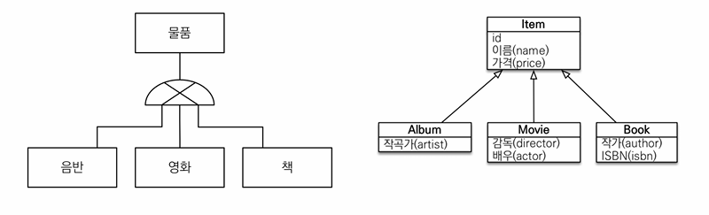

> 해당 글은 김영한님의 인프런 강의 [자바 ORM 표준 JPA 프로그래밍 - 기본편](https://www.inflearn.com/course/ORM-JPA-Basic)을 듣고 내용을 정리하기 위한 것으로 자세한 설명은 해당 강의를 통해 확인할 수 있습니다.
> 

---

## 상속관계 매핑

- 관계형 데이터베이스는 상속 관계X
- 슈퍼타입 서브타입 관계라는 모델링 기법이 객체 상속과 유사
- 상속관계 매핑: 객체의 상속과 구조와 DB의 슈퍼타입 서브타입 관계를 매핑



### 슈퍼 타입 서브타입 논리 모델을 실제 물리 모델로 구현하는 방법

- 각각 테이블로 변환 → 조인 전략
- 통합 테이블로 변환 → 단일 테이블 전략
- 서브타입 테이블로 변환 → 구현 클래스마다 테이블 전략

### 주요 어노테이션

- @Inheritance([strategy=InheritanceType.XXX](http://strategy=inheritancetype.xxx/))
    - **JOINED**: 조인 전략
    - **SINGLE_TABLE**: 단일 테이블 전략
    - **TABLE_PER_CLASS**: 구현 클래스마다 테이블 전략
- @DiscriminatorColumn(name=“DTYPE”)
- @DiscriminatorValue(“XXX”)
자식 클래스의 DTYPE 이름을 변경할때 사용한다.기본값은 엔티티 명이다.

### 조인 전략


> 

    
ITEM 엔티티
    
```java
@Entity
@Inheritance(strategy = InheritanceType.JOINED)
@DiscriminatorColumn
public class Item{
    @Id @GeneratedValue
    private Long id;
    
    private String name;
    private int price;
    
    ...
}
```
    
ALBUM 엔티티
    
```java
@Entity
@DiscriminatorValue("A") //DB의 DTYPE에 저장되는 이름 바꾸기
public class Album extends Item{
    private String artist;
    
    ...
}
```
    
MOVIE 엔티티

```java
@Entity
public class Movie extends Item{
    private String director;
    private String actor;
      
    ...
}
```
    
BOOK엔티티

```java
@Entity
public class Book extends Item{
    private String author;
    private String isbn;
     
    ...
}
```
    


ITEM의 name, price가 중복이 안되고 ALBUM, MOVIE, BOOK이 각가 다른 데이터들이 있는 방식으로 DB를 잘 정규화한 모델링이고 JPA와 가장 유사한 모델이다.

**장점**

- 테이블 정규화
- 외래 키 참조 무결성 제약 조건 활용가능
- 저장공간 효율화

**단점**

- 조회시 조인을 많이 사용, 성능 저하
- 조회 쿼리가 복잡함
- 데이터 저장시 INSERT SQL 2번 호출

### 단일 테이블 전략


> 
```java
@Entity
@Inheritance(strategy = InheritanceType.SINGLE_TABLE)
public class Item{
    @Id @GeneratedValue
    private Long id;
     
    private String name;
    private int price;
     
    ...
}
```

    

@Inheritance(strategy = InheritanceType.SINGLE_TABLE)로 변경해주면 된다.
단일 테이블 전략은 ALBUM, MOVIE, BOOK 인지 알기 위해서 @DiscriminatorColumn이 필수 이기때문에 @DiscriminatorColumn적지 않아도 생성된다.

**장점**

- 조인이 필요 없으므로 일반적으로 조회 성능이 빠름
- 조회 쿼리가 단순함

**단점**

- 자식 엔티티가 매핑한 컬럼은 모두 null 허용
- 단일 테이블에 모든 것을 저장하므로 테이블이 커질 수 있다. 상황에 따라서 조회 성능이 오히려 느려질 수 있다.

### 구현 클래스 마다 테이블 전략


> 
```java
@Entity
@Inheritance(strategy = InheritanceType.SINGLE_TABLE)
public abstract class Item{
    @Id @GeneratedValue
    private Long id;
    
    private String name;
    private int price;
    
    ...
}
```

    

Item 클래스를 abstract로 변경하고 @Inheritance(strategy = InheritanceType.SINGLE_TABLE)로 변경해주면 된다.

**이 전략은 데이터베이스 설계자와 ORM 전문가 둘 다 추천X**

**장점**

- 서브 타입을 명확하게 구분해서 처리할 때 효과적
- not null 제약조건 사용 가능

**단점**

- 여러 자식 테이블을 함계 조회할 때 성능이 느림(UNION SQL 필요)
- 자식 테이블을 통합해서 쿼리하기 어려움

### 전략 선택

기본적으로는 조인전략을 가지고 가는데 조인전략의 장단점이랑 단일 테이블 전략의 장단점 두가지를 가지고 뭘할지 결정하면된다.

---

## @MappedSuperclass

- 공통 매핑 정보가 필요할 때 사용(id, name)


> 

```java
@MappedSuperClass
public class BaseEntity{
    ....
}
```
    
@MapedSuperClass 필요

```java
@Entity
public class Member extends BaseEntity{

    ...
}
```

BaseEntity 상속

    

DB는 Member와 Seller를 따로 사용하지만, 객체 입장에서 Member와 Seller의 id, name의 속성만 상속 받고 싶을때 사용한다.
예를 들어서 모든 테이블에 마지막으로 수정한 사람 이름과 날짜가 필요한 상황에서 공통으로 필요하기때문에 이같은 상황에서 사용 가능하다.

- 상속관계 매핑x
- 엔티티X, 테이블과 매핑X
- 부모 클래스를 상속 받는 **자식 클래스에 매핑 정보만 제공**
- 조회, 검색 불가(**em.find(BaseEntity) 불가**)
- 테이블과 관계 없고, 단순히 엔티티가 공통으로 사용하는 매핑 정보를 모으는 역할
- 주로 등록일, 수정일, 등록자, 수정자 같은 전체 엔티티에서 공통으로 적용하는 정보를 모을 때 사용
- 참고: @Entity 클래스는 엔티티나 @MappedSuperclass로 지
정한 클래스만 상속 가능

---

## 실전 예제 - 4. 상속관계 매핑

> 실전 예제의 코드를 확인하고 싶으면 김영한님의 인프런 강의 [자바 ORM 표준 JPA 프로그래밍 - 기본편](https://www.inflearn.com/course/ORM-JPA-Basic)에서 확인 하실수 있습니다.
> 

### 요구사항 추가

- 상품의 종류는 음반, 도서, 영화가 있고 이후 더 확장될 수 있다.
- 모든 데이터는 등록일과 수정일이 필수다.

### 도메인 모델


### 도메인 모델 상세


### 테이블 설계

