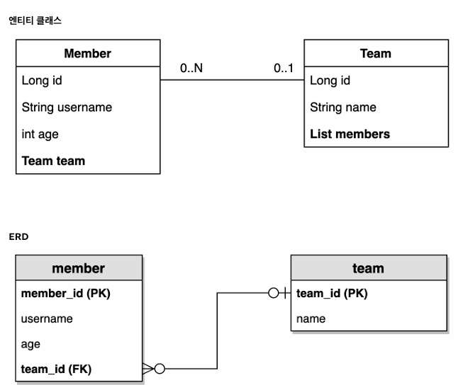

> 해당 글은 김영한님의 인프런 강의 [실전! 스프링 데이터 JPA](https://www.inflearn.com/course/%EC%8A%A4%ED%94%84%EB%A7%81-%EB%8D%B0%EC%9D%B4%ED%84%B0-JPA-%EC%8B%A4%EC%A0%84)을 듣고 내용을 정리하기 위한 것으로 자세한 설명은 해당 강의를 통해 확인할 수 있습니다.
> 

---

예제 도메인 모델을 엔티티 클래스와 ERD만 확인하고 넘어가겠다.



---

## 순수 JPA 기반 리포지토리 만들기

- 기본 CRUD
    - 저장
    - 변경 → 변경 감지 사용
    - 삭제
    - 전체 조회f
    - 단건 조회
    - 카운트

> JPA에서 수정은 변경감지 기능을 사용하면 된다.
트랜잭션 안에서 엔티티를 조회한 다음에 데이터를 변경하면, 트랜잭션 종료 시점에 변경감지 기능이 작동해서 변경된 엔티티를 감지하고 UPDATE SQL을 실행한다.
> 

**순수 JPA 기반 리포지토리 - 회원**

```java
@Repository
public class MemberJpaRepository {

    @PersistenceContext
    private EntityManager em;

    public Member save(Member member) {
        em.persist(member);
        return member;
    }

    public void delete(Member member) {
        em.remove(member);
    }

    public List<Member> findAll() {
        return em.createQuery("select m from Member m", Member.class)
                .getResultList();
    }

    public Optional<Member> findById(Long id) {
        Member member = em.find(Member.class, id);
        return Optional.ofNullable(member);
    }

    public long count() {
        return em.createQuery("select count(m) from Member m", Long.class)
                .getSingleResult();
    }

    public Member find(Long id) {
        return em.find(Member.class, id);
    }

}
```

**순수 JPA 기반 리포지토리 - 팀**

```java
@Repository
public class TeamJpaRepository {

    @PersistenceContext
    private EntityManager em;

    public Team save(Team team) {
        em.persist(team);
        return team;
    }

    public void delete(Team team) {
        em.remove(team);
    }

    public List<Team> findAll() {
        return em.createQuery("select t from Team t", Team.class)
                .getResultList();
    }

    public Optional<Team> findById(Long id) {
        Team team = em.find(Team.class, id);
        return Optional.ofNullable(team);
    }

    public long count() {
        return em.createQuery("select count(t) from Team t", Long.class)
                .getSingleResult();
    }
}
```

회원 리포지토리와 거의 동일하다

**순수 JPA 기반 리포지토리 테스트**

```java
@SpringBootTest
@Transactional
@Rollback(value = false)
class MemberJpaRepositoryTest {

    @Autowired
    MemberJpaRepository memberJpaRepository;

    @Test
    public void testMember() throws Exception{
        //given
        Member member = new Member("memberA");

        //when
        Member savedMember = memberJpaRepository.save(member);

        Member findMember = memberJpaRepository.find(savedMember.getId());

        //then
        assertThat(findMember.getId()).isEqualTo(member.getId());
        assertThat(findMember.getUsername()).isEqualTo(member.getUsername());
        assertThat(findMember).isEqualTo(member);
    }

    @Test
    public void basicCRUD() throws Exception{
        //given
        Member member1 = new Member("member1");
        Member member2 = new Member("member2");
        memberJpaRepository.save(member1);
        memberJpaRepository.save(member2);

        //단건 조회 검증
        Member findMember1 = memberJpaRepository.findById(member1.getId()).get();
        Member findMember2 = memberJpaRepository.findById(member2.getId()).get();
        assertThat(findMember1).isEqualTo(member1);
        assertThat(findMember2).isEqualTo(member2);

        //리스트 조회 검증
        List<Member> all = memberJpaRepository.findAll();
        assertThat(all.size()).isEqualTo(2);

        //카운트 검증
        long count = memberJpaRepository.count();
        assertThat(count).isEqualTo(2);

        //삭제 검증
        memberJpaRepository.delete(member1);
        memberJpaRepository.delete(member2);

        long deletedCount = memberJpaRepository.count();
        assertThat(deletedCount).isEqualTo(0);
    }

}
```

위 테스트를 통해서 기본 CRUD를 검증한다.

---

## 공통 인터페이스 설정

**JavaConfig 설정(스프링 부트 사용시 생략 가능)**

```java
 @Configuration
 @EnableJpaRepositories(basePackages = "jpabook.jpashop.repository")
 public class AppConfig {}
```

스프링 부트를 사용하면 @SpringBootApplication 위치를 지정하여 해당 패키지와 하위 패키지를 인식한다. @SpringBootApplication은 대부분 최상단에 위치해 있기 때문에  대부분 스캔 대상이 된다.

만약 위치가 달라지면 @EnableJpaRepositories가 필요하다.

**스프링 데이터 JPA가 구현 클래스 대신 생성**


- org.springframework.data.repository.Repository 를 구현한 클래스는 스캔 대상이다
- Spring Data JPA가 JpaRepository를 상속한것이 있으면 구현체를 대신 만들어준다.
- memberRepository.getClass()의 결과는 아래와 같다.


Spring Data JPA가 프록시로 구현 클래스를 만들어서 주입해준것이다.

- @Repository 애노테이션은 생략 가능하다.
    - 컴포넌트 스캔을 스프링 데이터 JPA가 자동으로 처리
    - JPA 예외를 스프링 예외로 변환하는 과정도 자동으로 처리

---

### 공통 인터페이스 적용

위에서 작성했던 순수 JPA로 구현한 MemberJpaRepository 대신에 스프링 데이터 JPA가 제공하는 공통 인터페이스를 사용한다.

**스프링 데이터 JPA 기반 MemberRepository**

```java
public interface MemberRepository extends JpaRepository<Member, Long> {
}
```

**MemberRepository 테스트**

```java
@SpringBootTest
@Transactional
@Rollback(value = false)
class MemberRepositoryTest {

    @Autowired
    MemberRepository memberRepository;

    @Test
    public void testMember() {
        Member member = new Member("memberA");
        Member savedMember = memberRepository.save(member);

        Member findMember = memberRepository.findById(savedMember.getId()).get();

        assertThat(findMember.getId()).isEqualTo(member.getId());
        assertThat(findMember.getId()).isEqualTo(member.getId());
        assertThat(findMember).isEqualTo(member);
    }

    @Test
    public void basicCRUD() throws Exception{
        //given
        Member member1 = new Member("member1");
        Member member2 = new Member("member2");
        memberRepository.save(member1);
        memberRepository.save(member2);

        //단건 조회 검증
        Member findMember1 = memberRepository.findById(member1.getId()).get();
        Member findMember2 = memberRepository.findById(member2.getId()).get();
        assertThat(findMember1).isEqualTo(member1);
        assertThat(findMember2).isEqualTo(member2);

        //리스트 조회 검증
        List<Member> all = memberRepository.findAll();
        assertThat(all.size()).isEqualTo(2);

        //카운트 검증
        long count = memberRepository.count();
        assertThat(count).isEqualTo(2);

        //삭제 검증
        memberRepository.delete(member1);
        memberRepository.delete(member2);

        long deletedCount = memberRepository.count();
        assertThat(deletedCount).isEqualTo(0);
    }
}
```

기존 순수 JPA 기반 테스트에서 사용했던 코드를 그대로 스프링 데이터 JPA 리포지토리에 사용해도 동일한 방식으로 동작한다.

**TeamRepository 생성**

```java
public interface TeamRepository extends JpaRepository<Team, Long> {
}
```

TeamRepository의 테스트는 위와 동일하기 때문에 생략한다.

Generic T는 엔티티 타입, ID는 식별자 타입(PK)이다.

---

## 공통 인터페이스 분석

- JpaRepository 인터페이스: 공통 CRUD 제공
- 제네릭은 <엔티티 타입, 식별자 타입> 설정

**공통 인터페이스 구성**


Repository, CrudRepository, PagingAndSortingRepository 인터페이스는 스프링 데이터의 공통 부분이ㅏ.

JpaRepository 인터페이스는 JPA의 특화된 기능을 제공한다.

**주의**

- T findOne(ID) → Optional<T> findById(ID) 변경
- boolean exists(ID) → boolean existsById(ID) 변경

**제네릭 타입**

- T: 엔티티
- ID: 엔티티의 식별자 타입
- S: 엔티티와 그 자식 타입

**주요 메서드**

- save(S): 새로운 엔티티는 저장하고 이미 있는 엔티티는 병합한다.
- delete(T): 엔티티 하나를 삭제한다. 내부에서 EntityManager.remove() 호출
- findById(ID): 엔티티 하나를 조회한다. 내붕서 EntityManger.find() 호출
- getOne(ID): 엔티티를 프록시로 조회한다. 내부에서 EntityManger.getReference() 호출
- findAll(…): 모든 엔티티를 조회한다. 정렬(Sort)이나 페이징(Pageable)조건을 파라미터로 제공할 수 있다.