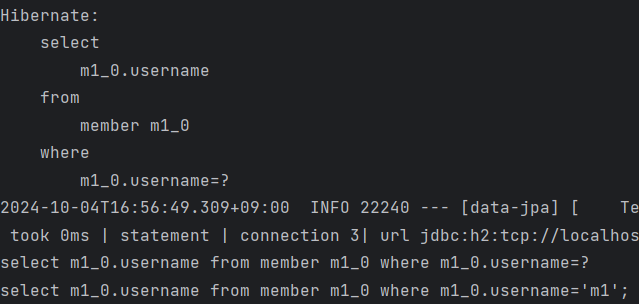

> 해당 글은 김영한님의 인프런 강의 [스프링 데이터 JPA](https://www.inflearn.com/course/%EC%8A%A4%ED%94%84%EB%A7%81-%EB%8D%B0%EC%9D%B4%ED%84%B0-JPA-%EC%8B%A4%EC%A0%84)을 듣고 내용을 정리하기 위한 것으로 자세한 설명은 해당 강의를 통해 확인할 수 있습니다
> 

---

## Specifications(명세)

책 도메인 주도 설계(DDD)는 SPECIFICATION(명세)라는 개념을 소개한다. 스프링 데이터 JPA는 JPA Criteria를 활용해서 이 개념을 사용할 수 있도록 지원한다.

**술어(predicate)**

- 참 또는 거짓으로 평가
- AND OR 같은 연산자로 조합해서 다양한 검색조건을 쉽게 생성(컴포지트 패턴)
- 예) 검색 조건 하나하나
- 스프링 데이터 JPA는 org.springframework.data.jpa.domain.Specification클래스로 정의

**명세 기능 사용 방법**

`JpaSpecificationExecutor` 인터페이스 상속

```java
public interface MemberRepository extends JpaRepository<Member, Long>,
                                                                                    JpaSpecificationExecutor<Member>{
                                                                                    
}
```

`JpaSpecificationExecutor` 인터페이스

```java
 public interface JpaSpecificationExecutor<T> {
         Optional<T> findOne(@Nullable Specification<T> spec);
         List<T> findAll(Specification<T> spec);
         Page<T> findAll(Specification<T> spec, Pageable pageable);
         List<T> findAll(Specification<T> spec, Sort sort);
         long count(Specification<T> spec);
 }
```

위 인터페이스에서 각 메서드 들이 Specification을 파라미터로 받아서 검색 조건으로 사용한다.

**명세 사용 코드**

```java
@Test
public void specBasic() {
    //given
    Team teamA = new Team("teamA");
    em.persist(teamA);

    Member m1 = new Member("m1", 0, teamA);
    Member m2 = new Member("m2", 0, teamA);
    em.persist(m1);
    em.persist(m2);

    em.flush();
    em.clear();

    //when
    Specification<Member> spec = MemberSpec.username("m1").and(MemberSpec.teamName("teamA"));
    List<Member> result = memberRepository.findAll(spec);

    Assertions.assertThat(result.size()).isEqualTo(1);
}
```

Specification을 구현하면 명세들을 조립할수 있다. where(), and(), or(), not()을 제공한다.

findAll에서 회원 이름 명세(username)과 팀 이름 명세(teamAName)을 and로 조합해서 검색조건으로 사용한다.

`MemberSpec`  명세 정의 코드

```java
public class MemberSpec {

    public static Specification<Member> teamName(final String teamName) {
        return (Specification<Member>) (root, query, builder) -> {
            if (StringUtils.isEmpty(teamName)) {
                return null;
            }

            Join<Member, Team> t = root.join("team", JoinType.INNER);//회우너과 조인
            return builder.equal(t.get("name"), teamName);
        };
    }

    public static Specification<Member> username(final String username) {
        return (Specification<Member>) (root, query, builder) ->
            builder.equal(root.get("username"), username);
    }
}
```

명세를 정의하려면 Specification 인터페이스를 구현해야한다. 명세를 정의할때는 toPredicate(…)메서드만 구현하면 되는데 JPA Criteria의 Root, CriteriaQuery, CriteriaBuilder 클래스를 제공한다.

> 실무에서는 JPA Criteria를 거의 안쓴다. 대신에 QueryDSL을 사용하자.
> 

---

## Query By Example

```java
@Test
public void queryByExample() {
    //given
    Team teamA = new Team("teamA");
    em.persist(teamA);

    Member m1 = new Member("m1", 0, teamA);
    Member m2 = new Member("m2", 0, teamA);
    em.persist(m1);
    em.persist(m2);

    em.flush();
    em.clear();

    //when
    //Probe 생성
    Member member = new Member("m1");
    Team team = new Team("teamA"); //내부조인 가능
    member.setTeam(team);

        //ExampleMatcher 생성, age 프로퍼티는 무시
    ExampleMatcher matcher = ExampleMatcher.matching().withIgnorePaths("age");

    Example<Member> example = Example.of(member, matcher);
    List<Member> result = memberRepository.findAll(example);

    assertThat(result.get(0).getUsername()).isEqualTo("m1");
}
```

**장점**

- 동적 쿼리를 편리하게 처리
- 도메인 객체를 그대로 사용
- 데이터 저장소를 RDB에서 NOSQL로 변경해도 코드 변경이 없게 추상화 되어 있음
- 스프링 데이터 JPA JpaRepository 인터페이스에 이미 포함

**단점**

- 조인은 가능하지만 내부 조인(INNER JOIN)만 가능함 외부 조인(LEFT JOIN) 안됨
- 중첩 제약조건 안됨
- 매칭 조건이 매우 단순함

**정리**

- 실무에서 사용하기에는 매칭 조건이 너무 단순하고, LEFT 조인이 안됨, 실무에서는 QueryDSL을 사용하자

---

## Projections

[공식 문서 참고](https://docs.spring.io/spring-data/jpa/reference/repositories/projections.html)

엔티티 대신에 DTO를 편리하게 조회할때 사용한다.

전체 엔티티가 아니라 만약 회원 이름만 조회하고 싶으면 어떻게 해야할까?

```java
public interface UsernameOnly {
        String getUsername();
}
```

조회할 엔티티의 필드를 getter혀익으로 지정하면 해달 필드만선택해서 조회(Projection)한다.

```java
public interface MemberRepository ... {
        List<UsernameOnly> findProjectionsByUsername(String username);
}
```

반환 타입을 UsernameOnly 인터페이스 명으로 해준다.

**테스트 코드**

```java
@Test
public void projections() throws Exception {
        //given
        Team teamA = new Team("teamA");
        em.persist(teamA);
        Member m1 = new Member("m1", 0, teamA);
        Member m2 = new Member("m2", 0, teamA);
        em.persist(m1);
        em.persist(m2);
        em.flush();
        em.clear();
        
        //when
        List<UsernameOnly> result = 
        memberRepository.findProjectionsByUsername("m1");
        
        //then
        Assertions.assertThat(result.size()).isEqualTo(1);
}
```



SQL에서도 select절에서 username만 조회(Projection)하는 것을 확인 할수 있다.

**인터페이스 기반 Closed Projections**

```java
public interface UsernameOnly {
        String getUsername();
}
```

프로퍼티 형식(getter)의 인터페이스를 제공하면 구현체는 스프링 데이토 JPA가 제공해준다.

**인터페이스 기반 Open Projections**

```java
public interface UsernameOnly {
        @Value("#{target.username + ' ' + target.age + ' ' + target.team.name}")
        String getUsername();
}
```

위 처럼 스프링의 SpEL 문법도 지원한다.

하지만 SpEL문법을 사용하면 DB에서 엔티티 필드를 다 조회해온다음에 계산한다. 따라서 JPQL SELET 절 최적화가 안된다. 다음은 SQL 결과에서 확인 할수 있다.


**클래스 기반 Projection**

다음과 같이 인터페이스가 아닌 구체적인 DTO 형식도 가능하다. 생성자의 파라미터 이름으로 매칭된다.

```java
public class UsernameOnlyDto {

        private final String username;
        
        public UsernameOnlyDto(String username) {
                this.username = username;
        }
        
        public String getUsername() {
                return username;
        }
}
```

**동적 Projections**

다음과 같이 Generic Type을 주면, 동적으로 프로젝션 데이터 변경이 가능하다.

```java
<T> List<T> findProjectionsByUsername(String username, Class<T> type);

//사용 코드
List<UsernameOnly> result = memberRepository.findProjectionsByUsername("m1", UsernameOnly.class);
```

**중첩 구조 처리**

```java
public interface NestedClosedProjection {

        String getUsername();
        TeamInfo getTeam();
        
        interface TeamInfo {
                String getName();
        }
}
```

쿼리 결과


**주의**

- 프로젝션 대상이 root 엔티티면 JPQL SELECT 절 최적화가 가능하다.
- 프로젝션 대상이 root가 아니면
    - Left outer join 처리
    - 위 쿼리 결과 처럼 모든 필드를 SELECT해서 엔티티로 조회한  다음에 계산

**정리**

- 프로젝션 대상이 root엔티티면 유용하지만 프로젝션 대상이 root엔티티를 넘어가면 JPQL SELECT 최적화가 되지 않는다.
- 실무의 복잡한 쿼리를 해결하기에는 한계가 있어서 단순할때만 사용하고 조금 복잡해지면 QueryDSL을 사용하자

---

## 네이티브 쿼리

가급적 네이티브 쿼리는 사용하지 않는 게 좋고 정말 어쩔수 없는 경우에만 사용한다.

스프링 데이터 Projections를 활용하는 방법은 좋은 방법이다.

**스프링 데이터 JPA 기반 네이티브 쿼리**

- 페이징 지원
- 반환 타입
    - Object[]
    - Tuple
    - DTO(스프링 데이터 인터페이스 Projections 지원)
    
    DTO 반환 방식을 권장한다.
    
- 제약
    - Sort 파라미터를 통한 정렬이 정상 동작하지 않을 수 있음(믿지 말고 직접 처리)
    - JPQL처럼 애플리케이션 로딩 시점에 문법 확인 불가
    - 동적 쿼리 불가

**JPA 네이티브 SQL 지원**

```java
 public interface MemberRepository extends JpaRepository<Member, Long> {
 
        @Query(value = "select * from member where username = ?", nativeQuery = 
        true)
        Member findByNativeQuery(String username);
 }
```

쿼리 결과


네이티브 SQL의 위치 기반 파라미터는 0부터 시작(JPQL은 1부터 시작)한다.

- 네이티브 SQL을 엔티티가 아닌 DTO로 변환하려면
    - DTO 대신 JPA TUPLE 조회
    - DTO 대신 MAP 조회
    - @SqlResultSetMapping  복잡
    - Hibernate ResultTransformer를 사용해야함  복잡
    - 네이티브 SQL을 DTO로 조회할 때는 **JdbcTemplate** or myBatis 권장

**Projections 활용**

DTO로 반환하려는데 편리하고, nativeQuery면서 동적쿼리가 아닌 경우에 사용해도 좋다. 그리고 페이징이 가능하다.

ex)스프링 데이터 JPA 네이티브 쿼리 + 인터페이스 기반 Projections 활용

```java
@Query(value = "SELECT m.member_id as id, m.username, t.name as teamName " +
"FROM member m left join team t ON m.team_id = t.team_id",
          countQuery = "SELECT count(*) from member",
          nativeQuery = true)
Page<MemberProjection> findByNativeProjection(Pageable pageable);
```

쿼리 결과


### 동적 네이티브 쿼리

- 하이버네이트 직접 사용
- 스프링 JdbcTemplate, myBatis, jooq같은 외부 라이브러리 사용

ex) 하이버네이트 기능 사용

```java
String sql = "select m.username as username from member m";
List<MemberDto> result = em.createNativeQuery(sql)
      .setFirstResult(0)
      .setMaxResults(10)
      .unwrap(NativeQuery.class)
      .addScalar("username")
      .setResultTransformer(Transformers.aliasToBean(MemberDto.class))
      .getResultList();
}
```