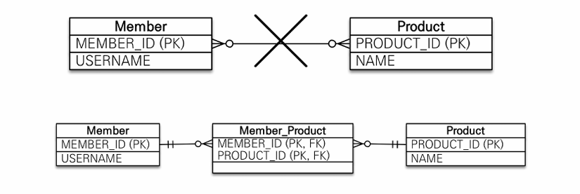
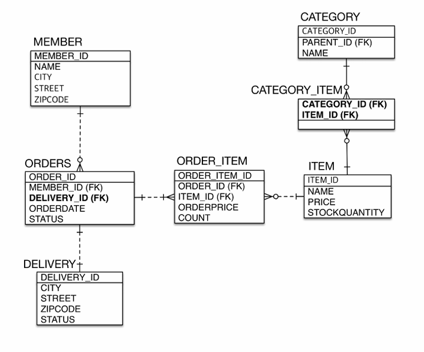

해당 글은 김영한님의 인프런 강의 [자바 ORM 표준 JPA 프로그래밍 - 기본편](https://www.inflearn.com/course/ORM-JPA-Basic)을 듣고 내용을 정리하기 위한 것으로 자세한 설명은 해당 강의를 통해 확인할 수 있습니다.

---

## 연관관계 매핑시 고려사항 3가지

- 다중성
- 단방향, 양방향
- 연관관계의 주인

### 다중성

- 다대일: @ManyToOne
- 일대다: @OneToMany
- 일대일: @OneToOne
- 다대다: @ManyToMany

## 단방향, 양방향

- **테이블**
    - 외래 키 하나로 양쪽 조인 가능
    - 사실 방향이라는 개념이 없음
- **객체**
    - 참조용 필드가 있는 쪽으로만 참조 가능
    - 한쪽만 참조하면 단방향
    - 양쪽이 서로 참조하면 양방향

### 연관관계의 주인

- 테이블은 **외래 키 하나**로 두 테이블이 연관관계를 맺음
- 객체 양방향 관계는 A->B, B->A 처럼 **참조가 2군데**
- 객체 양방향 관계는 참조가 2군데 있음. 둘중 테이블의 외래 키를 관리할 곳을 지정해야함
- 연관관계의 주인: 외래 키를 관리하는 참조
- 주인의 반대편: 외래 키에 영향을 주지 않음, 단순 조회만 가능

---

## 다대일 [N:1]

### 다대일 단방향

외래키가 있는곳에 참조를 걸고 연관관계 매핑을 하는것이 다대일 단방향 매핑이다.

### 다대일 단방향 정리

- 가장 많이 사용하는 연관관꼐
- **다대일**의 반대는 **일대다**

### 다대일 양방향

다대일 양방향은 반대쪽에 List members를 추가하면 된다.
반대쪽에 추가해도 테이블에는 영향이 가지 않는다.

> 지금 부터 무슨대무슨 무슨방향 에서 앞에 나오는( ex)”다”대일 양방향 에서 “다”)것은 연관관계의 주인이다.
> 

### 다대일 양방향 정리

- 외래 키가 있는 쪽이 연관관계의 주인
- 양쪽을 서로 참조하도록 개발

---

## 일대다 [1:N]

### 일대다 단방향

> 일이 연관관계의 주인이다.
이 모델은 권장하지 않는다.
> 

객체 입장에서는 위 사진처럼 List members가 연관관계의 주인으로 설계 될수 있다. 하지만 DB 입장 Member의 TEAM_ID가 연관관계의 주인이 될수 밖에 없다.

### 일다대 단방향 정리

- 일대다 단방향은 일대다(1:N)에서 **일(1)이 연관관계의 주인**
- 테이블 일대다 관계는 항상 **다(N) 쪽에 외래 키가 있음**
- 객체와 테이블의 차이 때문에 반대편 테이블의 외래 키를 관리하는 특이한 구조
- @JoinColumn을 꼭 사용해야 함. 그렇지 않으면 조인 테이블 방식을 사용함(중간에 테이블을 하나 추가함)
- 일대다 단방향 매핑의 단점
    - 엔티티가 관리하는 외래 키가 다른 테이블에 있음
    - 연관관계 관리를 위해 추가로 UPDATE SQL 실행
- 일대다 단방향 매핑보다는 **다대일 양방향 매핑을 사용**하자

### 일대다 양방향

### 일대다 양방향 정리

- 이런 매핑은 공식적으로 존재X
- @JoinColumn(**insertable=false, updatable=false**)
- **읽기 전용 필드**를 사용해서 양방향 처럼 사용하는 방법
- **다대일 양방향을 사용하자**

---

## 일대일 [1:1]

### 일대일 관계

- **일대일** 관계는 그 반대도 **일대일**
- 주 테이블이나 대상 테이블 중에 외래 키 선택 가능
    - 주 테이블에 외래 키
    - 대상 테이블에 외래 키
- 외래 키에 데이터베이스 **유니크(UNI) 제약조건 추가**

### 일대일: 주 테이블에 외래 키 단방향

Member가 하나의 Locker(사물함)을 가지는 상황

Member 테이블에 LOCKER_ID가 FK이면 Member 객체의 Locker locker을 추가해서 연관관계 매핑을 해주면 된다.

### 일대일: 주 테이블에 외래 키 단방향 정리

- 다대일(@ManyToOne) 단방향 매핑과 유사

### 일대일: 주 테이블에 외래 키 양방향

양방향을 하려면 반대쪽(Locker)에 Member member를 추가해서 mappedby를 추가해주면 된다.

### 일대일: 주 테이블에 외래 키 양방향 정리

- 다대일 양방향 매핑 처럼 **외래 키가 있는 곳이 연관관계의 주인**
- 반대편은 mappedBy 적용

### 일대일: 대상 테이블에 외래키 단방향

### 일대일: 대상 테이블에 외래 키 단방향 정리

- **단방향 관계는 JPA 지원X**
- 양방향 관계는 지원

### 일대일: 대상 테이블에 외래 키 양방향

일대일 주 테이블에 외래 키 양방향과 매핑 방법은 같다.

### 일대일 정리

- **주 테이블에 외래 키**
    - 주 객체가 대상 객체의 참조를 가지는 것 처럼 주 테이블에 외래 키를 두고 대상 테이블을 찾음
    - 객체지향 개발자 선호
    - JPA 매핑 편리
    - 장점: 주 테이블만 조회해도 대상 테이블에 데이터가 있는지 확인 가능
    - 단점: 값이 없으면 외래 키에 null 허용
- **대상 테이블에 외래 키**
    - 대상 테이블에 외래 키가 존재
    - 전통적인 데이터베이스 개발자 선호
    - 장점: 주 테이블과 대상 테이블을 일대일에서 일대다 관계로 변경할 때 테이블 구조 유지
    - 단점: 프록시 기능의 한계로 **지연 로딩으로 설정해도 항상 즉시 로딩됨**(프록시는 뒤에서 설명)

---

## 다대다 [N:M]

### 다대다

> 결론부터 말하자면 실무에서 쓰면 안된다.
> 
- 관계형 데이터베이스는 정규화된 테이블 2개로 다대다 관계를 표현할 수 없음
- 연결 테이블을 추가해서 일대다, 다대일 관계로 풀어내야함

**객체는 컬렉션을 사용해서 객체 2개로 다대다 관계 가능**

- **@ManyToMany** 사용
- **@JoinTable**로 연결 테이블 지정
- 다대다 매핑: 단방향, 양방향 가능

### 다대다 매핑의 한계

- **편리해 보이지만 실무에서 사용X**
- 연결 테이블이 단순히 연결만 하고 끝나지 않음
- 주문시간, 수량 같은 데이터가 들어올 수 있음

중간에 데이터를 추가하게 된다면 추가하지 못하게 된다.

### 다대다 한계 극복

- **연결 테이블용 엔티티 추가(연결 테이블을 엔티티로 승격)**
- **@ManyToMany** -> **@OneToMany, @ManyToOne**

Member와 Product를 연결해줄 MemberProduct 엔티티를 추가하면 된다. 그러면 MemberProcut 엔티티에 주문시간, 수량 같은 데이터 들이 중간에 들어올수 있다.

---

## 실전 예제 - 3.다양한 연관관계 매핑

> 실전 예제의 코드는 김영한님의 인프런 강의 [자바 ORM 표준 JPA 프로그래밍 - 기본편](https://www.inflearn.com/course/ORM-JPA-Basic)에서 확인하실수 있습니다.
> 
- 주문과 배송은 1:1(**@OneToOne**)
- 상품과 카테고리는 N:M(**@ManyToMany**)

### 배송, 카테고리 추가 - ERD

### 배송, 카테고리 추가 - 엔티티 상세

### N:M 관계는 1:N, N:1로

- 테이블의 N:M 관계는 중간 테이블을 이용해서 1:N, N:1
- 실전에서는 중간 테이블이 단순하지 않다.
- @ManyToMany는 제약: 필드 추가X, 엔티티 테이블 불일치
- 실전에서는 **@ManyToMany 사용X**

### @JoinColumn

|  속성 | 설명 | 기본값 |
| --- | --- | --- |
| name | 매핑할 외래 키 이름  | 필드명 + _ + 참조하는 테이블의 기본 키 컬럼명 |
| referencedColumnName | 외래 키가 참조하는 대상 테이블의 컬럼명 | 참조하는 테이블의 기본키 컬럼명 |
| foreignKey(DDL) | 외래 키 제약조건을 직접 지정할 수 있다.이 속성은 테이블을 생성할 때만 사용한다. |  |
|  unique 
nullable insertable 
updatable 
columnDefinition 
table | @Column의 속성과 같다.
 |  |

### @ManyToOne - 주요 속성

다대일 관계 매핑

| 속성 | 설명 | 기본값 |
| --- | --- | --- |
| optional | false로 설정하면 연관된 엔티티가 항상 있어야 한다.  | TRUE |
| fetch | 글로벌 페치 전략을 설정한다. | @ManyToOne=FetchType.EAGER @OneToMany=FetchType.LAZY|  |
| cascade | 영속성 전이 기능을 사용한다.|  |
| targetEntity | 연관된 엔티티의 타입 정보를 설정한다. 이 기능은 거의 사용하지 않는다. 컬렉션을 사용해도 제네릭으로 타입 정보를 알 수 있다.
 |  |

### @OneToMany - 주요 속성

일대다 관계 매핑

| 속성 | 설명 | 기본값 |
| --- | --- | --- |
| mappedBy | 연관관계의 주인 필드를 선택한다. |  |
| fetch | 글로벌 페치 전략을 설정한다. | @ManyToOne=FetchType.EAGER @OneToMany=FetchType.LAZY  |
| cascade | 영속성 전이 기능을 사용한다. |  |
| targetEntity | 연관된 엔티티의 타입 정보를 설정한다. 이 기능은 거의 사용하지 않는다. 컬렉션을 사용해도 제네릭으로 타입 정보를 알 수 있다 |  |