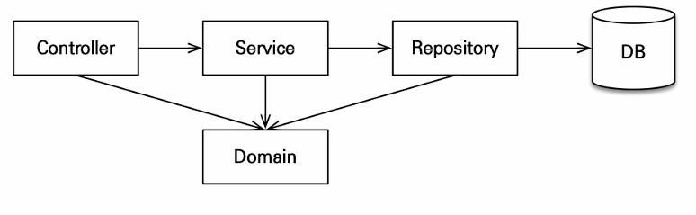

> 해당 글은 김영한님의 인프런 강의 [스프링부트와 JPA활용1 - 웹 어플리케이션 개발](https://www.inflearn.com/course/%EC%8A%A4%ED%94%84%EB%A7%81%EB%B6%80%ED%8A%B8-JPA-%ED%99%9C%EC%9A%A9-1)을 듣고 내용을 정리하기 위한 것으로 자세한 설명은 해당 강의를 통해 확인할 수 있습니다.
> 

---

**예제를 단순화 하기 위해 다음 기능은 구현X**

- 로그인과 권한 관리X
- 파라미터 검증과 예외 처리X
- 상품은 도서만 사용
- 카테고리는 사용X
- 배송 정보는 사용X

## 애플리케이션 아키텍처



**계층적 구조 사용**

- controller, web: 웹 계층
- service: 비즈니스 로직, 트랜잭션 처리
- repository: JPA를 직접 사용하는 계층, 엔티티 매니저 사용
- domain: 엔티티가 모여 있는 계층, 모든 계층에서 사용

---

# 회원 도메인 개발

**구현 기능**

- **회원 등록**
- **회원 목록 조회**

---

## 회원 리포지토리 개발

**회원 리포지토리**

```java
@Repository
public class MemberRepository {

        @PersistenceContext
    private EntityManager em;

    public void save(Member member) {
        em.persist(member);
    }

    public Member findOne(Long id) {
        return em.find(Member.class, id);
    }

    public List<Member> findAll() {
        return em.createQuery("select m from Member m", Member.class)
                .getResultList();
    }

    public List<Member> findByName(String name) {
        return em.createQuery("select m from Member m where m.name = :name", Member.class)
                .setParameter("name", name)
                .getResultList();
    }
}
```

- @Repository: 스프링 빈으로 등록, JPA 예외를 스프링 기반 예외로 예외 변환
- @PersistenceContext: 엔티티매니저(EntityManager)주입
- @PersistenceUnit: 엔티티 매니저 팩토리(EntityManagerFactory)주입
- save(): member 저장
- findOne(): member 하나를 조회
- findAll(): 모든 member 조회
- findByName(): 이름으로 member 조회

---

## 회원 서비스 개발

**회원 서비스 코드**

```java
@Service
@Transactional(readOnly = true)
@RequiredArgsConstructor
public class MemberService {

    private final MemberRepository memberRepository;

    /**
     * 회원 가입
     */

    @Transactional
    public Long join(Member member) {
        validateDuplicateMember(member); //중복 회원 검증
        memberRepository.save(member);
        return member.getId();
    }

    private void validateDuplicateMember(Member member) {
        List<Member> findMembers = memberRepository.findByName(member.getName());
        if(!findMembers.isEmpty()){
            throw new IllegalStateException("이미 존재하는 회원입니다.");
        }
    }

    //회원 전체 조회
    public List<Member> findMembers(){
        return memberRepository.findAll();
    }

    public Member findOne(Long memberId) {
        return memberRepository.findOne(memberId);
    }

}
```

- @Transactional: 트랜잭션, 영속성 컨텍스트
    - readOnly=true: 데이터의 변경이 없는 읽기 전용 메서드에 사용, 영속성 컨텍스트를 플러시 하지 않으므로 약간의 성능 향상(읽기 전용에는 다 적용)
    - 데이터베이스 드라이버가 지원하면 DB에서 성능 향상

**기능 설명**

- join(): Member 회원가입
- findMembers(): Member 전체 조회
- findOne: Member 한개 조회

> 참고:실무에서는 검증 로직이 있어도 **멀티 쓰레드 상황을 고려**해서 회원 테이블의 **회원명 컬럼에 유니크 제약 조건을 추가**하는 것이 안전하다.
> 

---

## 회원 기능 테스트

**테스트 요구사항**

- 회원가입을 성공해야 한다.
- 회원가입 할 때 같은 이름이 있으면 예외가 발생해야 한다.

**회원가입 테스트 코드**

```java
@RunWith(SpringRunner.class)
@SpringBootTest
@Transactional
public class MemberServiceTest {

    @Autowired
    MemberService memberService;
    @Autowired
    MemberRepository memberRepository;

    @Test
    public void 회원가입() throws Exception{
        //given
        Member member = new Member();
        member.setName("kim");

        //when
        Long savedId = memberService.join(member);

        //then
        Assert.assertEquals(member, memberRepository.findOne(savedId));
    }

    @Test(expected = IllegalStateException.class)
    public void 중복_회원_예외() throws Exception{
        //given
        Member member1 = new Member();
        member1.setName("kim");

        Member member2 = new Member();
        member2.setName("kim");

        //when
        memberService.join(member1);
        memberService.join(member2); //예외가 발생해야 한다!!!

        //then
        Assert.fail("예외가 발생해야한다.");
    }

}
```

- @RunWith(SpringRunner.class): 스프링과 테스트 통합
- @SpringBootTest: 스프링 부트를 띄우고 테스트(이게 없으면 @Autowired 다 실패)
- @Transactional: 반복 가능한 테스트 지원, 각각의 **테스트를 실행할 때마다 트랜잭션을 시작하고 테스트가 끝나면 트랜잭션을 강제로 롤백**(이 어노테이션이 테스트 케이스에서 사용 될때만 롤백)

@Transactional의 롤백 때문에 테스트 케이스는 insert 쿼리 발생하지 않는다. insert 쿼리를 확인하려면 EntityManeger em을 주입받고, em.flush()를 작성하면 된다.

### 테스트 케이스를 위한 설정

테스트는 케이스 격리된 환경에서 실행하고, 끝나면 데이터를 초기화하는 것이 좋다. 그래서 **메모리 DB**를 사용하는 것이 이상적이다.

테스트 케이스를 위한 스프링 환경과, 일반적으로 애플리케이션을 실행하는 환경은 다르기때문에 설**정 파일**을 다르게 사용해야 한다.

- test/resources/application.yml

```
 spring:
 #  datasource:
 #    url: jdbc:h2:mem:testdb
 #    username: sa
 #    password:
 #    driver-class-name: org.h2.Driver
 #  jpa:
 #    hibernate:
 #      ddl-auto: create
 #    properties:
 #      hibernate:
 #        show_sql: true
 #        format_sql: true
 #    open-in-view: false
 logging.level:
 org.hibernate.SQL: debug
 #  org.hibernate.type: trace
```

테스트에서 스프링을 실행하면 위 위치의 설정 파일을 읽는다. 없으면 src/resources/application.yml을 읽는다.

스프링 부트는 datasource 설정이 없으면, 기본적을 메모리 DB를 사용하고, driver-class도 현재 등록된 라이브러를 보고 찾아준다. 추가로 ddl-auto 도 craate-drop모드로 동작한다. 따라서 데이터소스나, JPA 관련된 별도의 추가 설정을 하지 않아도 된다.

---

# 상품 도메인 개발

**구현 기능**

- 상품 등록
- 상품 목록 조회
- 상품 수정

---

## 상품 엔티티 개발(비즈니스 로직 추가)

**상품 엔티티 코드**

```java
@Entity
@Inheritance(strategy = InheritanceType.SINGLE_TABLE)
@DiscriminatorColumn(name = "dtype")
@Getter @Setter
public abstract class Item {

    @Id
    @GeneratedValue
    @Column(name = "item_id")
    private Long id;

    private String name;
    private int price;
    private int stockQuantity;

    @ManyToMany(mappedBy = "items")
    private List<Category> categories = new ArrayList<>();

    //==비즈니스 로직-==//

    /**
     * stock 증가
     */
    public void addStock(int quantity){
        this.stockQuantity += quantity;
    }

    /**
     * stock 감소
     */
    public void removeStock(int quantity){
        int restStock = this.stockQuantity - quantity;
        if (restStock < 0) {
            throw new NotEnoughStockException("need more stock");
        }
        this.stockQuantity = restStock;
    }
}
```

비즈니스 로직

- addStock() 메서드는 파라미터로 넘어온 수만큼 재고를 늘린다.
- removeStock() 메서드는 파라미터로 넘어온 수만큼 재고를 줄인다.

**예외 추가**

```java
public class NotEnoughStockException extends RuntimeException{

    public NotEnoughStockException() {
    }

    public NotEnoughStockException(String message) {
        super(message);
    }

    public NotEnoughStockException(String message, Throwable cause) {
        super(message, cause);
    }

    public NotEnoughStockException(Throwable cause) {
        super(cause);
    }

}
```

---

## 상품 리포지토리 개발

**상품 리포지토리 코드**

```java
@Repository
@RequiredArgsConstructor
public class ItemRepository {

    private final EntityManager em;

    public void save(Item item) {
        if (item.getId() == null) {
            em.persist(item);
        } else {
            em.merge(item);
        }
    }

    public Item findOne(Long id) {
        return em.find(Item.class, id);
    }

    public List<Item> findAll(){
        return em.createQuery("select i from Item i", Item.class)
                .getResultList();
    }

}
```

- save() : id가 없으면 신규로 보고 persist() 실행, id가 있으면 이미 데이터베이스에 저장된 엔티티를 보고 수정한다고 보고, merge()를 실행, 자ㅔㅅ한 내용은 뒤에 웹에서 설명한다.

## 상품 서비스 개발

**상품 서비스 코드**

```java
@Service
@Transactional(readOnly = true)
@RequiredArgsConstructor
public class ItemService {

    private final ItemRepository itemRepository;

    @Transactional
    public void saveItem(Item item) {
        itemRepository.save(item);
    }

    public List<Item> findItems() {
        return itemRepository.findAll();
    }

    public Item findOne(Long itemId) {
        return itemRepository.findOne(itemId);
    }

}
```

상품 서비스는 상품 리포지토리에 위임만 하는 클래스이다.

---

# 주문 도메인 개발

## 주문, 주문상품 엔티티 개발

### 주문 엔티티 개발

**주문 엔티티 코드**

```java
@Entity
@Table(name ="orders")
@Getter @Setter
@NoArgsConstructor(access = AccessLevel.PROTECTED)
public class Order {

        ...

        //여러 필드

        ...

        //==생성 메서드==//
    public static Order createOrder(Member member, Delivery delivery, OrderItem... orderItems) {
        Order order = new Order();
        order.setMember(member);
        order.setDelivery(delivery);
        for (OrderItem orderItem : orderItems) {
            order.addOrderItem(orderItem);
        }
        order.setStatus(OrderStatus.ORDER);
        order.setOrderDate(LocalDateTime.now());
        return order;
    }

    //==비즈니스 로직==//
    /**
     * 주문 취소
     */
    public void cancel() {
        if (delivery.getStatus() == DeliveryStatus.COMP) {
            throw new IllegalStateException("이미 배송완료된 상품은 취소가 불가능합니다.");
        }

        this.setStatus(OrderStatus.CANCEL);
        for (OrderItem orderItem : orderItems) {
            orderItem.cancel();
        }
    }

    //==조회 로직==//

    /**
     * 전체 주문 가격 조회
     */
    public int getTotalPrice() {
        int totalPrice = 0;
        for (OrderItem orderItem : orderItems) {
            totalPrice += orderItem.getTotalPrice();
        }
        return totalPrice;
    }					

}
```

**기능 설명**

- **생성 메서드**(createOrder()): 주문 회원, 배송정보, 주문상품의 정보를 받아서 실제 주문 엔티티를 생성한다.
- **주문취소**(cancel()): 주문 상태를 취소로 변경하고 주문상품에 주문 취소를 알린다. 만약 이미 배송을 완료한 상품이면 주문을 취소하지 못하도록 예외를 발생시킨다.
- **전체 주문 가격 조회**: 주문 시 사용한 전체 주문 가격을 조회한다. 전체 주문 가격을 알려면 각각의 주문상품 가격을 알아야 한다. 로직을 보면 연관된 주문상품들의 가격을 조회해서 더한 값을 반환한다. (실무에서는 주로 주문에 전체 주문 가격 필드를 두고 역정규화 한다.)

### 주문상품 엔티티 개발

**주문상품 엔티티 코드**

```java
@Entity
@Getter @Setter
@NoArgsConstructor(access = AccessLevel.PROTECTED)
public class OrderItem {

        //==생성 메서드==//
    public static OrderItem createOrderItem(Item item, int orderPrice, int count) {
        OrderItem orderItem = new OrderItem();
        orderItem.setItem(item);
        orderItem.setOrderPrice(orderPrice);
        orderItem.setCount(count);

        item.removeStock(count);
        return orderItem;
    }

    //==비즈니스 로직==//
    public void cancel() {
        getItem().addStock(count);
    }

    //==조회 로직==//

    /**
     *주문상품 전체 가격 조회
     */
    public int getTotalPrice() {
        return getOrderPrice() * getCount();
    }

}
```

**기능 설명**

- **생성 메서드**(createOrderItem()): 주문 상품, 가격, 수량 정보를 사용해서 주문상품 엔티티를 생성한다. 그리고 item.removeStock(count)를 호출해서 주문한 수량만큼 상품의 재고를 줄인다.
- **주문 취소**(cancel()): getItem().addStock(count)를 호출해서 취소한 주문 수량만큼 상품의 재고를 증가시킨다.
- **주문 가격 조회**(getTotalPrice()): 주문 가격에 수량을 곱한 값을 반환한다.

---

## 주문 리포지토리 개발

**주문 리포지토리 코드**

```java
@Repository
@RequiredArgsConstructor
public class OrderRepository {

    private final EntityManager em;

    public void save(Order order) {
        em.persist(order);
    }

    public Order findOne(Long id) {
        return em.find(Order.class, id);
    }

}
```

주문 리포지토리에는 주문 엔티티를 저장하고 검색하는 기능이 있다. 주문 검색 기능은 뒤에서 작성할 것이다.

---

## 주문 서비스 개발

**주문 서비스 코드**

```java
@Service
@Transactional(readOnly = true)
@RequiredArgsConstructor
public class OrderService {

    private final OrderRepository orderRepository;
    private final MemberRepository memberRepository;
    private final ItemRepository itemRepository;

    /**
     * 주문
     */
    @Transactional
    public Long order(Long memberId, Long itemId, int count) {

        //엔티티 조회
        Member member = memberRepository.findOne(memberId);
        Item item = itemRepository.findOne(itemId);

        //배송정보 생성
        Delivery delivery = new Delivery();
        delivery.setAddress(member.getAddress());

        //주문상품 생성
        OrderItem orderItem = OrderItem.createOrderItem(item, item.getPrice(), count);

        //주문 생성
        Order order = Order.createOrder(member, delivery, orderItem);

        //주문 저장
        orderRepository.save(order);
        return order.getId();
    }

    /**
     * 주문 취소
     */

    @Transactional
    public void cancelOrder(Long orderId) {
        //주문 엔티티 조회
        Order order = orderRepository.findOne(orderId);
        //주문 취소
        order.cancel();
    }
}
```

주문 서비스는 주문 엔티티와 주문 상품 엔티티의 비즈니스 로직을 활용해서 주문, 주문 취소, 주문 내역 검색 기능을 제공한다.

---

## 주문 기능 테스트

**테스트 요구사항**

- 상품 주문이 성공해야 한다.
- 상품을 주문할 때 재고 수량을 초과하면 안 된다
- 주문 취소가 성공해야 한다.

**상품 주문 테스트 코드**

```java
@RunWith(SpringRunner.class)
@SpringBootTest
@Transactional
public class OrderServiceTest {

    @Autowired
    EntityManager em;
    @Autowired
    OrderService orderService;
    @Autowired
    OrderRepository orderRepository;

    @Test
    public void 상품주문() throws Exception{
        //given
        Member member = createMember();

        Book book = createBook("시골 JPA", 10000, 10);
        int orderCount = 2;

        //when
        Long orderId = orderService.order(member.getId(), book.getId(), orderCount);

        //then
        Order getOrder = orderRepository.findOne(orderId);

        assertEquals("상품 주문시 상태는 ORDER", OrderStatus.ORDER, getOrder.getStatus());
        assertEquals("주문한 상품 종류 수가 정확해야 한다.", 1, getOrder.getOrderItems().size());
        assertEquals("주문 가격은 가격 * 수량이다.", 10000 * orderCount, getOrder.getTotalPrice());
        assertEquals("주문 수량만큼 재고가 줄어야 한다.", 8, book.getStockQuantity());

    }

    @Test(expected = NotEnoughStockException.class)
    public void 상품주문_재고수량초과() throws Exception {
              //...
    }
    
    
    @Test
    public void 주문취소() throws Exception{
              //...

    }

    private Book createBook(String name, int price, int stockQuantity) {
            Book book = new Book();
            book.setName(name);
            book.setPrice(price);
            book.setStockQuantity(stockQuantity);
            em.persist(book);
            return book;
    }

    private Member createMember() {
            Member member = new Member();
            member.setName("회원1");
            member.setAddress(new Address("서울", "강가", "123-123"));
            em.persist(member);
            return member;
    }
}
```

상품주문이 정상 동작하는지 확인하는 테스트다. Given 절에서 테스트를 위한 회원과 상품을 만들고 When 절에서 실제 상품을 주문하고 Then 절에서 주문 가격이 올바른지, 주문 후 재고 수량이 정확히 줄었는지 검증한다.

**재고 수량 초과 테스트 코드**

```java
@Test(expected = NotEnoughStockException.class)
    public void 상품주문_재고수량초과() throws Exception {
        //given
        Member member = createMember();
        Item item = createBook("시골 JPA", 10000, 10);
        int orderCount = 11;

        //when
        orderService.order(member.getId(), item.getId(), orderCount);

        //then
        fail("재고 수량 부족 예외가 발생해야 한다.");
    }
}
```

1권 더 많은 수량을 주문해서 주문 초과로 다음 로직에서 예외가 발생한다.

```java
public abstract class Item{
    //...

    public void removeStock(int quantity){
        int restStock = this.stockQuantity - quantity;
        if (restStock < 0) {
            throw new NotEnoughStockException("need more stock");
        }
        this.stockQuantity = restStock;
    }
}
```

**주문 취소 테스트**

```java
@Test
public void 주문취소() throws Exception{
    //given
    Member member = createMember();
    Book item = createBook("시골 JPA", 10000, 10);

    int orderCount = 2;
    Long orderId = orderService.order(member.getId(), item.getId(), orderCount);
    //when
    orderService.cancelOrder(orderId);

    //then
    Order getOrder = orderRepository.findOne(orderId);

    assertEquals("주문 취소시 상태는 CANCEL 이다.", OrderStatus.CANCEL, getOrder.getStatus());
    assertEquals("주문이 취소된 상품은 그만큼 재고가 증가해야 한다.", 10, item.getStockQuantity());

}
```

주문을 취소하려면 먼저 주문을 해야 한다. Given 절에서 주문하고 When 절에서 해당 주문을 취소했다. Then 절에서 주문상태가 주문 취소 상태인지(CANCEL), 취소한 만큼 재고가 증가했는지 검증한다.

---

## 주문 검색 기능 개발

JPA에서 동적 쿼리를 어떻게 해결해야하는지 알아보자.

회원이름과 주문 상태를 선택해서 검색하는 기능을 개발할거다.  

검색조건 파라미터 OrderSearch

```java
@Getter @Setter
public class OrderSearch {

    private String memberName; //회원 이름
    private OrderStatus orderStatus; //주문 상태[ORDER, CANCEL]
}
```

---

검색을 추가한 주문 리포지토리 코드

```java
@Repository
@RequiredArgsConstructor
public class OrderRepository {

    private final EntityManager em;

    public void save(Order order) {
        em.persist(order);
    }

    public Order findOne(Long id) {
        return em.find(Order.class, id);
    }
        
         public List<Order> findAll(OrderSearch orderSearch) {
         //... 검색 로직

    }
}
```

findAll(OrderSearch orderSearch)메서드는 검색 조건에 동적으로 쿼리를 생성해서 주문 엔티티를 조회 한다.

**JQPL로 처리**

```java
public List<Order> findAllByString(OrderSearch orderSearch){

    String jpql = "select o From Order o join o.member m";
    boolean isFirstCondition = true;
    //주문 상태 검색
    if (orderSearch.getOrderStatus() != null) {
        if (isFirstCondition) {
            jpql += " where";
            isFirstCondition = false;
        }
        else {
            jpql += " and";
        }
        jpql += " o.status = :status";
    }

    //회원 이름 검색
    if (StringUtils.hasText(orderSearch.getMemberName())) {
        if (isFirstCondition) {
            jpql
                    += " where";
            isFirstCondition = false;
        }
        else {
            jpql += " and";
        }
        jpql+= " m.name like :name";
    }
    TypedQuery<Order> query = em.createQuery(jpql, Order.class)
            .setMaxResults(1000);
    if (orderSearch.getOrderStatus() != null) {
        query = query.setParameter("status", orderSearch.getOrderStatus());
    }
    if (StringUtils.hasText(orderSearch.getMemberName())) {
        query = query.setParameter("name", orderSearch.getMemberName());
    }
    return query.getResultList();
}
```

JPQL 쿼리를 문자로 생성하기는 번거롭고, 실수로 인한 버그가 충분히 발생할 수 있다.  

JPA Criteria로 처리

```java
public List<Order> findAllByCriteria(OrderSearch orderSearch) {
    CriteriaBuilder cb = em.getCriteriaBuilder();
    CriteriaQuery<Order> cq = cb.createQuery(Order.class);
    Root<Order> o = cq.from(Order.class);
    Join<Order, Member> m = o.join("member", JoinType.INNER); //회원과 조인
    List<Predicate> criteria = new ArrayList<>();
    //주문 상태 검색
    if (orderSearch.getOrderStatus() != null) {
        Predicate status = cb.equal(o.get("status"),
                orderSearch.getOrderStatus());
        criteria.add(status);
    }
    //회원 이름 검색
    if (StringUtils.hasText(orderSearch.getMemberName())) {
        Predicate name =
                cb.like(m.<String>get("name"), "%" + orderSearch.getMemberName()
                        + "%");
        criteria.add(name);
    }
    cq.where(cb.and(criteria.toArray(new Predicate[criteria.size()])));
    TypedQuery<Order> query = em.createQuery(cq).setMaxResults(1000); //최대 1000건
    return query.getResultList();
}
```

 JPA Criteria는 JPA 표준 스펙이지만 **실무에서 사용하기에 너무 복잡**하다. 그래서 다른 대안이자 **해결책으로 Queryds**l을 제시했다.