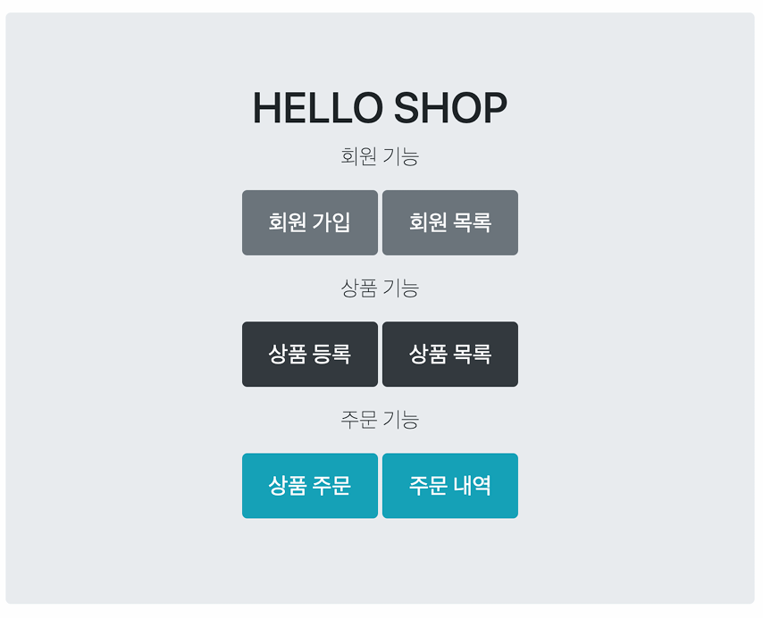

> 해당 글은 김영한님의 인프런 강의 [스프링부트와 JPA활용1 - 웹 어플리케이션 개발](https://www.inflearn.com/course/%EC%8A%A4%ED%94%84%EB%A7%81%EB%B6%80%ED%8A%B8-JPA-%ED%99%9C%EC%9A%A9-1)을 듣고 내용을 정리하기 위한 것으로 자세한 설명은 해당 강의를 통해 확인할 수 있습니다.
> 

## 요구사항 분석



위 사진과 같은 형태로 개발할것이고 아래는 개발할 기능 목록이다.

**기능목록**

- 회원 기능
    
    회원 등록, 조회
    
- 상품 기능
    
    상품 등록, 수정, 조회
    
- 주문 기능
    
    상품 주문, 주문 내역 조회, 주문 취소
    
- 기타 요구사항
    - 상품은 재고 관리가 필요하다
    - 상품 종류는 도서 음반, 영화가 있다.
    - 상품은 카테고리로 구분할 수 있다.
    - 상품 주문시 배송 정보를 입력할 수 있다.

---

## 도메인 모델과 테이블 설계


**회원, 주문, 상품의 관계**: 회원은 여러 상품을 주문할 수 있다. 그리고 한 번 주문할 때 여러 상품을 선택할 수 있으므로 주문과 상품은 다대다 관계다. 하지만 이런 다대다 관계는 관계형 데이터베이스는 물론이고 엔티티에서도 거의 사용하
지 않는다. 따라서 그림처럼 주문상품이라는 엔티티를 추가해서 다대다 관계를 일대다, 다대일 관계로 풀어냈다

**상품 분류**: 상품은 도서, 음반, 영화로 구분되는데 상품이라는 공통 속성을 사용하므로 상속 구조로 표현했다.

> 참고: 테이블명이 `ORDER`가 아니라 `ORDERS`인 것은 데이터베이스가 `order by`때문에 예약어로 잡고 있는 경우가 많다. 그래서 관례상 `ORDERS`를 많이 사용한다.
> 

> **참고: 실제 코드에서는 DB에 소문자 + _(언더스코어) 스타일을 사용하겠다.**  데이터베이스 테이블명, 컬럼명에 대한 관례는 회사마다 다르다. 보통은 대문자 + _(언더스코어)나 소문자 + _(언더스코어) 방식 중에 하나를 지정해서 일관성 있게 사용한다. 강의에서 설명할 때는 객체와 차이를 나타내기 위해데이터베이스 테이블, 컬럼명은 대문자를 사용했지만, **실제 코드에서는 소문자 + _(언더스코어) 스타일을 사용하겠다.**
> 

### 회원 엔티티 분석


엔티티 분석에 대한 자세한 내용은 기본편에서도 확인할수 있으니 자세한 설명은 생략한다.

회원이 주문을 하기 때문에, 회원이 주문리스트를 가지는 것은 얼핏 보면 잘 설계한 것 같지만, 객체 세상은 실제 세계와는 다르다. **회원을 통해서 주문이 일어나는게 아니라 주문을 생성할때 회원이 필요하다고 보는게 맞고 주문 내역이 필요하면 Order에서 필터링 조건이 들어가게 된다.** 그래서 Member와 Order의 관계는 일대다가 맞지만 다대일의 양방향 연관관계를 설명하기 위해서 추가했다.

### 회원 테이블 분석


**Member:** 회원 엔티티의 Address 임베디드 타입 정보가 회원 테이블에 그대로 들어갔다. 이것은 DELIVERY 테이블도 마찬가지다.

**ITEM**: 엘범, 도서, 영화 타입을 통합해서 하나의 테이블로 만들었다. DTYPE 컬럼으로 타입을 구분한다. 가장 단순한 싱글 테이블 전략을 사용한다.

> 참고: 테이블명이 ORDER가 아니라 ORDER인 이유는 DB가 order by 때문에 예약어로 잡고 있는 경우가 많다. 그래서 관례상 ORDERS를 많이 사용한다.
> 

> **참고: 실제 코드에서는 DB에 소문자 + _(언더스코어) 스타일을 사용하겠다.**  데이터베이스 테이블명, 컬럼명에 대한 관례는 회사마다 다르다. 보통은 대문자 + _(언더스코어)나 소문자 + _(언더스코어) 방식 중에 하나를 지정해서 일관성 있게 사용한다. 강의에서 설명할 때는 객체와 차이를 나타내기 위해 데이터베이스 테이블, 컬럼명은 대문자를 사용했지만, **실제 코드에서는 소문자 + _(언더스코어) 스타일을 사용하겠다.**
> 

### 연관관계 매핑 분석

**카테고리와 상품**: @ManyToMany를 사용해서 매핑한다.**(실무에서 @ManyToMany는 사용하지 말자. 여기서는 다대 다 관계를 예제로 보여주기 위해 추가했을 뿐이다)**

이전 기본편을 보았으면 위 사진을 이해하는 것은 어렵지 않기 때문에 자세한 설명은 생략한다.

> **참고: 외래 키가 있는 곳을 연관관계의 주인으로 정해라.**
> 

---

## 엔티티 클래스 개발

- 예제에서는 설명을 쉽게하기 위해 엔티티 클래스에 Getter, Setter를 모두 열고, 최대한 단순하게 설계
- **실무에서는 가급적 Getter는 열어두고, Setter는 꼭 필요한 경우에만 사용하는 것을 추천**

> 참고: 이론적으로 Getter, Setter 모두 제공하지 않고, 꼭 필요한 별도의 메서드를 제공하는게 가장 이상적이다. 하지만 **실무에서 엔티티의 데이터는 조회할 일이 너무 많으므로, Getter의 경우 모두 열어두는 것이 편리**하다. Getter는 호출하는 것만으로 어떤 일이 발생하지 않지만 Setter는 호출하면 데이터가 변한다. 그래서 Setter를 남발하게 되면 엔티티가 도대체 왜 변경되는지 추적하기가 힘들어지기 때문에 **엔티티를 변경할때는 Setter대신 변경 지점이 명확하도록 변경을 위한 비즈니스 메서드를 별도로 제공해야한다.**
> 

**회원 엔티티**

```java
@Entity
@Getter @Setter
public class Member {
    @Id @GeneratedValue
    @Column(name = "member_id")
    private Long id;
    
    private String name;
    
    @Embedded
    private Address address;
    
    @OneToMany(mappedBy = "member")
    private List<Order> orders = new ArrayList<>();
}
```

> 참고: 엔티티의 식별자는 `id`를 사용하고, PK 컬럼명은 `member_id`로 설정한다. 엔티티는 타입(예: Member)을 가지므로 `id` 필드로 쉽게 구분할 수 있지만, 테이블은 타입이 없어 구분이 어렵다. 일반적으로 테이블명 + `id` 형식을 사용하며, 객체에서는 `id` 대신 `memberId`를 사용할 수 있지만, 일관성을 유지하는 것이 중요하다.
> 

**주문 엔티티**

```java
@Entity
@Table(name = "orders")
@Getter @Setter
public class Order {
    @Id @GeneratedValue
    @Column(name = "order_id")
    private Long id;
    
    @ManyToOne(fetch = FetchType.LAZY)
    @JoinColumn(name = "member_id")
    private Member member; //주문 회원
    
    @OneToMany(mappedBy = "order", cascade = CascadeType.ALL)
    private List<OrderItem> orderItems = new ArrayList<>();
    
    @OneToOne(cascade = CascadeType.ALL, fetch = FetchType.LAZY)
    @JoinColumn(name = "delivery_id")
    private Delivery delivery; //배송정보
    
    private LocalDateTime orderDate; //주문시간
    
    @Enumerated(EnumType.STRING)
    private OrderStatus status; //주문상태 [ORDER, CANCEL]
    
    //==연관관계 메서드==//
    public void setMember(Member member) {
        this.member = member;
        member.getOrders().add(this);
    }
    public void addOrderItem(OrderItem orderItem) {
        orderItems.add(orderItem);
        orderItem.setOrder(this);
    }
    public void setDelivery(Delivery delivery) {
        this.delivery = delivery;
        delivery.setOrder(this);
    }
}
```

**주문상태**

```java
public enum OrderStatus {
    ORDER, CANCEL 
}
```

**주문상품 엔티티**

```java
@Entity
@Table(name = "order_item")
@Getter @Setter
public class OrderItem {
    @Id @GeneratedValue
    @Column(name = "order_item_id")
    private Long id;
    
    @ManyToOne(fetch = FetchType.LAZY)
    @JoinColumn(name = "item_id")
    private Item item;    //주문 상품
    
    @ManyToOne(fetch = FetchType.LAZY)
    @JoinColumn(name = "order_id")
    private Order order;    //주문
    
    private int orderPrice; //주문 가격
    private int count;      //주문 수량
}
```

**상품 엔티티**

```java
@Entity
@Inheritance(strategy = InheritanceType.SINGLE_TABLE)
@DiscriminatorColumn(name = "dtype")
@Getter @Setter
public abstract class Item {
    @Id @GeneratedValue
    @Column(name = "item_id")
    private Long id;
    
    private String name;
    private int price;
    private int stockQuantity;
    
    @ManyToMany(mappedBy = "items")
    private List<Category> categories = new ArrayList<Category>();
}
```

**상품- 도서 엔티티**

```java
@Entity
@DiscriminatorValue("B")
@Getter @Setter
public class Book extends Item {
    private String author;
    private String isbn;
}
```

**상품-음반 엔티티**

```java
@Entity
@DiscriminatorValue("A")
@Getter @Setter
public class Album extends Item {
    private String artist;
    private String etc;
}
```

**상품-영화 엔티티**

```java
@Entity
@DiscriminatorValue("M")
@Getter @Setter
public class Movie extends Item {
    private String director;
    private String actor;
}
```

**배송 엔티티**

```java
@Entity
@Getter @Setter
public class Delivery {
    @Id @GeneratedValue
    @Column(name = "delivery_id")
    private Long id;
    
    @OneToOne(mappedBy = "delivery", fetch = FetchType.LAZY)
    private Order order;
    
    @Embedded
    private Address address;
    
    @Enumerated(EnumType.STRING)
    private DeliveryStatus status; //ENUM [READY(준비), COMP(배송)]
}
```

**배송 상태**

```java
public enum DeliveryStatus {
    READY, COMP
}
```

**카테고리 엔티티**

```java
@Entity
@Getter @Setter
public class Category {
    @Id @GeneratedValue
    @Column(name = "category_id")
    private Long id;
    
    private String name;
    
    @ManyToMany
    @JoinTable(name = "category_item",
        joinColumns = @JoinColumn(name = "category_id"),
        inverseJoinColumns = @JoinColumn(name = "item_id"))
    private List<Item> items = new ArrayList<>();
    
    @ManyToOne(fetch = FetchType.LAZY)
    @JoinColumn(name = "parent_id")
    private Category parent;
    
    @OneToMany(mappedBy = "parent")
    private List<Category> child = new ArrayList<>();
    
    //==연관관계 메서드==//
    public void addChildCategory(Category child) {
        this.child.add(child);
        child.setParent(this);
    }
}
```

> 참고: **실무에서는 @ManyToMany를 사용하지 말아야한다**. 중간 테이블에 컬럼을 추가 할수 없고, 세밀하게 쿼리 실행이 어렵다. **중간 엔티티를 만들어서 다대다 매핑을 일대다, 다대일 매핑으로 풀어내사 사용해야한다.**
> 

**주소 값 타입**

```java
@Embeddable
@Getter
public class Address {
    private String city;
    private String street;
    private String zipcode;
    
    protected Address() {
    }
    
    public Address(String city, String street, String zipcode) {
        this.city = city;
        this.street = street;
        this.zipcode = zipcode;
    }
}
```

> 참고: **값 타입은 변경 불가능하게 설계해야 한다.**
**@Setter를 제거하고, 생성자에서 값을 모두 초기화해서 변경 불가능한 클래스를 만든다.** JPA 스펙상 엔티티나 임베디드 타입은 자바 기본생성자를 public, protected로 설정해야 한다. public 보다는 protected가 더 안전하다. JPA가 이런 제약을 두는 이유는 JPA 구현 라이브러리가 객체를 생성할 때 리플랙션 같은 기술을 사용할 수 있도록 지원해야 하기 때문이다.
> 

---

## 엔티티 설계시 주의점

**엔티티에는 가급적 Setter를 사용하지 말자**

Setter가 모두 열려있다. 변경 포인트가 너무 많아서, 유지보수가 어렵다. 나중에 리펙토링으로 Setter 제거

**모든 연관관계는 지연로딩으로 설정!**

- 즉시로딩(EAGER)은 예측이 어렵고, 어떤 SQL이 실행될지 추적하기 어렵다. 특히 JPQL을 실행할때 N + 1문제가 자주 발생한다.
- 실무에서는 지연로딩으로 설정해야한다.
- 연관된 엔티티를 함께 조회해야한다면 fetch join 또는 엔티티 그래프 기능을 사용한다.
- @XToOne 관계는 기본이 즉시로딩이여서 직접 지연로딩으로 설정 해야 한다.

**컬렉션은 필드에서 초기화 하자.**

컬렉션은 필드에서 바로 초기화 하는것이 안전하다.

- null 문제에서 안전하다
- 하이버네이트는 엔티티를 영속화 할때, 컬랙션을 감싸서 하이버네이트가 제공하는 내장 컬렉션으로 변경한다. 만약 getOrders() 처럼 임의의 메서드에서 컬력션을 잘못 생성하면 하이버네이트 내부 메커니즘에 문제가 발생
할 수 있다. 따라서 필드레벨에서 생성하는 것이 가장 안전하고, 코드도 간결하다.

```java
Member member = new Member();
System.out.println(member.getOrders().getClass());
em.persist(member);
System.out.println(member.getOrders().getClass());

//출력 결과
class java.util.ArrayList
class org.hibernate.collection.internal.PersistentBag
```