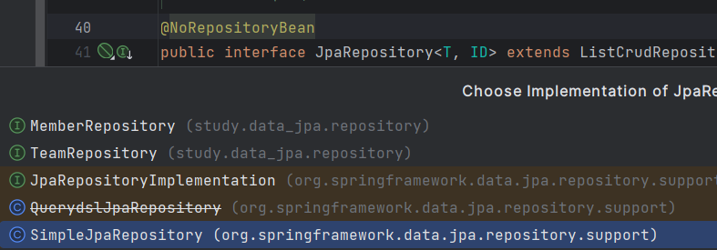

> 해당 글은 김영한님의 인프런 강의 [스프링 데이터 JPA](https://www.inflearn.com/course/%EC%8A%A4%ED%94%84%EB%A7%81-%EB%8D%B0%EC%9D%B4%ED%84%B0-JPA-%EC%8B%A4%EC%A0%84)을 듣고 내용을 정리하기 위한 것으로 자세한 설명은 해당 강의를 통해 확인할 수 있습니다.
> 

---

## 스프링 데이터 JPA 구현체 분석

스프링 데이터 JPA가 제공하는 공통 인터페이스 구현체

org.springframework.data.jpa.repository.support.SimpleJpaRepository



SimpleJpaRepository

```java
@Repository
@Transactional(readOnly = true)
public class SimpleJpaRepository<T, ID> ... {

        @Override
        @Transactional
        public <S extends T> S save(S entity) {
        
                Assert.notNull(entity, "Entity must not be null");
                
                if (entityInformation.isNew(entity)) {
                        entityManager.persist(entity);
                        return entity;
                } else {
                        return entityManager.merge(entity);
                }
        
        //...
    }

```

- @Repository 적용: JPA예외를 스프링이 추상화한 예외로 변환
- @Transactional 트랜잭션 적용
    - JPA의 모든 변경은 트랝개션 안에서 동작한다.
    - 스프링 데이터 JPA는 변경(등록, 수정, 삭제) 메서드를 위 코드에서 보는것과 같이 트랜잭션 처리한다.
    - 서비스 계층에서 트랜잭션을 시작하지 않으면 리포지토리에서 트랜잭션 시작한다
    - 서비스 계층에서 트랜잭션을 시작하면 리파지토리는 해당 트랜잭션을 전파 받아서 사용한다.
    - 그래서 스프링 데이터 JPA를 사용할때 트랜잭션이 없어도 데이터 변경이 가능했다.(트랜잭션이 리포지토리 계층에 걸려있었기 때문)
- @Transactional(readOnly = true)
    - SimpleJpaRepository는 @Transactional(readOnly = true)가 있어서 데이터를 단순히 조회만 하고 변경하지 않는 경우 위 어노테이션으로 인해 **플러시를 생략해서 약간의 성능 향상**을 얻는다.
    - 자세한 내용은 JPA 책 15.4.2 읽기 전용 쿼리의 성능 최적화 참고

중요

- save() 메서드
    - 새로운 엔티티 저장(persist)
    - 새로운 엔티티 아니면 병합(merge)

병합(merge)는 DB에 있던 엔티티를 가져오고 save()에 파라미터로 넘어온 엔티티로 모든 값을 교체하는데 단점은 DB에 쿼리를 한번 한다는 점이다. 되도록 merge를 쓰지말고 데이터 변경은 변경 감지로 해야한다.

---

## 새로운 엔티티를 구별하는 방법

save() 메서드는 새로운 엔티티면 저장(persist) 아니면 병합(merge)를 한다.

- 새로운 엔티티를 판단하는 기본 전략
    - 식별자가 객체일때 null로  판단
    - 식별자가 자바 기본타입일 때 0으로 판단
    - **Persistable** 인터페이스를 구현해서 판단 로직 변경 가능

JPA식별자 생성 전략이 @GenerateValue면 save() 호출 시점에 식별자가 없으므로 새로운 엔티티로 인식해서 정상 동작한다.

아래는 Item 엔티티의 @GenerateValue 전략을 사용해서 save() 메서드 내부에서 id값이 변하는 과정이다.


정상적으로 새로운 엔티티로 인식해서 return entity; 시점에 id값이 할당된다.

JPA식별자 생성 전략이 @Id만 사용해서 직접 할당하면 이미 식별자 값이 있는 상태로 save()를 호출한다. 

다음은 String 타입으로 @Id만 사용한 결과이다.


“A”식별자가 있어서 위 경우에는 merge()가 호출된다. merge()는 우선 DB를 호출해서 값을 확인하고, DB에 값이 없으면 새로운 엔티티를 인지하므로 매우 비 효율적이다. 다음과 같이 쿼리가 나간다.


따라서 **Persistable**를 사용해서 새로운 엔티티 확인 여부를 직접 구현하는게 효과적이다.

등록시간(@CreatedDate)를 조합해서 사용하면 이 필드로 새로운 엔티티 여부를 편리하게 확인할 수 있다.(@CreatedDate에 값이 없으면 새로운 엔티티로 판단한다.)

**Persistable**

```java
package org.springframework.data.domain;

public interface Persistable<ID> {
        ID getId();
        boolean isNew();
}
```

**Persistable 구현**

```java
@Entity
@EntityListeners(AuditingEntityListener.class)
@NoArgsConstructor(access = AccessLevel.PROTECTED)
public class Item implements Persistable<String> {

    @Id
    private String id;

    @CreatedDate
    private LocalDateTime createdDate;

    public Item(String id) {
        this.id = id;
    }

    @Override
    public String getId() {
        return id;
    }

    @Override
    public boolean isNew() {
        return createdDate == null;
    }
}
```