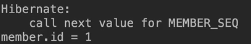

해당 글은 김영한님의 [인프런 강의 자바 ORM 표준 JPA 프로그래밍 - 기본편](https://www.inflearn.com/course/ORM-JPA-Basic)을 듣고 내용을 정리하기 위한 것으로 자세한 설명은 해당 강의를 통해 확인할 수 있습니다.

---

### 엔티티 매핑
- 객체와 테이블 매핑: @Entity, @Table
- 필드와 컬럼 매핑: @Column
- 기본 키 매핑: @Id
- 연관관계 매핑: @ManyToOne,@JoinColumn

### 객체와 테이블 매핑
**@Entity**
- @Entity가 붙은 클래스는 JPA가 관리, 엔티티라 한다.
- JPA를 사용해서 테이블과 매핑할 클래스는 @Entity 필수
- 주의
    - 기본 생성자 필수(파라미터가 없는 public 또는 protected 생성자)
    - final 클래스, enum, interface, inner 클래스 사용X
    - 저장할 필드에 final 사용 X

**@Entity** 속성 정리
- 속성: name
    - JPA에서 사용할 엔티티 이름을 지정한다.
    - 기본값: 클래스 이름을 그대로 사용(예: Member)
    - 같은 클래스 이름이 없으면 가급적 기본값을 사용한다.

**@Table**
- @Table은 엔티티와 매핑할 테이블 지정
| 속성 | 기능 | 기본값 |
| ---- | ---- | ---- |
|name|매핑할 테이블 이름|엔티티 이름을 사용|
|catalog|데이터베이스 catalog 매핑| |
|schema|데이터베이스 schema 매핑| |
|uniqueConstraints(DDL)|DDL 생성 시에 유니크 제약 조건 생성| |

---

### 데이터베이스 스키마 자동 생성
JPA 사용시 DDL을 애플리케이션 실행 시점에 자동 생성한다.
- 테이블 중심 -> 객체 중심
- 데이터베이스 방언을 활용해서 데이터베이스에 맞는 적절한 DDL 생성
- 이렇게 **생성된 DDL은 개발 장비에서만 사용(운영에서 사용X)**
- 생성된 DDL은 운영서버에서는 사용하지 않거나, 적절히 다듬은 후 사용


### 데이터베이스 스키마 자동 생성 - 속성
hibernate.hbm2ddl.auto
|옵션|설명|
| - | - |
|create|기존테이블 삭제 후 다시 생성(DROP + CREATE)|
|create-drop| create와 같으나 종료시점에 테이블 DROP|
|update|변경분만 반영(운영DB에는 사용하면 안됨)|
|validate|엔티티와 테이블이 정상 매핑되었는지만 확인|
|none|사용하지 않음|


### 데이터베이스 스키마 자동 생성 - 주의
- **운영 장비에는 절대 create, create-drop, update 사용하면 안된다.**
- 개발 초기 단계는 create 또는 updat
- 테스트 서버는 update 또는 validate
- 스테이징과 운영 서버는 validate 또는 none

---

### DDL 생성 기능
- 제약조건 추가: 회원 이름은 필수, 10자 초과X
    - @Column(nullable = false, length = 10)
- 유니크 제약조건 추가
    - Column(unique = true)
>DDL 생성 기능은 DDL을 자동 생성할 때만 사용되고 JPA의 실행 로직에는 영향을 주지 않는다.

---

### 필드와 컬럼 매핑

**요구사항 추가**
1. 회원은 일반 회원과 관리자로 구분해야 한다.
2. 회원 가입일과 수정일이 있어야 한다.
3. 회원을 설명할 수 있는 필드가 있어야 한다. 이 필드는 길이 제한이 없다.

```java
@Entity 
public class Member { 
    @Id 
    private Long id; 
    @Column(name = "name") 
    private String username; 
    private Integer age; 
    @Enumerated(EnumType.STRING) 
    private RoleType roleType; 
    @Temporal(TemporalType.TIMESTAMP) 
    private Date createdDate; 
    @Temporal(TemporalType.TIMESTAMP) 
    private Date lastModifiedDate; 
    @Lob 
    private String description; 
    //Getter, Setter… 
}
```
- @Id는 PK를 매핑 한것이다.
- 객체에는 “username”이라고 쓰고 DB 컬럼명으로는  “name”이라고 쓰고 싶으면 @Column(name = “name”)을 사용한다.
- Integer타입을 쓰면 타입과 가장 적절한 숫자 타입이 만들어진다. 
- @Enumerated를 사용하면 enum 타입을 사용할수 있다.
- @Temporal을 사용하면 날짜 정보를 저장할수 있다. TemporalType으로는 Date(날짜), Time(시간), TIMESTAMP(날짜, 시간)이 있다.
- varchar을 넘어서는 큰 값을 넣고 싶으면 @Lob을 사용하면 된다.

### 매핑 어노테이션 정리
hibernate.hbm2ddl.auto
|어노테이션|설명|
| - | - |
|@Column|컬럼 매핑|
|@Temporal|날짜 타입 매핑|
|@Enumerated|enum 타입 매핑|
|@Lob|BLOB, CLOB 매핑|
|@Transient|특정 필드를 컬럼에 매핑하지 않음(매핑 무시)|

### @Column
| 속성| 설명 | 기본값 |
| - | - | - |
|name|필드와 매핑할 테이블의 컬럼 이름 |객체의 필드 이름|
|insertable, 
updatable|등록, 변경 가능 여부|TRUE|
| nullable(DDL) |null 값의 허용 여부를 설정한다. false로 설정하면 DDL 생성 시에 not null 제약조건이 붙는다||
|unique(DDL)|@Table의 uniqueConstraints와 같지만 한 컬럼에 간단히 유니크 제약조건을 걸 때 사용한다.||
|columnDefinition(DDL) |데이터베이스 컬럼 정보를 직접 줄 수 있다.ex) varchar(100) default ‘EMPTY'|필드의 자바 타입과 방언 정보를 사용|
|length(DDL) |문자 길이 제약조건, String 타입에만 사용한다.|255|
|precision, scale(DDL)|BigDecimal 타입에서 사용한다(BigInteger도 사용할 수 있다). precision은 소수점을 포함한 전체 자 릿수를, scale은 소수의 자릿수다. 참고로 double, float 타입에는 적용되지 않는다. 아주 큰 숫자나 정 밀한 소수를 다루어야 할 때만 사용한다.|precision=19, scale=2 |
>Unique(DDL)은 sql 로그에 유니크 제약조건 이름이 랜덤명처럼 나와서 식별하기 힘들다. 그래서 제약조건 이름 설정이 가능한uniqueConstraints를 사용하는게 좋다.

### @Enumerated
자바 enum 타입을 매핑할 때 사용한다.

주의! ORDINAL 사용X
|속성|설명|기본값|
| - | - | - |
|value |• EnumType.ORDINAL: enum 순서를 데이터베이스에 저장 • EnumType.STRING: enum 이름을 데이터베이스에 저장 |EnumType.ORDINAL |
```java
public enum RoleType{
	USER, ADMIN
}
```
ORDINAL을 사용하면 안되는 이유는 만약 위처럼 enum의 값이 있다고 한다면 DB에는 USER는 0, ADMIN은 1이 저장된다. 하지만 이후에 GUEST가 추가되었다고 가정해보자.
```java
public enum RoleType{
//GUEST 추가
	GUEST, USER, ADMIN
}
```
이렇게 GUEST가 추가가 된다면 DB에 GUEST가 0으로 저장되는데 이전에 저장된 USER의 값도 0이기때문에 큰일이 일어난다.

### Temporal
날짜 타입(java.util.Date, java.util.Calendar)을 매핑할 때 사용한다
>**LocalDate, LocalDateTime을 사용할 때는 생략 가능(최신 하이버네이트 지원)**

|속성|설명|
|-|-|
|value|•TemporalType.DATE: 날짜, 데이터베이스 date 타입과 매핑(예: 2013–10–11)<br> •TemporalType.TIME: 시간, 데이터베이스 time 타입과 매핑(예: 11:11:11)<br> •TemporalType.TIMESTAMP: 날짜와 시간, 데이터베이스 timestamp 타입과 매핑(예: 2013–10–11 11:11:11)|

### @Lob
데이터베이스 BLOB, CLOB 타입과 매핑
- @Lob에는 지정할 수 있는 속성이 없다.
- 매핑하는 필드 타입이 문자면 CLOB 매핑, 나머지는 BLOB 매핑
    - CLOB: String, char[], java.sql.CLOB
    - BLOB: byte[], java.sql. BLOB

### @Transient
- 필드 매핑X
- 데이터베이스에 저장X, 조회X
- 주로 메모리상에서만 임시로 어떤 값을 보관하고 싶을 때 사용
- @Transient  
private Integer temp;

## 기본 키 매핑
### 기본 키 매핑 어노테이션
- @Id
- @GeneratedValue

```java
@Id @GeneratedValue(strategy = GenerationType.AUTO)
private Long id;
```

### 기본 키 매핑 방법
- 직접 할당: @Id만 사용
- 자동 생성(@GeneratedValue)
    - IDENTITY: 데이터베이스에 위임, MYSQL
    - SEQUENCE: 데이터베이스 시퀀스 오브젝트 사용, ORACLE
    - @SequenceGenerator 필요
    - TABLE: 키 생성용 테이블 사용, 모든 DB에서 사용
    - @TableGenerator 필요
    - AUTO: 방언에 따라 자동 지정, 기본값

---

### IDENTITY 전략 - 특징
- 기본 키 생성을 데이터베이스에 위임
- 주로 MySQL, PostgreSQL, SQL Server, DB2에서 사용(예: MySQL의 AUTO_ INCREMENT)
- JPA는 보통 트랜잭션 커밋 시점에 INSERT SQL 실행
- AUTO_ INCREMENT는 데이터베이스에 INSERT SQL을 실행한 이후에 ID 값을 알 수 있음
- IDENTITY 전략은 em.persist() 시점에 즉시 INSERT SQL 실행하고 DB에서 식별자를 조회

### IDENTITY 전략 - 매핑
```java
@Entity 
public class Member { 
    @Id 
    @GeneratedValue(strategy = GenerationType.IDENTITY) 
    private Long id; 
```
---

### SEQUENCE 전략 - 특징
- 데이터베이스 시퀀스는 유일한 값을 순서대로 생성하는 특별한 데이터베이스 오브젝트(예: 오라클 시퀀스)
- 오라클, PostgreSQL, DB2, H2 데이터베이스에서 사용
### SEQUENCE 전략 - 매핑
```java
@Entity 
@SequenceGenerator( 
        name = “MEMBER_SEQ_GENERATOR", 
        sequenceName = “MEMBER_SEQ", //매핑할 데이터베이스 시퀀스 이름 
        initialValue = 1, allocationSize = 1) 
public class Member { 
    @Id 
    @GeneratedValue(strategy = GenerationType.SEQUENCE, 
            generator = "MEMBER_SEQ_GENERATOR") 
    private Long id;
```



identity와 다르게 em.persist()하는 시점에 데이터베이스 시퀀스를 이용하여 식별자를 조회(call next value for …)한다. 그리고 조회한 식별자를 엔티티에 할당한 후 엔티티 를 영속성 컨텍스트에 저장한다(Identity에서 되지 않는 버퍼링이 가능하다.). 이후 커밋시점에 데이터베이스에 저장한다.

### SEQUENCE - @SequenceGenerator

•주의: allocationSize 기본값 = 50

|속성|설명|기본값|
|-|-|-|
|name|식별자 생성기 이름|필수|
|sequenceName|데잍베이스에 등록되어 있는 시퀀스 이름|hibernate_sequence|
|initialValue|DDL 생성 시에만 사용됨, 시퀀스 DDL을 생성할 때 처음 1시작하는 수를 지정한다.|1|
|allocationSize|시퀀스 한 번 호출에 증가하는 수(성능 최적화에 사용됨)<br>데이터베이스 시퀀스 값이 하나씩 증가하도록 설정되어 있으면 이 값을 반드시 1로 설정해야 한다|50|
|catalog, schema|데이터베이스 catalog, schema 이름||

### SEQUENCE 전략과 최적화

SEQUENCE 전략은 데이터베이스 시퀀스를 통해 식별자를 조회하는 추가 작업이 필요하다. 따라서 데이터베이스와 2번 통신한다. 

JPA가 시퀀스에 접근하는 횟수를 줄이기 위해서 allocationSize(기본값 50)를 사용한다.

allicationSize에 설정한 값 만큼 한번에 시퀀스 값을 증가 시키고, 그만큼 memory에 시퀀스 값을 할당한다. 이후 memory를 활용해 JVM안에서 시퀀스를 할당한다.

이 방법은 시퀀스 값을 선점하므로 여러 JVM이 동시에 동작해도 기본 키 값이 충돌하지 않는다는 장점이 있다.

---

### TABLE 전략

- 키 생성 전용 테이블을 하나 만들어서 데이터베이스 시퀀스를 흉내내는 전략
- 장점: 모든 데이터베이스에 적용 가능
- 단점: 성능이 떨어진다.

### TABLE 전략 - 매핑

```sql
create table MY_SEQUENCES ( 
    sequence_name varchar(255) not null, 
    next_val bigint, 
    primary key ( sequence_name ) 
)
```

```java
@Entity  
@TableGenerator( 
        name = "MEMBER_SEQ_GENERATOR", 
        table = "MY_SEQUENCES", 
        pkColumnValue = "MEMBER_SEQ", allocationSize = 1) 
public class Member { 
@Id 
@GeneratedValue(strategy = GenerationType.TABLE, 
                   generator = "MEMBER_SEQ_GENERATOR") 
    private Long id; 
```

### @TableGenerator - 속성

|속성|설명|기본값|
|-|-|-|
|name|식별자 생성기 이름|필수|
|table|키생성 테이블 명|hibernate_sequence|
|pkColumnName|시퀀스 컬럼명|sequence_name|
|valueColumnNa|시퀀스 값 컬럼명|next_val|
|pkColumnValue|키로 사용할 값 이름|엔티티 이름|
|initialValue|초기 값, 마지막으로 생성된 값이 기준이다.|0|
| allocationSize |시퀀스 한 번 호출에 증가하는 수(성능 최적화에 사용됨)| 50
|
|catalog, schema|데이터베이스 catalog, schema 이름||
|uniqueConstraints(DDL)|유니크 제약 조건을 지정할 수 있다.||

---

### 권장하는 식별자 전략

- **기본 키 제약 조건**: null 아님, 유일, **변하면 안된다.**
- 미래까지 이 조건을 만족하는 자연키(주민등록 번호 등)는 찾기 어렵다. 대리키(대체키)를 사용하자.
- 예를 들어 주민등록번호도 기본 키로 적절하기 않다.
- **권장: Long형(10억 넘어도 동작 가능) + 대체키 + 키 생성전략 사용**

---

## 실전 예제 - 1. 요구사항 분석과 기본 매핑

### 요구사항 분석

- 회원은 상품을 주문할 수 있다.
- 주문 시 여러 종류의 상품을 선택할 수 있다.

### 기능 목록

- 회원 기능
    - 회원등록
    - 회원조회
- 상품 기능
    - 상품등록
    - 상품수정
    - 상품조회
- 주문 기능
    - 상품주문
    - 주문내역조회
    - 주문취소


### 도메인 모델 분석

- 회원과 주문의 관계: 회원은 여러 번 주문할 수 있다. (일대다)
- 주문과 상품의 관계: 주문할 때 여러 상품을 선택할 수 있다. 반
대로 같은 상품도 여러 번 주문될 수 있다. 주문상품 이라는 모델
을 만들어서 다대다 관계를 일다대, 다대일 관계로 풀어냄


### 테이블 설계


### 엔티티 설계와 매핑


> 위 실전예제의 코드를 확인하고 싶으면  [자바 ORM 표준 JPA 프로그래밍 - 기본편](https://www.inflearn.com/course/ORM-JPA-Basic)에서 확인하시면 됩니다.
> 

### 데이터 중심 설계의 문제점

- 현재 방식은 객체 설계를 테이블 설계에 맞춘 방식
- 테이블의 외래키를 객체에 그대로 가져옴
- 객체 그래프 탐색이 불가능
- 참조가 없으므로 UML도 잘못됨