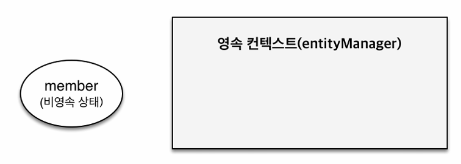
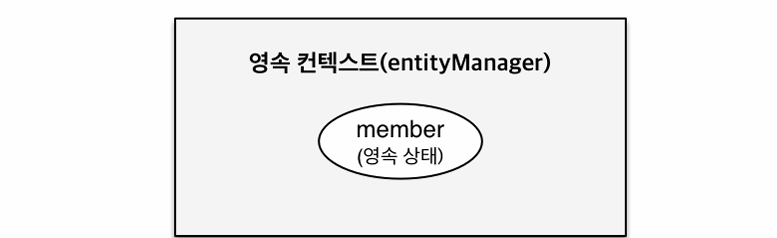
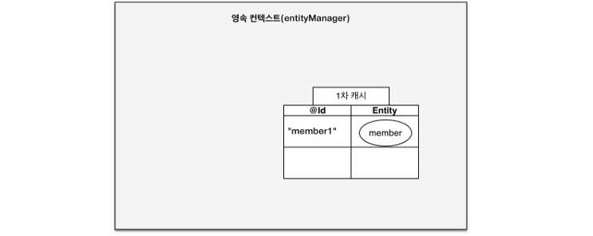
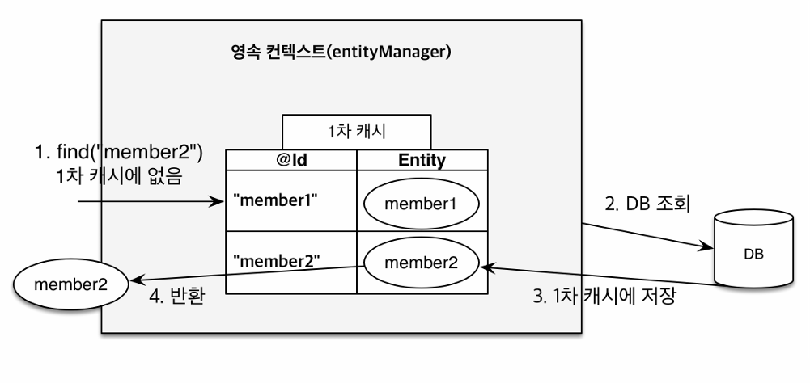
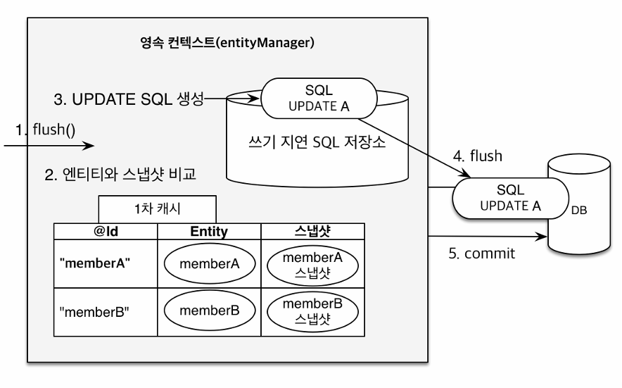

해당 글은 김영한님의 인프런 강의 [자바 ORM 표준 JPA 프로그래밍 - 기본편](https://www.inflearn.com/course/ORM-JPA-Basic)을 듣고 내용을 정리하기 위한 것으로 자세한 설명은 해당 강의를 통해 확인할 수 있습니다.

### 영속성 컨텍스트
---
### JPA에서 가장 중요한 2가지
- 객체와 관계형 데이터베이스 매핑하기(Object Relational Mapping)
- 영속성 컨텍스트

영속성 컨텍스트는 **엔티티를 영구 저장하는 환경**이라는 뜻이다. 논리적인 개념이며 눈에 보이지 않는다. 엔티티 매니저를 통해서 영속성 컨텍스트에 접근할 수 있다.

---

### 생명주기
엔티티는 아래와 같은 생명주기가 존재한다.
- 비영속 (new/transient)
영속성 컨텍스트와 전혀 관계가 없는 새로운 상태
- 영속 (managed)
영속성 컨텍스트에 관리되는 상태
- 준영속 (detached)
영속성 컨텍스트에 저장되었다가 분리된 상
- 삭제 (removed)
삭제된 상태

---

### 비영속

```java {linenos=true}
//객체를 생성한 상태(비영속)  
Member member = new Member();  
member.setId("member1");  
member.setUsername("회원1");
```
위와 같이 객체를 생성만 한 상태는 비영속 상태이다

---

### 영속

```java {linenos=true}
//객체를 생성한 상태(비영속)  
Member member = new Member();  
member.setId("member1");  
member.setUsername(“회원1”);
EntityManager em = emf.createEntityManager();
em.getTransaction().begin();
//객체를 저장한 상태(영속)
em.persist(member);
```
엔티티 매니저를 얻어와서 엔티티 매니저에 persist해서 멤버 객체를 집어 넣으면 엔티티 매니저 안에 있는 영속성 컨텍스트라는 곳에 멤버 객체가 들어가면서 영속 상태가 된다.
em.persist(member)할때는 DB에 저장되지는 않는다. 즉 , 영속 상태가 된다고 해서 바로 DB에 쿼리가 날아가지는 않는다. 트랜잭션을 커밋하는 시점에 영속성 컨텍스트에 있는 것이 DB에 쿼리가 날아가게 된다.

---

### 준영속, 삭제
```java {linenos=true}
//회원 엔티티를 영속성 컨텍스트에서 분리, 준영속 상태  
em.detach(member);

//객체를 삭제한 상태(삭제)  
em.remove(member);
```
em.remove는 실제 DB 삭제를 요청하는 상태라고 보면된다.

---

### 영속성 컨텍스트의 이점
영속성 컨텍스트의 이점은 아래와 같다
- 1차캐시
- 동일성 보장
- 트랜잭션을 지원하는 쓰기 지연
- 변경 감지
- 지연 로딩

### 엔티티 조회, 1차 캐시

```java
//엔티티를 생성한 상태(비영속)  
Member member = new Member();  
member.setId("member1");  
member.setUsername("회원1");
//엔티티를 영속  
em.persist(member);
```
위 사진에서 1차 캐시에 키인 @Id가 DB pk로 맵핑한 것이고  값이 엔티티 자체 값이 된다. 그래서 member id인 member1이 id가 되고 member 객체가 값이 된다.

---

### 1차 캐시에서 조회
```java
Member member = new Member();
member.setId("member1");
member.setUsername("회원1");
//1차 캐시에 저장됨
em.persist(member);
//1차 캐시에서 조회
Member findMember = em.find(Member.class, "member1");
```

member객체를 저장 해놓고 조회를 하면 jpa는 em.find로 먼저 DB를 뒤지지 않고 1차 캐시를 확인하고 member 엔티티가 있으면 캐시에 있는 값을 조회해온다.

---

### 데이터베이스에서 조회
```java
Member findMember2 = em.find(Member.class, "member2");
```

위 상황은 DB에는 member2가 있고 캐시에는 없는 경우입니다.

먼저 find(”member2”)로 캐시를 확인하고 없으면 DB에서 조회한다. DB에서 조회한 member2를 1차  캐시에 저장하고 member2를 반환한다.
이후에 meber2를 다시 조회하면 영속성 컨텍스트 안에 있는 1차 캐시에 있는 멤버2가 반환이 된다.
이처럼 DB를 조회하지않고 값을 조회할수있는 이점이 있지만 큰도움은 되지 않는다.
이유는 엔티티 매니저는 데이터베이스 단위로 보통 만들고 데이터 베이스 트랜잭션이 끝날때 영속성 컨텍스트를 같이 종료시킨다. 즉, 고객의 요청이 하나 들어오면 보통 비즈니스가 끝나버리면 영속성 컨텍스트를 지워서 1차 캐시도 다 날아간다.  그리고 여러 명의 고객이 사용하는 캐쉬가 아니고 짧은 찰나의 순간에만 이득이 있기때문에  크게 성능의 이점을 얻을수 있는 장점은 없다. 하지만 복잡한 비즈니스 같은 경우에는 쿼리가 줄어드는 경우도 있다.

### 영속 엔티티의 동일성 보장
```java
Member a = em.find(Member.class, "member1");  
Member b = em.find(Member.class, "member1");
System.out.println(a == b); //동일성 비교 true
```
1차 캐시로 반복 가능한 읽기(REPEATABLE READ) 등급의 트랜잭션 격리 수준을 데이터베이스가 아닌 애플리케이션 차원에서 제공한다. 간단히 JPA에서 위 코드 처럼 같은 트랜잭션 안에서 실행을 하면 == 비교에서 True가 나온다고 이해하면 된다.

---

### 엔티티 등록
### 트랜잭션을 지원하는 쓰기 지원
```java
EntityManager em = emf.createEntityManager();
EntityTransaction transaction = em.getTransaction();
//엔티티 매니저는 데이터 변경시 트랜잭션을 시작해야 한다.
transaction.begin();  // [트랜잭션] 시작
em.persist(memberA);
em.persist(memberB);
//여기까지 INSERT SQL을 데이터베이스에 보내지 않는다.
//커밋하는 순간 데이터베이스에 INSERT SQL을 보낸다.
transaction.commit(); // [트랜잭션] 커밋
```
em.persist에서 insert sql을 데이터 베이스에 보내지 않고 커밋 하는 순간에 데이터 베이스에 insert sql을 보낸다.

em.persist(memberA)를 하면 memberA가 1차캐시에 들어감과 동시에 JPA가 memberA의 엔티티를 분석해서 insert 쿼리를 생성하여 쓰기 지연 SQL 저장소에 쌓아둔다. em.persist(memberB)도 동일하게 진행된다.

트랜잭션을 commit하는 시점에 쓰기 지연 SQL 저장소에 있던 애들이 flush가 되면서 DB로 날아간다. 그리고 실제 데이터 베이스 트랜잭션이 커밋된다.

---

### 엔티티 수정
### 변경 감지
```java
EntityManager em = emf.createEntityManager();
EntityTransaction transaction = em.getTransaction();
transaction.begin();  // [트랜잭션] 시작
// 영속 엔티티 조회
Member memberA = em.find(Member.class, "memberA");
// 영속 엔티티 데이터 수정
memberA.setUsername("hi");
memberA.setAge(10);
//em.update(member) 이런 코드가 있어야 하지 않을까?
transaction.commit(); // [트랜잭션] 커밋
```
memberA의 값을 변경하고 변경한 값을 다시 저장하기 위해서 em.update(member) 같은 코드가 있어야 한다고 생각할수 있지만 그렇지 않다.
em.update(member)가 필요없는 이유는 다음과 같다.

JPA는 데이터베이스 트랜잭션을 커밋하는 시점에 내부적으로 flush가 호출된다. 그리고 엔티티와 스냅샷(값을 읽어온 최초 시점의 상태)을 비교한다. 비교해서 값이 바뀌었으면 update 쿼리를 쓰기 지연 SQL 저장소에 만든다. 그리고 업데이트 쿼리를 데이터베이스에 반영하고 커밋한다. 이것을 변경감지라고 한다.

---

### 엔티티 삭제
```java
//삭제 대상 엔티티 조회  
Member memberA = em.find(Member.class, "memberA");
em.remove(memberA); //엔티티 삭제
```
트랜잭션 커밋 시점에 delete 쿼리가 나가게 된다.

---

### 플러시
영속성 컨텍스트의 변경 내용을 데이터베이스에 반영하는 것이다.

### 플러시 발생
플러시를 발생시키는 경우는 아래와 같다.
- 변경 감지
- 수정된 엔티티 쓰기 지연 SQL 저장소에 등록
- 쓰기 지연 SQL 저장소의 쿼리를 데이터베이스에 전송(등록, 수정, 삭제 쿼리)

### 영속성 컨텍스트를 플러시 하는 방법
양석상 컨텍스트를 플러시 하는 방법은 다음과 같다.
- em.flush() - 직접 호출
- 트랜잭션 커밋 - 플러시 자동 호출
- JPQL 쿼리 실행 - 플러시 자동 호출

### JPQL 쿼리 실행시 플러시가 자동으로 호출되는 이유
```java
em.persist(memberA);
em.persist(memberB);
em.persist(memberC);
 //중간에 JPQL 실행
query = em.createQuery("select m from Member m", Member.class);
List<Member> members= query.getResultList();
```
em.persist()로 member A, B, C를 저장했는데 이때는 실제 데이터베이스에 쿼리가 날아가지는 않는다. 그래서 중간에 JPQL을 실행하게 되면 member를 DB에서 가져올게 없게 된다. 이런 문제를 방지하고자 JPQL은 실행할떄 무조건 flush를 날려버린다.

**플러시는** 영속성 컨텍스를 비우는게 아니라 영속성 컨텍스트의 변경 내용을 데이터베이스 동기화 하는거라고 이해하면 된다. 이러한 매커니즘이 가능한 이유는 트랜잭션이라는 작업 단위의 존재 때문이다. 즉, 커밋 직전에만 동기화하면 되기 때문에 가능한 것이다.

---

### 준영속 상태
준영속 상태는 영속 상태의 엔티티가 연속성 컨텍스트에서 분리되는 것을 말한다. 준영속 상태가 되면 영속성 컨텍스트가 제공하는 기능(dirty checking 등)을 사용하지 못한다.

### 준영속 상태로 만드는 방법
준영속 상태로 만드는 방법은 다음과 같다.
- em.detach(entity) - 특정 엔티티만 준영속 상태로 전환
- em.clear() - 영속성 컨텍스트를 완전히 초기화
- em.close() - 영속성 컨텍스트를 종료


