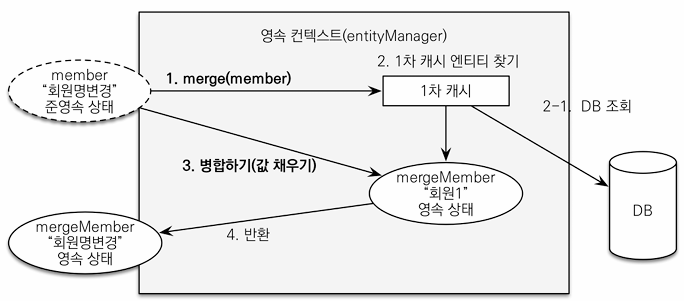

> 해당 글은 김영한님의 인프런 강의 [스프링부트와 JPA활용1 - 웹 어플리케이션 개발](https://www.inflearn.com/course/%EC%8A%A4%ED%94%84%EB%A7%81%EB%B6%80%ED%8A%B8-JPA-%ED%99%9C%EC%9A%A9-1)을 듣고 내용을 정리하기 위한 것으로 자세한 설명은 해당 강의를 통해 확인할 수 있습니다.
> 

---

## 홈 화면과 레이아웃

### **홈 컨트롤러 등록**

```java
@Slf4j
@Controller
public class HomeController {

    @RequestMapping("/")
    public String home() {
        log.info("home controller");
        return "home";
    }
}
```

### **타임리프 템플릿 등록**

>     
```jsx
<!DOCTYPE HTML>
<html xmlns:th="http://www.thymeleaf.org">
<head th:replace="fragments/header :: header">
    <title>Hello</title>
    <meta http-equiv="Content-Type" content="text/html; charset=UTF-8" />
</head>
<body>
<div class="container">
    <div th:replace="fragments/bodyHeader :: bodyHeader" />
    <div class="jumbotron">
    <h1>HELLO SHOP</h1>
    <p class="lead">회원 기능</p>
    <p>
        <a class="btn btn-lg btn-secondary" href="/members/new">회원 가입</a>
        <a class="btn btn-lg btn-secondary" href="/members">회원 목록</a>
    </p>
    <p class="lead">상품 기능</p>
    <p>
        <a class="btn btn-lg btn-dark" href="/items/new">상품 등록</a>
        <a class="btn btn-lg btn-dark" href="/items">상품 목록</a>
    </p>
    <p class="lead">주문 기능</p>
    <p>
        <a class="btn btn-lg btn-info" href="/order">상품 주문</a>
        <a class="btn btn-lg btn-info" href="/orders">주문 내역</a>
    </p>
    </div>
    <div th:replace="fragments/footer :: footer" />
</div> <!-- /container -->
</body>
</html>
```

    

백엔드 코드가 중점이기때문에 header.html, bodyHeader.html, footer.html와 bootstrap 적용은 넘어가도록 하겠다.

> 참고: **Hierarchical-style layouts**
예제에서는 뷰 템플릿을 최대한 간단하게 설명하려고, header, footer같은 템플릿 파일을 반복해서 포함한다. 다음 링크의 Hierarchical-style layouts을 참고하면 이런 부분도 중복을 제거할 수 있다.
[https://www.thymeleaf.org/doc/articles/layouts.html](https://www.thymeleaf.org/doc/articles/layouts.html)
> 

> 참고: 뷰 템플릿 변경사항을 서버 재시작 없이 즉시 반영하기
> 
> 1. spring-boot-devtools 추가
> 2. html 파일 build-> Recompile

---

## 회원 등록

폼 객체를 사용해서 화면 계층과 서비스 계층을 분리한다.

**회원 등록 폼 객체**

```java
@Getter @Setter
public class MemberForm {

    @NotEmpty(message = "회원 이름은 필수 입니다.")
    private String name;

    private String city;

    private String street;
    private String zipcode;
}
```

가단한 예제를 위해 검증하는 에노테이션은 한개만 한다.

**회원 등록 컨트롤러**

```java
@Controller
@RequiredArgsConstructor
public class MemberController {

    private final MemberService memberService;

    @GetMapping("/members/new")
    public String createForm(Model model) {
        model.addAttribute("memberForm", new MemberForm());
        return "members/createMemberForm";
    }

    @PostMapping("/members/new")
    public String create(@Valid MemberForm form, BindingResult result) {

        if (result.hasErrors()) {
            return "members/createMemberForm";
        }

        Address address = new Address(form.getCity(), form.getStreet(), form.getZipcode());

        Member member = new Member();
        member.setName(form.getName());
        member.setAddress(address);

        memberService.join(member);
        return "redirect:/";
    }
}
```

@valid로 인해 에러가 생기면 result에 담기면서 result에 담긴 정보를 가지고 createMemberForm.html로 이동한다. 그리고 에러가 발생해도 form데이터도 다시 createMemberForm에 가져가기때문에 웹에 입력했던 데이터 값은 그대로 나온다

>  
```jsx
<!DOCTYPE HTML>
<html xmlns:th="http://www.thymeleaf.org">
<head th:replace="fragments/header :: header" />
<style>
    .fieldError {
        border-color: #bd2130;
    }
</style>
<body>
<div class="container">
    <div th:replace="fragments/bodyHeader :: bodyHeader"/>
    <form role="form" action="/members/new" th:object="${memberForm}" method="post">
        <div class="form-group">
            <label th:for="name">이름</label>
            <input type="text" th:field="*{name}" class="form-control" placeholder="이름을 입력하세요"
                    th:class="${#fields.hasErrors('name')}? 'form-control fieldError' : 'form-control'">
            <p th:if="${#fields.hasErrors('name')}" th:errors="*{name}">Incorrect date</p>
        </div>
        <div class="form-group">
            <label th:for="city">도시</label>
            <input type="text" th:field="*{city}" class="form-control" placeholder="도시를 입력하세요">
        </div>
        <div class="form-group">
            <label th:for="street">거리</label>
            <input type="text" th:field="*{street}" class="form-control" placeholder="거리를 입력하세요">
        </div>
        <div class="form-group">
            <label th:for="zipcode">우편번호</label>
            <input type="text" th:field="*{zipcode}" class="form-control" placeholder="우편번호를 입력하세요">
        </div>
        <button type="submit" class="btn btn-primary">Submit</button>
    </form>
    <br/>
    <div th:replace="fragments/footer :: footer" />
</div> <!-- /container -->
</body>
</html>
```


---

## 회원 목록 조회

**회원 목록 컨트롤러 추가**

```java
@Controller
@RequiredArgsConstructor
public class MemberController {

        //...
        
        //추가
    @GetMapping("/members")
    public String list(Model model) {
        List<Member> members = memberService.findMembers();
        model.addAttribute("members", members);
        return "members/memberList";
    }
}
    
```

> 

    
```jsx
<!DOCTYPE HTML>
<html xmlns:th="http://www.thymeleaf.org">
<head th:replace="fragments/header :: header" />
<body>
<div class="container">
    <div th:replace="fragments/bodyHeader :: bodyHeader" />
    <div>
    <table class="table table-striped">
        <thead>
        <tr>
        <th>#</th>
        <th>이름</th>
        <th>도시</th>
        <th>주소</th>
        <th>우편번호</th>
        </tr>
        </thead>
        <tbody>
        <tr th:each="member : ${members}">
        <td th:text="${member.id}"></td>
        <td th:text="${member.name}"></td>
        <td th:text="${member.address?.city}"></td>
        <td th:text="${member.address?.street}"></td>
        <td th:text="${member.address?.zipcode}"></td>
        </tr>
        </tbody>
    </table>
    </div>
    <div th:replace="fragments/footer :: footer" />
</div> <!-- /container -->
</body>
</html>
```


타임리프에서 ?를 사용하면 null을 무시한다.

---

## 상품 등록

**상품 등록 폼**

```java
@Getter @Setter
public class BookForm {

    private Long id;
    private String name;
    private int price;
    private int stockQuantity;
    private String author;
    private String isbn;
}
```

**상품 등록 컨트롤러**

```java
@Controller
@RequiredArgsConstructor
public class ItemController {

    private final ItemService itemService;

    @GetMapping("/items/new")
    public String createForm(Model model) {
        model.addAttribute("form", new BookForm());
        return "items/createItemForm";
    }

    @PostMapping("/items/new")
    public String create(BookForm form) {
        Book book = new Book();
        book.setName(form.getName());
        book.setPrice(form.getPrice());
        book.setStockQuantity(form.getStockQuantity());
        book.setAuthor(form.getAuthor());
        book.setIsbn(form.getIsbn());

        itemService.saveItem(book);
        return "redirect:/";
    }
}
```

create메서드에서 Book을 set으로 BookForm의 값들을 하나씩 대입하는것보다 엔티티에 생성 메서드를 만드는게 좋다.

> 
```jsx
<!DOCTYPE HTML>
<html xmlns:th="http://www.thymeleaf.org">
<head th:replace="fragments/header :: header" />
<body>
<div class="container">
    <div th:replace="fragments/bodyHeader :: bodyHeader"/>
    <form th:action="@{/items/new}" th:object="${form}" method="post">
        <div class="form-group">
            <label th:for="name">상품명</label>
            <input type="text" th:field="*{name}" class="form-control" placeholder="이름을 입력하세요">
        </div>
        <div class="form-group">
            <label th:for="price">가격</label>
            <input type="number" th:field="*{price}" class="form-control" placeholder="가격을 입력하세요">
        </div>
        <div class="form-group">
            <label th:for="stockQuantity">수량</label>
            <input type="number" th:field="*{stockQuantity}" class="form-control" placeholder="수량을 입력하세요">
        </div>
        <div class="form-group">
            <label th:for="author">저자</label>
            <input type="text" th:field="*{author}" class="form-control" placeholder="저자를 입력하세요">
        </div>
        <div class="form-group">
            <label th:for="isbn">ISBN</label>
            <input type="text" th:field="*{isbn}" class="form-control" placeholder="ISBN을 입력하세요">
        </div>
        <button type="submit" class="btn btn-primary">Submit</button>
    </form>
    <br/>
    <div th:replace="fragments/footer :: footer" />
</div> <!-- /container -->
</body>
</html>
```


- 상품 등록 폼에서 데이터를 입력하고 Submit 버튼을 클릭하면 /items/new를 POST 방식으로 요청
- 상품 저장이 끝나면 상품 목록 화면(redirect:/items)으로 리다이렉트

---

## 상품 목록

**상품 목록 컨트롤러**

```java
@Controller
@RequiredArgsConstructor
public class ItemController {

    private final ItemService itemService;
    
    //...
    
    @GetMapping("/items")
    public String list(Model model) {
        List<Item> items = itemService.findItems();
        model.addAttribute("items", items);
        return "items/itemList";
    }
    
}
```

> 
    
```jsx
<!DOCTYPE HTML>
<html xmlns:th="http://www.thymeleaf.org">
<head th:replace="fragments/header :: header" />
<body>
<div class="container">
    <div th:replace="fragments/bodyHeader :: bodyHeader"/>
    <div>
        <table class="table table-striped">
            <thead>
            <tr>
                <th>#</th>
                <th>상품명</th>
                <th>가격</th>
                <th>재고수량</th>
                <th></th>
            </tr>
            </thead>
            <tbody>
            <tr th:each="item : ${items}">
                <td th:text="${item.id}"></td>
                <td th:text="${item.name}"></td>
                <td th:text="${item.price}"></td>
                <td th:text="${item.stockQuantity}"></td>
                <td>
                <a href="#" th:href="@{/items/{id}/edit (id=${item.id})}"
                    class="btn btn-primary" role="button">수정</a>
                </td>
            </tr>
            </tbody>
        </table>
    </div>
    <div th:replace="fragments/footer :: footer"/>
</div> <!-- /container -->
</body>
</html>
```


    

---

## 상품 수정

**상품 수정과 관련된 컨트롤러 코드**

```java
@Controller
@RequiredArgsConstructor
public class ItemController {

        
            //상품 수정 폼 추가
    @GetMapping("/items/{itemId}/edit")
    public String updateItemForm(@PathVariable("itemId") Long itemId, Model model) {
        Book item = (Book) itemService.findOne(itemId);

        BookForm form = new BookForm();
        form.setId(item.getId());
        form.setName(item.getName());
        form.setPrice(item.getPrice());
        form.setStockQuantity(item.getStockQuantity());
        form.setAuthor(item.getAuthor());
        form.setIsbn(item.getIsbn());

        model.addAttribute("form", form);
        return "items/updateItemForm";
    }

        @PostMapping("/items/{itemId}/edit")
    public String updateItem(@PathVariable Long itemId, @ModelAttribute("form") BookForm form) {

        Book book = new Book();
        book.setId(form.getId());
        book.setName(form.getName());
        book.setPrice(form.getPrice());
        book.setStockQuantity(form.getStockQuantity());
        book.setAuthor(form.getAuthor());
        book.setIsbn(form.getIsbn());

        itemService.saveItem(book); 
        return "redirect:/items";
    }
}
```

>  
```jsx
<!DOCTYPE HTML>
<html xmlns:th="http://www.thymeleaf.org">
<head th:replace="fragments/header :: header" />
<body>
<div class="container">
    <div th:replace="fragments/bodyHeader :: bodyHeader"/>
    <form th:object="${form}" method="post">
        <!-- id -->
        <input type="hidden" th:field="*{id}" />
        <div class="form-group">
            <label th:for="name">상품명</label>
            <input type="text" th:field="*{name}" class="form-control" placeholder="이름을 입력하세요" />
        </div>
        <div class="form-group">
            <label th:for="price">가격</label>
            <input type="number" th:field="*{price}" class="form-control" placeholder="가격을 입력하세요" />
        </div>
        <div class="form-group">
            <label th:for="stockQuantity">수량</label>
            <input type="number" th:field="*{stockQuantity}" class="form-control" placeholder="수량을 입력하세요" />
        </div>
        <div class="form-group">
            <label th:for="author">저자</label>
            <input type="text" th:field="*{author}" class="form-control" placeholder="저자를 입력하세요" />
        </div>
        <div class="form-group">
            <label th:for="isbn">ISBN</label>
            <input type="text" th:field="*{isbn}" class="form-control" placeholder="ISBN을 입력하세요" />
        </div>
        <button type="submit" class="btn btn-primary">Submit</button>
    </form>
    <div th:replace="fragments/footer :: footer" />
</div> <!-- /container -->
</body>
</html>
```


**상품 수정 폼 이동**

1. 수정 버튼을 선택하면 /items/{itemId}/edit URL을 GET 방식으로 요청
2. 그 결과로 updateItemForm() 메서드를 실행하는데 이 메서드는 itemService.fondOne(itemId)를 호출해서 수정할 상품을 조회
3. 조회 결과를 모델 객체에 담아서 뷰(items/updateItemForm)에 전달

**상품 수정 실행**

1. 상품 수정 폼에서 정보를 수정하고 Submit 버튼을 선택
2. /items/{itemId}/edit URL을 POST방식으로 요청하고 updateItem() 메서드를 실행
3. 이때 컨트롤러에 파라미터로 넘어온 Item 엔티티 인스턴스는 현재 준영속 상태다. 따라서 영속성 컨텍스트의 지원을 받을 수 없고 데이터를 수정해도 변경 감지 기능은 동작X

---

## 변경 감지와 병합(merge)

**준영속 엔티티**

영속성 컨텍스트가 더는 관리하지 않는 엔티티를 말한다.
(여기서는itemService.saveItem(book)에서 수정을 시도하는  Book 객체다.) **Book 객체는 이미 DB에 한번 저장되어서 식별자가 존재**한다. 이렇게 임의로 만들어낸 엔티티도 기존 식별자를 가지고 있으면 준영속 엔티티로 볼 수있다.

**준영속 엔티티를 수정하는 2가지 방법**

- 변경 감지 기능 사용
- 병합(merge)사용

### **변경 감지 기능 사용**

```java
@Transactional
void update(Item itemParam) { //itemParam: 파리미터로 넘어온 준영속 상태의 엔티티
        Item findItem = em.find(Item.class, itemParam.getId()); //같은 엔티티를 조회한다.
        findItem.setPrice(itemParam.getPrice()); //데이터를 수정한다.
}
```

영속성 컨텍스트에서 엔티티를 다시 조회한 후에 데이터를 수정하는 방법읻. 트랜잭션 안에서 엔티티를 다시 조회, 변경 할 값 선택후 트랜잭션 커밋 시점에 변경감지가 동작해서 데이터베이스에 UPDATE SQL 실행한다.

### **병합사용**

병합은 준영속 상태의 엔티티를 영속 상태로 변경할 때 사용하는 기능이다.

```java
@Transactional
void update(Item itemParam) { //itemParam: 파리미터로 넘어온 준영속 상태의 엔티티
        Item mergeItem = em.merge(itemParam);
}
```

**병합: 기존에 있는 엔티티**



병합시 동작 방식을 간단히 정리

1. 준영속 엔티티의 식별자 값으로 영속 엔티티를 조회한다.
2. 영속 엔티티의 값을 준영속 엔티티의 값으로 모두 교체한다.(병합한다.)
3. 트랜잭션 커밋 시점에 변경 감지 기능이 동작해서 데이터베이스에 UPDATE SQL이 실행

> 주의: 변경 감지 기능을 사용하면 원하는 속성만 선택해서 변경할 수 있지만, 병합을 사용하면 모든 속성이 변경된다. 병합시 값이 없으면 null로 업데이트 할 위험도 있다. (병합은 모든 필드를 교체한다.)
> 

### 상품 리포지토리의 저장 메서드 분석 ItemRepository

```java
@Repository
@RequiredArgsConstructor
public class ItemRepository {

    private final EntityManager em;

    public void save(Item item) {
        if (item.getId() == null) {
            em.persist(item);
        } else {
            em.merge(item);
        }
    }
    //...
    
}
```

- save() 메서드는 식별자 값이 없으면(null) 새로운 엔티티로 판단해서 영속화(persist)하고 식별자가 있으면 병합(merge)
- 지금처럼 준영속 상태인 상품 엔티티를 수정할 때는 id값이 있으므로 병합 수행

> 실무에서는 보통 업데이트 기능이 매우 제한적이다. 그런데 병합은 모든 필드를 변경해버리고, 데이터가 없으면 null 로 업데이트 해버린다. 병합을 사용하면서 이 문제를 해결하려면, 변경 폼 화면에서 모든 데이터를 항
상 유지해야 한다. **실무에서는 보통 변경가능한 데이터만 노출하기 때문에, 병합을 사용하는 것이 오히려 번거롭다.**
> 

**그럼 변경감지와 병합중 어떤 것을 써야할까?**

가장 좋은 해결방법은 엔티티를 변경할때는 항상 변경감지를 상용하는 것이다.

- 컨트롤러에서 어설프게 엔티티를 생성 X
- 트랜잭션이 있는 서비스 계층에 식별자(id)와 변경할 데이터를 명확하게 전달(파라미터 or dto)
- 트랜잭션이 있는 서비스 계층에서 영속 상태의 엔티티를 조회하고, 엔티티의 데이터를 직접 변경
- 트랜잭션 커밋 시점에 변경 감지가 실행됩니다.

```java
@Controller
@RequiredArgsConstructor
public class ItemController {

    private final ItemService itemService;
    
    //....
    
    @PostMapping("/items/{itemId}/edit")
    public String updateItem(@PathVariable Long itemId, @ModelAttribute("form") BookForm form) {

        itemService.updateItem(itemId, form.getName(), form.getPrice(), form.getStockQuantity());
        return "redirect:/items";
    }
}
```

```java
@Service
@Transactional(readOnly = true)
@RequiredArgsConstructor
public class ItemService {

    private final ItemRepository itemRepository;
    
    //...
    
    @Transactional
    public void updateItem(Long itemId, String name, int price, int stockQuantity) {
        Item finditem = itemRepository.findOne(itemId);
        finditem.setName(name);
        finditem.setPrice(price);
        finditem.setStockQuantity(stockQuantity);
    }
}
```

---

## 상품 주문

**상품 주문 컨트롤러**

```java
Controller
@RequiredArgsConstructor
public class OrderController {

    private final OrderService orderService;
    private final MemberService memberService;
    private final ItemService itemService;
    
    @GetMapping("/order")
    public String creatForm(Model model) {

        List<Member> members = memberService.findMembers();
        List<Item> items = itemService.findItems();

        model.addAttribute("members", members);

        model.addAttribute("items", items);

        return "order/orderForm";
    }

    @PostMapping("/order")
    public String order(@RequestParam("memberId") Long memberId,
                        @RequestParam("itemId") Long itemId,
                        @RequestParam("count") int count) {

        orderService.order(memberId, itemId, count);
        return "redirect:/orders";
    }
   
 }
```

주문 폼 이동

- 메인 화면에서 상품 주문을 선택하면 /order를 GET방식으로 호출
- OrderController의 createForm() 메서드
- 주문 화면에는 주문할 고객정보와 상품 정보가 필요하므로 model객체에 담아서 뷰에 넘겨줌

주문 실행

- 주문할 회원과 상품 그리고 수량을 선택해서 Submit 버튼을 누르면 /order URL을 POST 방식으로 호출
- 컨트롤러의 order() 메서드 실행
- 이 메서드는 고객 식별자(memberId), 주문할 상품 식별자(itemId), 수량(count)정보를 받아서 주문 서비스에 주문을 요청
- 주문이 끝나면 상품 주문 내역이 있는 /orders URL로 리다이렉트
- 상품 주문 폼
    
    ```jsx
    <!DOCTYPE HTML>
    <html xmlns:th="http://www.thymeleaf.org">
    <head th:replace="fragments/header :: header" />
    <body>
    
    <div class="container">
        <div th:replace="fragments/bodyHeader :: bodyHeader"/>
        <form role="form" action="/order" method="post">
            <div class="form-group">
                <label for="member">주문회원</label>
                <select name="memberId" id="member" class="form-control">
                    <option value="">회원선택</option>
                    <option th:each="member : ${members}"
                            th:value="${member.id}"
                            th:text="${member.name}" />
                </select>
            </div>
            <div class="form-group">
                <label for="item">상품명</label>
                <select name="itemId" id="item" class="form-control">
                    <option value="">상품선택</option>
                    <option th:each="item : ${items}"
                            th:value="${item.id}"
                            th:text="${item.name}" />
                </select>
            </div>
            <div class="form-group">
                <label for="count">주문수량</label>
                <input type="number" name="count" class="form-control" id="count" placeholder="주문 수량을 입력하세요">
            </div>
            <button type="submit" class="btn btn-primary">Submit</button>
        </form>
        <br/>
        <div th:replace="fragments/footer :: footer" />
    </div> <!-- /container -->
    </body>
    </html>
    ```
    

---

## 주문 목록 검색, 취소

**주문 목록**

**검색 컨트롤러**

```java
@Controller
@RequiredArgsConstructor
public class OrderController {

    private final OrderService orderService;
    private final MemberService memberService;
    private final ItemService itemService;
    
    //...
    
    @GetMapping("/orders")
    public String orderList(@ModelAttribute("orderSearch") OrderSearch orderSearch, Model model) {
        List<Order> orders = orderService.findOrders(orderSearch);
        model.addAttribute("orders", orders);

        return "order/orderList";
    }   
}
```
>  
```jsx
<!DOCTYPE HTML>
<html xmlns:th="http://www.thymeleaf.org">
<head th:replace="fragments/header :: header"/>
<body>
<div class="container">
    <div th:replace="fragments/bodyHeader :: bodyHeader"/>
    <div>
        <div>
            <form th:object="${orderSearch}" class="form-inline">
                <div class="form-group mb-2">
                    <input type="text" th:field="*{memberName}" class="form-control" placeholder="회원명"/>
                </div>
                <div class="form-group mx-sm-1 mb-2">
                    <select th:field="*{orderStatus}" class="form-control">
                        <option value="">주문상태</option>
                        <option th:each="status : ${T(jpabook.jpashop.domain.OrderStatus).values()}"
                                th:value="${status}"
                                th:text="${status}">option
                        </option>
                    </select>
                </div>
                <button type="submit" class="btn btn-primary mb-2">검색</button>
            </form>
        </div>
        <table class="table table-striped">
            <thead>
            <tr>
                <th>#</th>
                <th>회원명</th>
                <th>대표상품 이름</th>
                <th>대표상품 주문가격</th>
                <th>대표상품 주문수량</th>
                <th>상태</th>
                <th>일시</th>
                <th></th>
            </tr>
            </thead>
            <tbody>
            <tr th:each="item : ${orders}">
                <td th:text="${item.id}"></td>
                <td th:text="${item.member.name}"></td>
                <td th:text="${item.orderItems[0].item.name}"></td>
                <td th:text="${item.orderItems[0].orderPrice}"></td>
                <td th:text="${item.orderItems[0].count}"></td>
                <td th:text="${item.status}"></td>
                <td th:text="${item.orderDate}"></td>
                <td>
                <a th:if="${item.status.name() == 'ORDER'}" href="#"
                    th:href="'javascript:cancel('+${item.id}+')'"
                    class="btn btn-danger">CANCEL</a>
                </td>
            </tr>
            </tbody>
        </table>
    </div>
    <div th:replace="fragments/footer :: footer"/>
</div> <!-- /container -->
</body>
<script>
    function cancel(id) {
        var form = document.createElement("form");
        form.setAttribute("method", "post");
        form.setAttribute("action", "/orders/" + id + "/cancel");
        document.body.appendChild(form);
        form.submit();
    }
</script>
</html>
```


**주문 취소**

```java
@Controller
@RequiredArgsConstructor
public class OrderController {

    private final OrderService orderService;
    private final MemberService memberService;
    private final ItemService itemService;
    
    @PostMapping("/orders/{orderId}/cancel")
    public String cancelOrder(@PathVariable("orderId") Long orderId) {
        orderService.cancelOrder(orderId);
        return "redirect:/orders";
    }
}
```

---