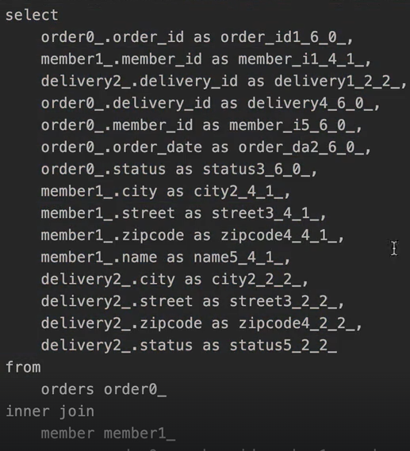

> 해당 글은 김영한님의 인프런 강의 [스프링부트와 JPA활용2 - API 개발과 성능 최적화](https://www.inflearn.com/course/%EC%8A%A4%ED%94%84%EB%A7%81%EB%B6%80%ED%8A%B8-JPA-API%EA%B0%9C%EB%B0%9C-%EC%84%B1%EB%8A%A5%EC%B5%9C%EC%A0%81%ED%99%94)을 듣고 내용을 정리하기 위한 것으로 자세한 설명은 해당 강의를 통해 확인할 수 있습니다.
> 

---

## 간단한 주문 조회 V1: 엔티티를 직접 노출

@xToOne(ManyToOne, OneToOne) 관계를 최적화 하는데에 집중한다.

V1은 좋은 방법이 아니기 때문에 간단히 보고 넘어가도 된다.

```java
@RestController
@RequiredArgsConstructor
public class OrderSimpleApiController {

    private final OrderRepository orderRepository;
    
    @GetMapping("/api/v1/simple-orders")
    public List<Order> ordersV1() {
        
        List<Order> all = orderRepository.findAllByString(new OrderSearch());

        for (Order order : all) {
                  //getMember까지는 프록시 객체를 가져오고.getName은 실제 값을 가져와야 하기때문에
                  //실제 값을 가져와야해서 Lazy 강제 초기화 된다.
            order.getMember().getName(); //Lazy 강제 초기화
            order.getDelivery().getAddress(); //Lazy 강제 초기화
        }

        return all;
    }
}
```

- order → member와 order → delivery는 지연 로딩이기 때문에 실제 엔티티 대신 프록시가 존재한다.
- jackson 라이브러리는 기본적으로 ByteBuddyIntercepter객체를 json으로 생성이 안되서 예외가 발생한다.
- hibernate5Module을 스프링 빈으로 등록하면 해결된다.

**스프링 부트 3.0 이상: Hibernate5JakartaModule 등록** 

build.gradle에 추가

```java
implementation 'com.fasterxml.jackson.datatype:jackson-datatype-hibernate5-jakarta’
```

JpashopApplication에 다음 코드 추가

```java
@Bean
Hibernate5JakartaModule hibernate5Module() {
        Hibernate5Module hibernate5Module = new Hibernate5Module();
        //강제 지연 로딩 설정
    hibernate5Module.configure(Hibernate5Module.Feature.FORCE_LAZY_LOADING, true);
    return hibernate5Module;
}
```

위 코드처럼 설정하면 강제로 지연 로딩이 가능하다.

order → member, member → orders 양방향 연관관계를 계속 로딩하기 떄문에 @JsonIgnore 옵션을 한곳에 주어야한다.

---

## 간단한 주문 조회 **V2: 엔티티를 DTO로 변환**

**orderSimpleApiController - 추가**

```java
@GetMapping("/api/v2/simple-orders")
public List<SimpleOrderDto> ordersV2() {
    //Order 2개
    //N + 1문제 발생, 1 + 회원 N + 배송 N
    List<Order> orders = orderRepository.findAllByString(new OrderSearch());

    List<SimpleOrderDto> result = orders.stream()
            .map(o -> new SimpleOrderDto(o))
            .collect(Collectors.toList());

    return result;
 }
 
 
@Data
static class SimpleOrderDto {
    private Long orderId;
    private String name;
    private LocalDateTime orderDate;
    private OrderStatus orderStatus;
    private Address address;

    public SimpleOrderDto(Order order) {
        orderId = order.getId();
        name = order.getMember().getName(); //LAZY 초기화, 영속성 컨텍스트가 memberid를 가지고 영속성 컨텍스트에서 찾아온다. 업으면 DB에 쿼리를 날림
        orderDate = order.getOrderDate();
        orderStatus = order.getStatus();
        address = order.getDelivery().getAddress(); //LAZY 초기화
    }
}
```

엔티티를 DTO로 변환하는 일반적인 방법이다. 

쿼리가 총 1 + N + N 번 실행 되는데 order 조회 1번(order 조회 결과 수가 N이 된다.), order → member 지연 로딩 N번, order → delivery 지연 로딩 조회 N번으로 order의 결과가 4개면 최악의 경우 1+4+4번 실행 된다.

---

## 간단한 주문 조회 V3: 엔티티를 DTO로 변환 - 페치 조인 최적화

**OrderSimpleApiController - 추가**

```java
@GetMapping("/api/v3/simple-orders")
public List<SimpleOrderDto> ordersV3() {
    List<Order> orders = orderRepository.findAllWithMemberDelivery();
    List<SimpleOrderDto> result = orders.stream()
            .map(o -> new SimpleOrderDto(o))
            .collect(Collectors.toList());

    return result;
}
```

**OrderRepository - 추가** 

```java
public List<Order> findAllWithMemberDelivery() {
    return em.createQuery(
            "select o from Order o" +
                    " join fetch o.member m" +
                    " join fetch o.delivery d", Order.class
    ).getResultList();
}
```

- 페치 조인으로 쿼리 1번에 조회



- 페치 조인으로 order → member, order → delibvery는 이미 조회 된 상태 이므로 지연로딩X

단점은 select절에 모든 정보를 다 가지고 있다. 이것을 해결하기 위한 방법으로는 V4를 확인하면 된다.

---

## 간단한 주문 조회 V4: JPA에서 DTO로 바로 조회

**OrderSimpleAipController - 추가**

```java
private final OrderSimpleQueryRepository orderSimpleQueryRepository; //의존관계 주입

@GetMapping("/api/v4/simple-orders")
public List<OrderSimpleQueryDto> ordersV4() {
    return orderSimpleQueryRepository.findOrderDtos();
}
```

**OrderSimpleQueryRepository 조회 전용 리포지토리**

```java
@Repository
@RequiredArgsConstructor
public class OrderSimpleQueryRepository {

    private final EntityManager em;

    public List<OrderSimpleQueryDto> findOrderDtos() {
        return em.createQuery(
                        "select new jpabook.jpashop.repository.order.simplequery.OrderSimpleQueryDto(o.id, m.name, o.orderDate, o.status, d.address) " +
                                "from Order o" +
                                " join o.member m" +
                                " join o.delivery d", OrderSimpleQueryDto.class)
                .getResultList();
    }
}
```

V3에서는 fetch join을 사용하고 V4에서는 join을 사용한 이유는 fetch join은 JPA에서 지원하는 문법이고, 엔티티를 조회할 떄만 사용할수 있다. V4처럼 DTO를 조회할때는 사용할수 없기 때문이다.

new 오퍼레이션을 사용하면 OrderSimpleQueryDto(o) 이렇게 넘기면 o의 식별자인 o.id만 넘어간다. 즉, OrderSimpleQueryDto(o.id)와 동일하다. 그래서 식별자를 넘기는게 아닌 값들을 지정해서 넘겨준다.

**OrderSimpleQueryDto 리포지토리에서 DTO 직접 조회**

```java
@Data
public class OrderSimpleQueryDto {
    private Long orderId;
    private String name;
    private LocalDateTime orderDate;
    private OrderStatus orderStatus;
    private Address address;

    public OrderSimpleQueryDto(Long orderId, String name, LocalDateTime orderDate, OrderStatus orderStatus, Address address) {
        this.orderId = orderId;
        this.name = name; //LAZY 초기화, 영속성 컨텍스트가 memberid를 가지고 영속성 컨텍스트에서 찾아온다. 없으면 DB에 쿼리를 날림
        this.orderDate = orderDate;
        this.orderStatus = orderStatus;
        this.address = address; //LAZY 초기화
    }
}
```

쿼리 결과


- V3와 다르게 원하는 값을 선택해서 조회
- new 명령어를 사용해서 JPQL의 결과를 DTO로 즉시 변환
- SELECT 절에서 원하는 데이터를 직접 선택하므로 DB  애플리케이션 네트웍 용량 최적화(생각보다 미비)
- V3는 List<Order>의 값을 수정할수 있어서 재사용성이 있지만, V4는 API 스펙에 맞춘 코드가 리포지토리에 들어가기 때문에 재사용성이 떨어진다.

### 정리

V3, V4 두가지 방법은 각각 장단점이 있다. 둘중 상황에 따라서 더 나은 방법을 선택하면 되는데 권장하는 방법은 다음과 같다.

**쿼리 방식 선택 권장 순서**

1. 우선 엔티티를 DTO로 변환하는 방법을 선택
2. 필요하면 페치 조인으로 성능 최적화 → 대부분 성능 이슈 해결
3. 그래도 안되면 DTO로 직접 조회
4. 최후의 방법은 JPA가 제공하는 네이티브 SQL이나 스프링 JDBC Template을 사용해서 SQL을 직접 사용

---