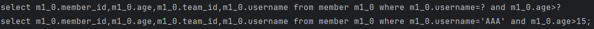

> 해당 글은 김영한님의 인프런 강의 [스프링부트와 JPA활용2 - API 개발과 성능 최적화](https://www.inflearn.com/course/%EC%8A%A4%ED%94%84%EB%A7%81%EB%B6%80%ED%8A%B8-JPA-API%EA%B0%9C%EB%B0%9C-%EC%84%B1%EB%8A%A5%EC%B5%9C%EC%A0%81%ED%99%94)을 듣고 내용을 정리하기 위한 것으로 자세한 설명은 해당 강의를 통해 확인할 수 있습니다.
> 

---

쿼리 메소드 기능 3가지

- 메소드 이름으로 쿼리 생성
- 메소드 이름으로 JPA NamedQuery 호출
- @Query 어노테이션을 사용해서 리포지토리 인터페이스 쿼리 직접 정의

## 메소드 이름으로 쿼리 생성

메소드 이름을 분석해서 JPQL 쿼리를 실행한다.

이름과 나이를 기준으로 회원을 조회하는 상황이다.

**순수 JPA 리포지토리**

```java
public List<Member> findByUsernameAndAgeGreaterThen(String username, int age) {
    return em.createQuery("select m from Member m where m.username = :username and m.age > :age", Member.class)
            .setParameter("username", username)
            .setParameter("age", age)
            .getResultList();
}
```

**순수 JPA 테스트 코드**

```java
@Test
public void findByUsernameAndAgeGreaterThen() {
    Member m1 = new Member("AAA", 10);
    Member m2 = new Member("AAA", 20);
    memberJpaRepository.save(m1);
    memberJpaRepository.save(m2);

    List<Member> result = memberJpaRepository.findByUsernameAndAgeGreaterThen("AAA", 15);

    assertThat(result.get(0).getUsername()).isEqualTo("AAA");
    assertThat(result.get(0).getAge()).isEqualTo(20);
    assertThat(result.size()).isEqualTo(1);

}
```

**스프링 데이터 JPA**

```java
public interface MemberRepository extends JpaRepository<Member, Long> {

        List<Member> findByUsernameAndAgeGreaterThan(String username, int age);

}
```

**쿼리 결과**



스프링 데이터 JPA는 메소드 이름을 분석해서 JPQL을 생성하고 실행한다.

메소드이름의 Username은 파라미터의 username과 equal 조건이고 Age는 GreatherThan이여서 파라미터의 age보다 크거나 작다의 조건이 된다.

**쿼리 메소드 필터 조건**

[스프링 데이터 JPA 공식 문서 참고](https://docs.spring.io/spring-data/jpa/reference/jpa/query-methods.html#jpa.query-methods.query-creation)

**스프링 데이터 JPA가 제공하는 쿼리 메소드 기능**

- 조회: find…By, read…By, query…By, get…By
    - [공식 문서 참고](https://docs.spring.io/spring-data/jpa/reference/jpa/query-methods.html#jpa.query-methods.query-creation)
    - ex) findHelloBy 처럼 …에 식별하기 위한 내용(설명)이 들어가도 된다.
- COUNT: count…By 반환타입
- EXISTS: exists…By 반환타입
- 삭제: delete…By, remove…By
- DISTINCT: findDistinct, findMemberDistinctBy
- LIMIT: findFirst3, findFirst, findTop, findTop3
    - [공식 문서 참고](https://docs.spring.io/spring-data/jpa/reference/repositories/query-methods-details.html#repositories.limit-query-result)

> 이 기능은 엔티티의 필드명이 변경되면 인터페이스에 정의한 메서드 이름도 꼭 함께 변경해야 한다. 그렇지않으면 애플리케이션을 시작하는 시점에 오류가 발생한다.
이렇게 애플리케이션 로딩 시점에 오류를 인지할 수 있는 것이 스프링 데이터 JPA의 매우 큰 장점이다.
> 

---

## JPA NamedQuery

@NamedQuery 어노테이션으로 Named 쿼리 정의

```java
@NamedQuery(
        name="Member.findByUsername",
        query = "select m from Member m where m.username = :username"
)
public class Member {
        //...
}
```

**JPA를 직접 사용해서 Named 쿼리 호출**

```java
@Repository
public class MemberJpaRepository {

        //...

    public List<Member> findByUsername(String username) {
        return em.createNamedQuery("Member.findByUsername", Member.class)
                .setParameter("username", username)
                .getResultList();
    }
}
```

**스프링 데이터 JPA로 NamedQuery 사용**

```java
@Query(name = "Member.findByUsername")
List<Member> findByUsername(@Param("username") String username);
```

@Query를 생략하고 메서드 이름만을 Named쿼리를 호출할수 있다.

**스프링 데이터 JPA로 Named 쿼리 호출**

```java
public interface MemberRepository 
extends JpaRepository<Member, Long> { // 여기서 선언한 Member 도메인 클래스

        List<Member> findByUsername(@Param("username") String username);
}
```

1. 스프링 데이터 JPA는 선언한 “도메인 클래스 + .(점) + 메서드 이름”으로 Named 쿼리를 찾아서 실행
2. 실행할 Named 쿼리가 없을시 메서드 이름으로 쿼리 생성 전약을 사용

> 스프링 데이터 JPA를 사용하면 실무에서 Named Query를 직접 등록해서 사용하는 일은 드물다. 대신 @Query를 사용해서 리파지토리 메소드에 쿼리를 직접 정의한다
> 

---

## @Query, 리포지토리 메소드에 쿼리 정의하기

**메서드 JPQL 쿼리 작성**

```java
public interface MemberRepository extends JpaRepository<Member, Long> {

    @Query("select m from Member m where m.username = :username and m.age = :age")
    List<Member> findUser(@Param("username") String username, @Param("age") int age);		
}
```

- @org.springframework.data.jpa.repository.Query 어노테이션을 사용
- 실행할 메서드에 정적 쿼리를 직접 작성하므로 이름 없는 Named 쿼리라 할 수 있다.
- JPA Named 쿼리처럼 @Query(…)에서 m.usererrss 처럼 잘못 작성하면 어플리케이션 실행 시점에 문법 오류를 발견할수 있는 큰 장점이 있다.

> 메서드 이름으로 쿼리 생성 기능은 파라미터가 증가하면 메서드 이름이 지저분해지기때문에 @Query 기능을 자주 사용함
> 

---

## @Query, 값, DTO 조회하기

**단순히 값 하나를 조회**

```java
@Query("select m.username from Member m")
List<String> findUsernameList();
```

JPA 값 타입(@Embedded)도 이 방식으로 조회할 수 있다.

**MemberDto**

```java
@Data
public class MemberDto {

    private Long id;
    private String username;
    private String teamName;

    public MemberDto(Long id, String username, String teamName) {
        this.id = id;
        this.username = username;
        this.teamName = teamName;
    }
}
```

**DTO로 직접 조회**

```java
@Query("select new study.data_jpa.dto.MemberDto(m.id, m.username, t.name) from Member m join m.team t")
List<MemberDto> findMemberDto();
```

DTO로 직접 조회하려면 JPA의 new 명령어를 사용해야하고 생성자가 맞는 DTO가 필요하다.(JPA 사용 방식과 동일)

---

## 파라미터 바인딩

파라미터 바인딩은 위치 기반, 이름 기반이 있다.

```java
select m from Member m where m.username = ?0 //위치 기반
select m from Member m where m.username = :name //이름 기반
```

위치 기반은 순서 실수가 바뀌거나하면 심각한 오류가 발생할수 있기때문에 코드 가독성과 유지보수를 위해 이름 기반 파라미터 바인딩을 사용하는것이 좋다.

**파라미터 바인딩**

```java
public interface MemberRepository extends JpaRepository<Member, Long> {
        @Query("select m from Member m where m.username = :username and m.age = :age")
    List<Member> findUser(@Param("username") String username, @Param("age") int age);
}
```

**컬렉션 파라미터 바인딩**

```java
@Query("select m from Member m where m.username in :names")
List<Member> findByNames(@Param("names") List<String> names); //Collection가능
```

Collcetion 타입으로 in절을 지원한다.

---

## 반환 타입

스프링 데이터 JPA는 유연한 반환 타입을 지원한다.

```java
List<Member> findByUsername(String name); //컬렉션
Member findByUsername(String name); //단건
Optional<Member> findByUsername(String name); //단건 Optional
```

자세한건 [스프링 데이터 JPA 공식 문서](https://docs.spring.io/spring-data/jpa/reference/repositories/query-return-types-reference.html#appendix.query.return.types)를 참고하면 된다.

**조회 결과 많거나 없으면 어떻게 될까?**

- 컬렉션
    - 결과 없음: **빈 컬렉션 반환(**실무에서 if(…≠ null) 쓰는거 조심), 즉 **null이 아님을 보장**한다.
- 단건 조회
    - 결과 없음: null 반환
    - 결과가 2건 이상: javax.persistence.NonUniqueResultException 예외 발생

> 단건으로 지정한 메서드를 호출하면 스프링 데이터 JPA는 내부에서 JPQL의 Query.getSingleResult() 메서드를 호출한다. 이 메서드를 호출했을 때 조회 결과가 없으면 javax.persistence.NoResultException
> 
> 
> 예외가 발생하는데 개발자 입장에서 다루기가 상당히 불편하다. 스프링 데이터 JPA는 단건을 조회할 때 이 예외가 발생하면 예외를 무시하고 대신에 null을 반환한다.
> 

---