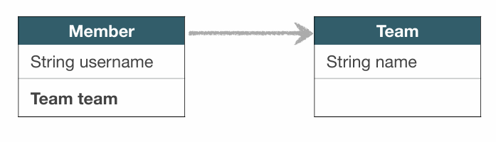

> 해당 글은 김영한님의 인프런 강의 [자바 ORM 표준 JPA 프로그래밍 - 기본편](https://www.inflearn.com/course/ORM-JPA-Basic)을 듣고 내용을 정리하기 위한 것으로 자세한 설명은 해당 강의를 통해 확인할 수 있습니다.
> 

---

## 프록시

### Memer를 조회할 때 Team도 함께 조회 해야 할까?



```java
public void printUserAndTeam(String memberId) { 
  Member member = em.find(Member.class, memberId); 
  Team team = member.getTeam(); 
  System.out.println("회원 이름: " + member.getUsername()); 
  System.out.println("소속팀: " + team.getName());  
}
```

- 회원과 팀 함께 출력

```java
public void printUser(String memberId) { 
  Member member = em.find(Member.class, memberId); 
  Team team = member.getTeam(); 
  System.out.println("회원 이름: " + member.getUsername()); 
}
```

- 회원만 출력

회원과 팀을 함께 출력하는 상황에서는 Member객체를 em.find()로 가져올때 Team도 DB에서 가져와서 괜찮은데 회원만 출력하고 싶을때는 Team의 정보까지 가져오기 때문에 최적화가 되지 않는다.

### 프록시 기초

- em.find() vs em.**getReference()**
- em.find(): 데이터베이스를 통해서 실제 엔티티 객체 조회
- em.getReference(): 데이터베이스 조회를 미루는 가짜(프록시)엔티티 객체 조회


em.find()를 사용하는 시점에는 select 쿼리를 DB에 날리고 진짜 객체를 받고 em.getReference()를 사용하는 시점에는 select 쿼리를 DB에 날리지 않고 가짜(프록시) 객체를 받는다. 그리고 member.getUsername()과 같은 Member객체의 필드값이 필요하면 select 쿼리를 DB에 날린다.

### 프록시 특징

- 실제 클래스를 상속 받아서 만들어짐
- 실제 클래스와 겉 모양이 같다.
- 사용하는 입장에서는 진짜 객체인지 프록시 객체인지 구분하지 않고 사용하면 됨 (이론상)


- 프록시 객체는 실제 객체의 참조(target)를 보관
- 프록시 객체를 호출하면 프록시 객체는 실제 객체의 메소드 호출

### 프록시 객체 초기화

```java
Member member = em.getReference(Member.class, “id1”); 
member.getName();
```


em.getReferemce()로 프록시 객체를 가져오고 member.getName()을 가져와야하는데 Member target이 null 이기때문에 JPA가 영속성 컨텍스트에 Member 객체를 요청해서 영속성 컨텍스트가 DB를 조회해서 실제 엔티티객체를 생성하고 Member target에 연결해준다.
위 과정이 완료되고 target.getName()을 통해 실제 객체에서 값을 가져오온다.

### 프록시의 특징

- 프록시 객체는 처음 사용할 때 한 번만 초기화
- 프록시 객체를 초기화 할 때, 프록시 객체가 실제 엔티티로 바뀌는 것은 아님, 초기화되면 프록시 객체를 통해서 실제 엔티티에 접근 가능
- 프록시 객체는 원본 엔티티를 상속받음, 따라서 **타입 체크시 주의**해야함 (== 비교 실패, 대신 **instance of 사용**)

> 
    
```java
Member m1 = em.find(Member.calss, member1.getId());
log.info("m1  =  {}", m1.getClass());
    
Member reference = em.getReference(Member.class, member1.getId());
log.info("reference = {}", (m1 == reference));

//log 결과
m1 = class hellojpa.Member
reference = class hellojpa.Member
```

위 결과 처럼 나오는 이유는 2가지 이유가 있다. 
첫번째 이유는 Member를 영속성 컨텍스트에 올려놨는데 그걸 프록시로 가져와 봐야 아무 이점이 없고 원본을 반환하는게 성능 최적화 입장에서도 좋다. 
두번째는 JPA에서는 같은 영속성 컨텍스트 안에서 == 비교를 TRUE로 보장해준다. 위 코드의 예시와 반대로 em.getReference()로 프록시 객체를 받고 em.find()를 요청해도 프록시 객체를 받는다.


    
> 
    
```java
Member refMember = em.getReference(Member.class, member1.getId());

//em.detech(refMember); 준영속 상태
em.clear();

refMember.getUsername(); // org.hibernate.LazyInitializationException: could not initialize proxy 오류 발생
```


    

### 프록시 확인

> 
PersistenceUnitUtil.isLoaded(Object entity)
    
```java
EntityManagerFactory emf = Persistence.createEntityManagerFactory(...)
...

Member refMember = em.getReference(Member.classm member1.getId());
log.info("isLoaded = {}", emf.get PersistenceUnitUtil().isLoaded(refMember) // isLoaded = false가 나온다.
```

- **프록시 클래스 확인 방법**
entity.getClass().getName() 출력(..javasist.. orHibernateProxy…)
> 
org.hibernate.Hibernate.initialize(entity);
    
```java
Member refMeber = em.getReference(Member.class, member1.getId());
Hibernate.initialize(refMember);//강제 초기화
```

    
- 참고: JPA 표준은 강제 초기화 없음
강제 호출: member.getName()

---

## 즉시 로딩과 지연 로딩

### Member를 조회할 때 Team도 함께 조회해야 할까?

단순히 member 정보만 사용하는 비즈니스 로직
println(member.getName());


단순히 Member를 조회할때 연관관계가 걸려있어서 Team까지 조인해서 가져오면 손해이기때문에 JPA는 지연 로딩이라는 옵션을 제공한다.

### 지연 로딩 LAZY을 사용해서 프록시로 조회

```java
@Entity 
public class Member { 
  @Id 
  @GeneratedValue 
  private Long id; 
  
  @Column(name = "USERNAME") 
  private String name; 
 
  @ManyToOne(fetch = FetchType.LAZY) //** 
  @JoinColumn(name = "TEAM_ID") 
  private Team team; 
  .. 
}
```

Member의 Team에 지연 로딩을 설정하면 em.find()로 member객체를 조회하고 Team객체는 프록시로 받는다.

### 지연 로딩


### 지연 로딩 LAZY을 사용해서 프록시로 조회


Member member = em.find(Member.class, 1L)


Team team = member.getTeam();
team.getName(); //실제 team을 사용하는 시점에 초기화(DB 조회)

### Member와 Team을 자주 함께 사용한다면?


### 즉시 로딩 EAGER을 사용해서 함께 조회

```java
@Entity 
public class Member { 
 
    @Id 
    @GeneratedValue 
    private Long id; 
 
    @Column(name = "USERNAME") 
    private String name; 
 
    @ManyToOne(fetch = FetchType.EAGER) //** 
    @JoinColumn(name = "TEAM_ID") 
    private Team team; 
    .. 
}
```

### 즉시 로딩


Member를 조회할때 Team도 조인해서 값을 가져온다.

### 즉시 로딩(EAGER), Member조회시 항상 Team도 조회


JPA 구현체는 가능하면 조인을 사용해서 SQL 한번에 함께 조회

### 프록시와 즉시로딩 주의

- **가급적 지연 로딩만 사용(특히 실무에서)**
- 즉시 로딩을 적용하면 예상하지 못한 SQL이 발생
- **즉시 로딩은 JPQL에서 N+1 문제를 일으킨다.**
- **@ManyToOne, @OneToOne은 기본이 즉시 로딩 → LAZY로 설정**
- @OneToMany, @ManyToMany는 기본이 지연 로딩

---

## 지연 로딩 활용

> 실무에서는 모두 지연 로딩을 사용하는걸 권장
> 
- **Member**와 **Team**은 자주 함께 사용 -> **즉시 로딩**
- **Member**와 **Order**는 가끔 사용 -> **지연 로딩**
- **Order**와 **Product**는 자주 함께 사용 -> **즉시 로딩**


Member를 조회하면 Team은 즉시 로디잉기때문에 member와 team의 쿼리가 한번에 나오고 orders는 지연 로딩이여서 프록시가 반한된다.


### 지연 로딩 활용 - 실무

- **모든 연관관계에 지연 로딩을 사용해라!**
- **실무에서 즉시 로딩을 사용하지 마라!**
- JPQL fetch 조인이나, 엔티티 그래프 기능을 사용해라!
(뒤에서 설명)
- 즉시 로딩은 상상하지 못한 쿼리가 나간다.

---

## 영속성 전이: CASCADE

- 특정 엔티티를 영속 상태로 만들 때 연관된 엔티티도 함께 영속상태로 만들도 싶을 때
- 예: 부모 엔티티를 저장할 때 자식 엔티티도 함께 저장.


### 영속성 전이: 저장

```java
@OneToMany(mappedBy="parent", cascade=CascadeType.PERSIST)
```

```java
Child child1 = new Child();
Child child2 = new Child();

Parent parent = new Parent();
parent.addChild(child1);
parent.addChild(child2);

em.persist(parent);
//em.persist(child1);
//em.persist(child2);
```

parent 하나만 persist했는데 child1, child2 둘다 persist가 된다. 만약 cascade=CascadeType.PERSIST하지 않고 parent만 persist하면 오류가 난다.


### 영속성 전이: CASCADE - 주의!

- 영속성 전이는 연관관계를 매핑하는 것과 아무 관련이 없음
- 엔티티를 영속화할 때 연관된 엔티티도 함께 영속화하는 편리함을 제공할 뿐

### CASCADE의 종류

- **ALL: 모두 적용**
- **PERSIST: 영속**
- **REMOVE: 삭제**
- MERGE: 병합
- REFRESH: REFRESH
- DETACH: DETACH

쓸만한 것은 All, Persist인데 저장만 할때와 삭제하면 안되고 조심해야할때는 Persist쓰고 라이프사이클을 다 맞춰야 하면 All을 쓰면 된다.
그리고 소유자가 한명일때와 라이프사이클이 같을때만 사용한다.

---

## 고아 객체

- 고아 객체 제거: 부모 엔티티와 연관관계가 끊어진 자식엔티티를 자동으로 삭제
- **orphanRemoval = true**
- Parent parent1 = em.find(Parent.class, id);
parent1.getChildren().remove(0);
//자식 엔티티를 컬렉션에서 제거
- DELETE FROM CHILD WHERE ID=?

### 고아 객체 - 주의

- 참조가 제거된 엔티티는 다른 곳에서 참조하지 않는 고아 객체로보고 삭제하는 기능
- **참조하는 곳이 하나일 때 사용해야함**!
- **특정 엔티티가 개인 소유할 때 사용**
- @OneToOne, @OneToMany만 가능
- 참고: 개념적으로 부모를 제거하면 자식은 고아가 된다. 따라서 고아 객체 제거 기능을 활성화 하면, 부모를 제거할 때 자식도 함께제거된다. 이것은  CascadeType.REMOVE처럼 동작한다.

---

## 영속성 전이 + 고아 객체, 생명주기

- **CascadeType.ALL + orphanRemoval=true**
- 스스로 생명주기를 관리하는 엔티티는 em.persist()로 영속화, em.remove()로 제거
- 두 옵션을 모두 활성화 하면 부모 엔티티를 통해서 자식의 생명주기를 관리할 수 있음
- 도메인 주도 설계(DDD)의 Aggregate Root개념을 구현할 때 유용

---

## 실전 예제 - 5.연관관계 관리

- 모든 연관관계를 지연 로딩으로
- @ManyToOne, @OneToOne은 기본이 즉시 로딩이므로 지연 로딩으로 변경

### 영속성 전이 설정

- **Order** -> **Delivery**를 영속성 전이 ALL 설정
- **Order** -> **OrderItem**을 영속성 전이 ALL 설정

---