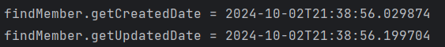

> 해당 글은 김영한님의 인프런 강의 [스프링 데이터 JPA](https://www.inflearn.com/course/%EC%8A%A4%ED%94%84%EB%A7%81-%EB%8D%B0%EC%9D%B4%ED%84%B0-JPA-%EC%8B%A4%EC%A0%84)을 듣고 내용을 정리하기 위한 것으로 자세한 설명은 해당 강의를 통해 확인할 수 있습니다.
> 

---

## 사용자 정의 리포지토리 구현

스프링 데이터 JPA 리포지토리는 인터페이스만 정의하면 구현체는 스프링이 자동으로 생성한다.

스프링 데이터 JPA가 제공하는 인터페이스를 직접 구현j하면 구현해야 하는 기능이 너무 많다.

JPA를 직접사용(EntityManager), 스프링 JDBC Template, MyBatis, 데이터베이스 커넥션 직접 사용, Querydls 등 다양한 이유로 인터페이스의 메서드를 직접 구현하고 싶다면 어떻게 해야할까?

**사용저 정의 인터페이스**

```java
public interface MemberRepositoryCustom {
    List<Member> findMemberCustom();
}
```

**사용자 정의 인터페이스 구현 클래스**

```java
@RequiredArgsConstructor
public class MemberRepositoryImpl implements MemberRepositoryCustom{

    private final EntityManager em;

    @Override
    public List<Member> findMemberCustom() {
        return em.createQuery("select m from Member m", Member.class)
                .getResultList();
    }
}
```

- 규칙: 리포지토리 인터페이스 이름 + Impl
    - 스프링 데이터 2.x부터는 사용자 저으이 인터페이스 명 + Imple 방식도 지원

MemberRepositoryImple 대신에 MemberRepositoryCustomImple 같이 구현해도 된다. 기존 방식보다 이 방식이 인터페이스 이름과 구현 클래스 이름이 비슷해서 더 직관적이고 여러 인터페이스를 분리해서 구현하는 것도 가능하기때문에 새롭게 변경된 이 방식을 사용하는것을 더 권장한다.

- 스프링 데이터 JPA가 인식해서 스프링 빈으로 등록한다.

**사용자 정의 인터페이스 상속**

```java
public interface MemberRepository extends JpaRepository<Member, Long>, MemberRepositoryCustom{
}
```

**사용자 정의 메서드 호출 코드**

```java
List<Member> result = memberRepository.findMemberCustom();
```

**Imple 대신 다른 이름으로 변경하는 방법**

**XML 설정**

```java
<repositories base-package="study.datajpa.repository" 
repository-impl-postfix="Impl" />
```

**JavaConfig 설정**

```java
@EnableJpaRepositories(basePackages = "study.datajpa.repository",
                     repositoryImplementationPostfix = "Impl")
```

> 실무에서는 주로 QueryDSL이나 SpringJdbcTemplate을 함께 사용할 때 사용자 정의 리포지토리 기능 자주 사용
> 

> 항상 사용자 정의 리포지토리가 필요한 것은 아니다. 그냥 임의의 리포지토리를 만들어도 된다. 예를들어 MemberQueryRepository를 인터페이스가 아닌 클래스로 만들고 스프링 빈으로 등록해서 그냥 직접 사용해도 된다. 물론 이 경우 스프링 데이터 JPA와는 아무런 관계 없이 별도로 동작한다.
> 

---

## Auditing

등록일, 수정일, 등록자, 수정자 등 엔티티를 생성, 변경할 때 변경한 사람과 시간을 추적하고 싶으면 어떻게 해야할까?

### 순수 JPA 사용

우선 등록일, 수정일 적용

```java
@Getter
@MappedSuperclass
public class JpaBaseEntity {

    @Column(updatable = false)
    private LocalDateTime createdDate;
    private LocalDateTime updatedDate;

    @PrePersist
    public void prePersist() {
        LocalDateTime now = LocalDateTime.now();
        createdDate = now;
        updatedDate = now;
    }

    @PreUpdate
    public void preUpdate() {
        updatedDate = LocalDateTime.now();
    }
}
```

@Column(updatable = false)은 createdDate의 값이 변경되지 않도록한다.

@PrePersist는 persist 하기전에 실행이되도록 한다. prePersist()에서 updatedDate = now의 필요성이 없다고 생각할수있지만 등록일과 수정일을 등록하면 최초 등로된 데이터인지 알수있고 업데이트에 null이 있으면 쿼리 하기가 되게 지저분해져서 값을 채워두는게 좋다.

@PreUpdate는 업데이트 되기전에 실행된다.

```java
 public class Member extends JpaBaseEntity {}
```

**확인 코드**

```java
@Test
public void jpaEventBaseEntity() throws Exception {
        //given
        Member member = new Member("member1");
        memberRepository.save(member); //@PrePersist
        Thread.sleep(100);
        member.setUsername("member2");
        em.flush(); //@PreUpdate
        em.clear();
        //when
        Member findMember = memberRepository.findById(member.getId()).get();
        //then
        System.out.println("findMember.createdDate = " + 
        findMember.getCreatedDate());
        System.out.println("findMember.updatedDate = " + 
        findMember.getUpdatedDate());
}
```



JPA 주요 이벤트 어노테이션

- @PrePersist, @PostPersist
- @PreUpdate, @PostUpdate

위 어노테이션의 자세한 정보는 공식문서를 참고하길 바라낟.

### **스프링 데이터 JPA 사용**

**설정**

@EnableJpaAuditing → 스프링 부트 설정 클래스에 적용

@EntityListeners(AuditingEntityListener.class) → 엔티티에 적용

**사용 어노테이션**

@CreatedDate, @LastModifiedDate, @CreatedBy, @LastModifiedBy

**스프링 데이터 Auditing 적용 - 등록일, 수정일**

```java
@EntityListeners(AuditingEntityListener.class)
@MappedSuperclass
@Getter
public class BaseEntity {
        @CreatedDate
        @Column(updatable = false)
        private LocalDateTime createdDate;
        
        @LastModifiedDate
        private LocalDateTime lastModifiedDate;
}
```

**스프링 데이터 Auditing 적용 - 등록자, 수정자**

```java
@EntityListeners(AuditingEntityListener.class)
@MappedSuperclass
public class BaseEntity {
        @CreatedDate
        @Column(updatable = false)
        private LocalDateTime createdDate;
        
        @LastModifiedDate
        private LocalDateTime lastModifiedDate;
        
        @CreatedBy
        @Column(updatable = false)
        private String createdBy;
        
        @LastModifiedBy
        private String lastModifiedBy;
}

```

등록자, 수정자를 처리해주는 `AuditorAware` 스프링 빈 등록

```java
@EnableJpaAuditing
@SpringBootApplication
public class DataJpaApplication {

        public static void main(String[] args) {
                SpringApplication.run(DataJpaApplication.class, args);
        }
        
        @Bean
        public AuditorAware<String> auditorProvider() {
                return () -> Optional.of(UUID.randomUUID().toString());
        }
}
```

DataJpaApplication에 @EnableJpaAuditing도 함께 등록해야 한다. 등록되거나 수정될때마다 auditorProvider를 호출해서 결과물을 꺼내고 createdBy, lastModifiedBy의 값들이 채워진다.

실무에서는 세션 정보나, 스프링 시큐리티 로그인 정보에서 ID를 받는다.

> 실무에서 대부분의 엔티티는 등록시간, 수정시간이 필요하지만, 등록자, 수정자는 없을 수도 있다. 그래서 다음과 같이 Base 타입을 분리하고, 원하는 타입을 선택해서 상속
> 

```java
public class BaseTimeEntity {
        @CreatedDate
        @Column(updatable = false)
        private LocalDateTime createdDate;
        
        @LastModifiedDate
        private LocalDateTime lastModifiedDate;

}

public class BaseEntity extends BaseTimeEntity {
@CreatedBy
@Column(updatable = false)
private String createdBy;

@LastModifiedBy
private String lastModifiedBy;
 }
```

저장시점에 등록일, 등록자는 물론이고, 수정일, 수정자도 같은 데이터가 저장된다. 데이터가 중복 저장되는 것 같지만, 이렇게 해두면 변경 컬럼만 확인해도 마지막에 업데이트한 유저를 확인 할 수 있으므로 유지보수 관점에서 편리하다. 이렇게 하지 않으면 변경 컬럼이 null 일때 등록 컬럼을 또 찾아야한다.

참고로 저장시점에 저장데이터만 입력하고 싶으면 @EnableJpaAuditing(modifyOnCreate =  false)옵션을 사용하면 된다.

### 전체 적용

@EntityListeners(AuditingEntityListener.class)를 생략하고 스프링 데이터 JPA가 제공하는 이벤트를 엔티티 전체에 적용하려면 orm.xml에 다음과 같이 등록하면 된다.

META-INF/orm.xml

```xml
<?xml version="1.0" encoding="UTF-8"?>
 <entity-mappings xmlns="http://xmlns.jcp.org/xml/ns/persistence/orm"
 xmlns:xsi="http://www.w3.org/2001/XMLSchema-instance"
 xsi:schemaLocation="http://xmlns.jcp.org/xml/ns/persistence/orm 
http://xmlns.jcp.org/xml/ns/persistence/orm_2_2.xsd"
 version="2.2">
 
    <persistence-unit-metadata>
        <persistence-unit-defaults>
            <entity-listeners>
                <entity-listener 
class="org.springframework.data.jpa.domain.support.AuditingEntityListener"/>
            </entity-listeners>
        </persistence-unit-defaults>
    </persistence-unit-metadata>
</entity-mappings>

```

---

## Web 확장 - 도메인 클래스 컨버터

HTTP 파라미터로 넘어온 엔티티의 아이디로 엔티티 객체를 찾아서 바인딩을 한다.

**도메인 클래스 컨버터 사용전**

```java
@RestController
@RequiredArgsConstructor
public class MemberController {

        private final MemberRepository memberRepository;
        
        @GetMapping("/members/{id}")
        public String findMember(@PathVariable("id") Long id) {
                Member member = memberRepository.findById(id).get();
                return member.getUsername();
        }
}
```

**도메인 클래스 컨버터 사용 후**

```java
@RestController
@RequiredArgsConstructor
public class MemberController {
        private final MemberRepository memberRepository;
        
        @GetMapping("/members/{id}")
        public String findMember(@PathVariable("id") Member member) {
                return member.getUsername();
        }
}
```

Http 요청은 회원 id를 받지만 도메인 클래스 컨버터ㅏ 중간에 동작해서 회원 엔티티 객체를 반환 해준다.

도메인 클래스 컨버터도 리포지토리(멤버로 지정해놓은 리포지토리)를 사용해서 엔티티를 찾는다.

**주의**
도메인 클래스 컨버터로 엔티티를 파라미터로 받으면, 이 엔티티는 단순 조회용으로만 사용해야 한다. (트랜잭션이 없는 범위에서 엔티티를 조회했으므로, 엔티티를 변경해도 DB에 반영되지 않는다.)

---

## Web 확장 - 페이징과 정렬

스프링 데이터가 제공하는 페이징과 정렬 기능을 스프링 MVC에서 편리하게 사용할 수 있다.

**페이징과 정렬 예제**

```java
@GetMapping("/members")
public Page<Member> list(Pageable pageable) {
        Page<Member> page = memberRepository.findAll(pageable);
        return page;
}
```

파라미터로 Pagealbe을 받는 것이 가능하다. Pageable은 인터페이스, 실제는 org.springframework.data.domain.PageRequest 객체를 생성한다.

**요청 파라미터**

- ex) /members?page=0&size=3&sort=id,desc&sort=username,desc
- page: 현재 페이지, **0부터 시작한다.**
- size: 한 페이지에 노출할 데이터 건수(디폴트 값은 20)
- sort: 정렬 조건을 정의한다. 예) 정렬 속성,정렬 속성...(ASC | DESC), 정렬 방향을 변경하고 싶으면 sort 파라미터 추가(asc 생략 가능)

**기본값**

- 글로벌 설정: 스프링 부트

```yaml
spring.data.web.pageable.default-page-size=20 /# 기본 페이지 사이즈/
spring.data.web.pageable.max-page-size=2000 /# 최대 페이지 사이즈/
```

- 개별 설정

@PageableDefault 어노테이션 사용

```java
@RequestMapping(value = "/members_page", method = RequestMethod.GET)
public String list(@PageableDefault(size = 12, sort = "username",
                     direction = Sort.Direction.DESC) Pageable pageable) {
        //...
}

```

**접두사**

- 페이징 정보가 둘 이상이면 접두사로 구분
- @Qualifier에 접두사명 추가 "{접두사명}_xxx”
- ex) /members?member_page=0&order_page=1

```java
public String list(
    @Qualifier("member") Pageable memberPageable,
    @Qualifier("order") Pageable orderPageable, ...
```

### Page 내용을 DTO로 변환하기

엔티티를 API로 노출하면 다양한 문제가 발생한다. 그래서 엔티티를 꼭 DTO로 변환해서 반환해야 한다. Page는 map()을 지원해서 내부 데이터를 다른 것으로 변경 할 수 있따.

**MemberDTO**

```java
@Data
public class MemberDto {
        private Long id;
        private String username;
        public MemberDto(Member m) {
        this.id = m.getId();
        this.username = m.getUsername();
        }
}
```

Page.map() 사용

```java
@GetMapping("/members")
public Page<MemberDto> list(Pageable pageable) {
        Page<Member> page = memberRepository.findAll(pageable);
        Page<MemberDto> pageDto = page.map(MemberDto::new);
        return pageDto;
}

//코드 최적화
@GetMapping("/members")
public Page<MemberDto> list(Pageable pageable) {
        return memberRepository.findAll(pageable).map(MemberDto::new);
}
```

### Page를 1부터 시작하기

- 스프링 데이터는 Page를 0부터 시작한다.
- 1부터 시작하는 방법은?
    - Pageable, Page를 파리미터와 응답 값으로 사용히지 않고, 직접 클래스를 만들어서 처리한다. 그리고 직접 PageRequest(Pageable 구현체)를 생성해서 리포지토리에 넘긴다. 물론 응답값도 Page 대신에 직접만들어서 제공해야 한다.
    - spring.data.web.pageable.one-indexed-parameters를 true로 설정한다. 그런데 이 방법은 web에서 page 파라미터를 -1 처리 할 뿐이다. 즉, page = 0가 page = 1 이 동일하다. 따라서 응답값인 Page에 모두 0 페이지 인덱스를 사용하는 한계가 있다.

one-indexed-parameters Page 1요청(http://localhost:8080/members?page=1)

```json
{ 
        "content": [
        ...
        ],
        "pageable": {
                "offset": 0,
                "pageSize": 10,
                "pageNumber": 0 //0 인덱스
        },
        "number": 0, //0 인덱스
        "empty": false
}
```

page의 값이 1이어도 pageNumber와 number의 값은 0으로 반환한다. 위의 한계 때문에 이 방법은 권장하지 않는다.